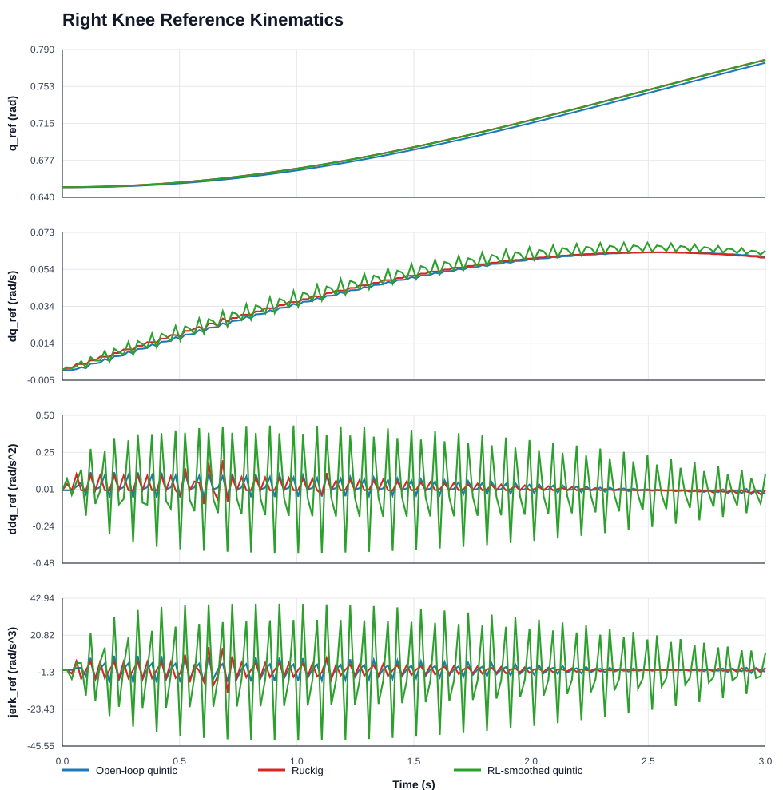
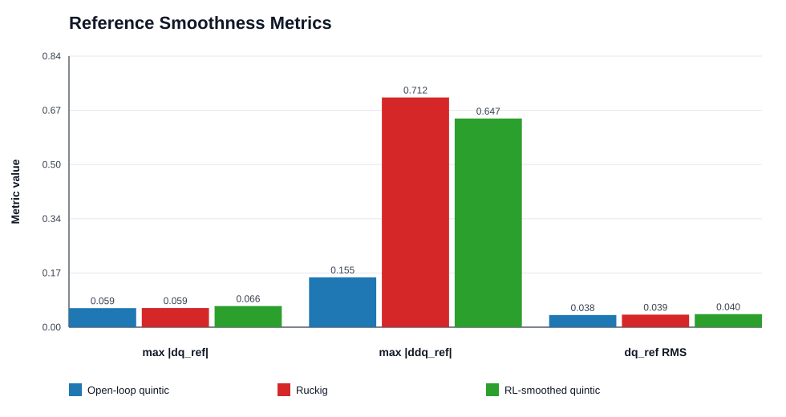
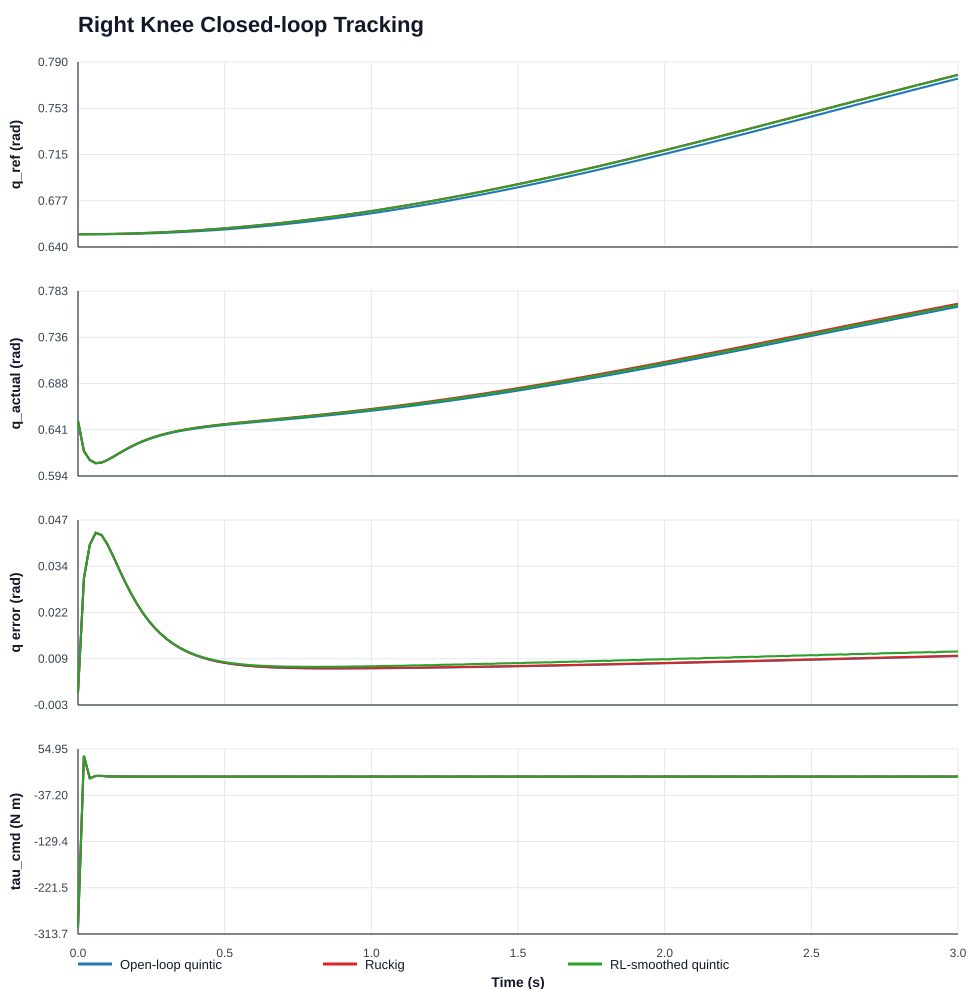
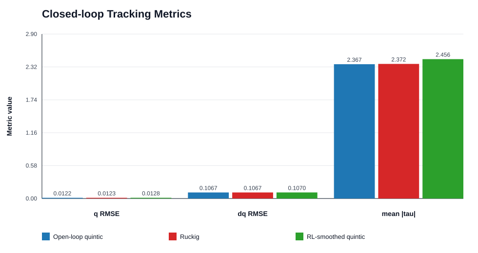

# 右膝单关节插值模式对比实验报告

## 摘要

本报告整理了 `RightKnee` 单关节 position-only policy 输出下的三种参考生成方式对比：`open_loop` 五次多项式插值、`ruckig` jerk-limited 在线轨迹生成、`rl_smoothed` 低通差分目标速度/加速度五次插值。实验数据来自 `data/mujoco_fit/track_position_only_*` 三组 MuJoCo 闭环运行日志，以及 `data/mujoco_fit/right_knee_*_metrics.csv` 中的离线统计结果。

核心结论是：在当前右膝单关节、低频正弦参考、3 s MuJoCo 闭环条件下，三种模式的位置跟踪性能非常接近，`open_loop` 的 $q$ RMSE 最低但优势很小；`ruckig` 和 `rl_smoothed` 并未在该温和任务上显著改善闭环误差。参考平滑性指标显示，`ruckig` 和 `rl_smoothed` 在当前参数下反而引入了更高的离散加速度/jerk 峰值，因此该组结果不能直接支持“更复杂插值一定更好”，而更支持“插值器必须结合任务频率、执行器约束和控制代价重新调参”。

## 1. 实验目的

本实验关注的问题是：当上层 policy 只输出离散关节位置点时，底层 2 ms 控制循环中使用不同插值模式生成 $q_{\mathrm{ref}}$、$\dot q_{\mathrm{ref}}$，是否会改变右膝单关节的参考平滑性、闭环跟踪误差和力矩代价。

具体评价目标包括：

- 参考轨迹运动学质量：$\max |\dot q_{\mathrm{ref}}|$、$\max |\ddot q_{\mathrm{ref}}|$、$\max |\dddot q_{\mathrm{ref}}|$、$\dot q_{\mathrm{ref}}$ RMS。
- 闭环跟踪质量：$q$ RMSE、$q$ MAE、$\max |e_q|$、$\dot q$ RMSE。
- 控制代价：$\max |\tau|$、$\operatorname{mean}|\tau|$。

## 2. 实验对象与数据来源

实验对象为 H1 MuJoCo 模型中的右膝关节：

| 项目 | 设置 |
|---|---|
| 关节 | `RightKnee`, `joint_id = 2` |
| 控制周期 | $T_s = 0.002~\mathrm{s}$ |
| policy 周期 | `policy_dt = 0.05 s` |
| policy source | `sine` |
| policy center | `0.75 rad` |
| policy amplitude | `0.1 rad` |
| policy frequency | `0.1 Hz` |
| 控制器 | EID 控制器配置，但本组 comparison 使用 position-only 跟踪评价 |
| 仿真时长 | 3 s 闭环统计；参考离线统计使用 1000 个采样点 |

主要原始文件：

- `data/mujoco_fit/track_position_only_open_loop/mujoco_closed_loop_log.csv`
- `data/mujoco_fit/track_position_only_ruckig/mujoco_closed_loop_log.csv`
- `data/mujoco_fit/track_position_only_rl_smoothed/mujoco_closed_loop_log.csv`
- `data/mujoco_fit/right_knee_position_only_interpolation_comparison_metrics.csv`
- `data/mujoco_fit/right_knee_closed_loop_tracking_position_only_metrics.csv`

## 3. 插值算法说明

### 3.1 Open-loop Quintic

`open_loop` 模式以离散 policy 位置点作为边界点，在相邻 policy 周期之间使用五次多项式插值。代码路径为 `include/reference_trajectory.hpp` 中的 `evalSegment()`、`makeSegment()` 和 `evalQuintic()`。

对每个 policy 边界点，位置来自 policy source；速度由相邻位置点差分得到；加速度设为 0：

$$
q_k = \operatorname{policyPosition}(t_k)
$$

$$
\dot q_k = \frac{q_k - q_{k-1}}{T_{\mathrm{policy}}}
$$

$$
\ddot q_k = 0
$$

五次多项式满足起点和终点的 $q$、$\dot q$、$\ddot q$ 边界条件：

$$
q(t) = a_0 + a_1 t + a_2 t^2 + a_3 t^3 + a_4 t^4 + a_5 t^5
$$

该方法的优点是实现简单、每个 segment 内位置/速度/加速度连续；风险在于边界速度来自差分，边界加速度强制为 0，跨 segment 时不一定与真实闭环状态一致。

### 3.2 Ruckig

`ruckig` 模式在每个控制周期调用 Ruckig 在线轨迹生成器，从当前参考状态或闭环状态向下一个 policy 点生成 jerk-limited 轨迹。代码路径为 `sampleRuckig()` 和 `stepRuckig()`。

本组配置的关键参数为：

```text
policy_interpolation: ruckig
policy_max_acceleration: 5.0
policy_max_jerk: 100.0
policy_ruckig_target_velocity: policy
```

实现中将到下一个 policy 点的剩余时间设置为 `minimum_duration`，避免 Ruckig 以最快时间提前冲到目标点：

$$
T_{\min} = \max(t_{\mathrm{target}} - t_{\mathrm{now}}, T_s)
$$

Ruckig 的理论优势是显式约束速度、加速度和 jerk，更符合执行器约束；但实际表现依赖边界速度、jerk 限制、剩余时间和目标点变化规律。当前数据中，Ruckig 的 jerk 峰值正好达到 $100~\mathrm{rad/s^3}$ 的配置上限。

### 3.3 RL-smoothed Quintic

`rl_smoothed` 模式面向 RL position-only 输出。它仍使用五次多项式生成控制周期内参考，但目标速度和目标加速度不直接使用原始差分，而是进行低通和平滑混合。代码路径为 `sampleRlSmoothed()` 和 `makeRlPreviewSegment()`。

本组配置的关键参数为：

```text
policy_interpolation: rl_smoothed
policy_max_acceleration: 5.0
policy_rl_velocity_alpha: 0.35
policy_rl_acceleration_alpha: 0.25
policy_rl_target_acceleration_blend: 0.5
```

目标速度计算：

$$
\dot q_{\mathrm{raw}}
= \frac{q_{\mathrm{target}} - q_{\mathrm{prev}}}{T_{\mathrm{policy}}}
$$

$$
\dot q_{\mathrm{lim}}
= \operatorname{clamp}(\dot q_{\mathrm{raw}}, -\dot q_{\max}, \dot q_{\max})
$$

$$
\dot q_{\mathrm{target}}
= \operatorname{lowpass}(\dot q_{\mathrm{target,prev}}, \dot q_{\mathrm{lim}}, \alpha_v)
$$

目标加速度计算：

$$
\ddot q_{\mathrm{raw}}
= \frac{\dot q_{\mathrm{target}} - \dot q_{\mathrm{target,prev}}}{T_{\mathrm{policy}}}
$$

$$
\ddot q_{\mathrm{lim}}
= \operatorname{clamp}(\ddot q_{\mathrm{raw}}, -a_{\max}, a_{\max})
$$

$$
\ddot q_{\mathrm{filtered}}
= \operatorname{lowpass}(\ddot q_{\mathrm{target,prev}}, \ddot q_{\mathrm{lim}}, \alpha_a)
$$

$$
\ddot q_{\mathrm{target}}
= (1-\beta)\ddot q_{\mathrm{filtered}} + \beta \ddot q_{\mathrm{start}}
$$

其中 $\alpha_v$ 为目标速度低通系数，$\alpha_a$ 为目标加速度低通系数，$\beta$ 对应 `policy_rl_target_acceleration_blend`。

该方法的目标是减少 RL 离散动作差分速度的突变，并让新的 segment 起点承接上一段参考状态；但滤波参数不合适时，仍可能在 segment 连接或目标变化时形成较大离散 jerk。

## 4. 实际数据

### 4.1 参考轨迹平滑性指标

数据来源：`data/mujoco_fit/right_knee_position_only_interpolation_comparison_metrics.csv`。

| 模式 | samples | $\max |\dot q_{\mathrm{ref}}|$ | $\max |\ddot q_{\mathrm{ref}}|$ | $\max |\dddot q_{\mathrm{ref}}|$ | $\dot q_{\mathrm{ref}}$ RMS |
|---|---:|---:|---:|---:|---:|
| position_only_open_loop | 1000 | 0.059145 | 0.154603 | 22.612846 | 0.037717 |
| ruckig_position_only | 1000 | 0.059480 | 0.712288 | 100.000000 | 0.038913 |
| rl_smoothed | 1000 | 0.065538 | 0.647132 | 283.784004 | 0.040448 |

相对 `position_only_open_loop`：

- `ruckig_position_only` 的 $\max |\ddot q_{\mathrm{ref}}|$ 约为 4.61 倍，$\max |\dddot q_{\mathrm{ref}}|$ 约为 4.42 倍。
- `rl_smoothed` 的 $\max |\ddot q_{\mathrm{ref}}|$ 约为 4.19 倍，$\max |\dddot q_{\mathrm{ref}}|$ 约为 12.55 倍。
- 三者的 $\dot q_{\mathrm{ref}}$ RMS 很接近，说明平均速度量级接近，差别主要体现在高阶导数峰值。





### 4.2 闭环跟踪指标

数据来源：`data/mujoco_fit/right_knee_closed_loop_tracking_position_only_metrics.csv`。

| 模式 | samples | $q$ RMSE | $q$ MAE | $\max |e_q|$ | $\dot q$ RMSE | $\max |\tau|$ | $\operatorname{mean}|\tau|$ |
|---|---:|---:|---:|---:|---:|---:|---:|
| position_only_open_loop | 150 | 0.012243 | 0.009923 | 0.043117 | 0.106660 | 300.000000 | 2.366539 |
| ruckig_position_only | 150 | 0.012290 | 0.009990 | 0.043131 | 0.106691 | 299.997986 | 2.371623 |
| rl_smoothed | 150 | 0.012764 | 0.010682 | 0.043120 | 0.107026 | 300.000000 | 2.455770 |

相对 `position_only_open_loop`：

- `ruckig_position_only` 的 $q$ RMSE 增加约 0.38%，$\operatorname{mean}|\tau|$ 增加约 0.21%。
- `rl_smoothed` 的 $q$ RMSE 增加约 4.25%，$\operatorname{mean}|\tau|$ 增加约 3.77%。
- 三者 $\max |e_q|$ 基本一致，最大力矩都接近 $300~\mathrm{N\,m}$ 限幅。





## 5. 分析

### 5.1 当前任务对插值器的区分度有限

右膝参考为低频正弦，幅值只有 $0.1~\mathrm{rad}$，policy 周期为 $50~\mathrm{ms}$。在这种温和任务下，三种插值模式给出的平均参考速度和闭环位置误差非常接近。因此，闭环 $q$ RMSE 不能充分区分插值器优劣。

这点很重要：如果只看 $q$ RMSE，会得出“三种模式差不多”的结论；但参考加速度和 jerk 指标显示，内部参考运动学并不相同。

### 5.2 Ruckig 在当前参数下没有发挥预期优势

Ruckig 的设计目标是约束速度、加速度和 jerk，但本实验中 $\max |\dddot q_{\mathrm{ref}}|$ 达到 $100~\mathrm{rad/s^3}$，即配置上限。它的位置误差与 open-loop 基本相同，平均力矩略高。

这并不说明 Ruckig 方法无效，更可能说明当前设置仍偏向“在剩余 policy 周期内尽快满足目标速度边界”，而目标速度又来自 policy 点差分。若希望 Ruckig 更平滑，需要进一步评估：

- 将 `policy_ruckig_target_velocity` 从 `policy` 改为 `zero` 或更保守的估计。
- 降低 `policy_max_jerk`，同时检查是否还能在 `minimum_duration` 内到达目标。
- 对 policy 点或目标速度先做滤波，再交给 Ruckig。
- 在更激烈的 step 或高频 policy 输出下重复实验。

### 5.3 RL-smoothed 的参数还没有调到最优

`rl_smoothed` 的预期是降低差分速度噪声，但本组结果中 $\max |\dddot q_{\mathrm{ref}}|$ 最高，闭环 $q$ RMSE 和平均力矩也略高。原因可能是目标速度低通、目标加速度低通和当前参考加速度混合之间存在相位滞后或 segment 边界修正。

当前参数：

$\alpha_v = 0.35$，$\alpha_a = 0.25$，$\beta = 0.5$。

仍需要做参数扫描，不能只根据这一组默认参数判断 `rl_smoothed` 的最终性能。

### 5.4 Open-loop 在单关节温和正弦下表现最好，但泛化风险仍在

`position_only_open_loop` 在这组数据中 $q$ RMSE 最低、$\operatorname{mean}|\tau|$ 最低、参考高阶导数峰值也最低。它在单关节低频正弦任务上是一个很强的 baseline。

但 open-loop 的结构性问题没有因此消失：它不读取真实闭环状态作为新 segment 初值，也不显式约束执行器 jerk；当 policy 输出更稀疏、更高频、更不规则，或者进入多关节强耦合任务时，边界速度差分和状态不一致仍可能触发高频控制输入。

## 6. 结论

本组右膝单关节插值模式对比表明：

1. 在当前低频正弦右膝任务中，`position_only_open_loop`、`ruckig_position_only`、`rl_smoothed` 的闭环位置跟踪误差接近，`open_loop` 略优。
2. `ruckig` 和 `rl_smoothed` 在默认参数下没有带来更低的力矩代价，反而出现更高的参考加速度/jerk 峰值。
3. 不能用这组单关节结果直接推断全身 RL 中的最优插值器；它更适合作为插值器调参和后续 benchmark 的基础证据。
4. 后续完整评估应同时统计 tracking RMSE、参考高阶导数、$\operatorname{mean}|\tau|$、$\max |\tau|$、$\operatorname{mean}|\Delta \tau|$、饱和比例和 RL reward，而不是只看位置误差。

## 7. 复现与绘图

本报告图表由以下脚本生成：

```powershell
node analysis_artifacts\right_knee_interpolation\scripts\plot_right_knee_interpolation.js
```

脚本只依赖 Node.js 标准库，读取现有 CSV 日志并输出 SVG：

- `analysis_artifacts/right_knee_interpolation/figures/right_knee_reference_timeseries.svg`
- `analysis_artifacts/right_knee_interpolation/figures/right_knee_reference_metric_bars.svg`
- `analysis_artifacts/right_knee_interpolation/figures/right_knee_tracking_timeseries.svg`
- `analysis_artifacts/right_knee_interpolation/figures/right_knee_tracking_metric_bars.svg`

当前 Python 环境中的 pandas/matplotlib 与 NumPy 版本存在二进制兼容问题，因此本次没有使用 matplotlib 生成图片。为了保证复现稳定性，绘图脚本采用纯 SVG 输出。

## 8. 局限与后续建议

本实验仍是右膝单关节、低频正弦、短时闭环的局部对比，不是全身 RL 的最终插值 benchmark。建议后续补充：

- step、chirp、高频正弦、真实 RL action 序列四类输入。
- `open_loop`、`closed_loop`、`ruckig(policy velocity)`、`ruckig(zero velocity)`、`rl_smoothed` 的统一 sweep。
- Ruckig 的 `max_acceleration`、`max_jerk` 参数扫描。
- `rl_smoothed` 的 `velocity_alpha`、`acceleration_alpha`、`target_acceleration_blend` 参数扫描。
- 多关节右髋-右膝耦合场景下的同指标复测。
- 全身 RL 中以相同 seed、相同训练步数对比 reward、joint_acc、action_rate、feet_contact_forces 和 torque smoothness。
