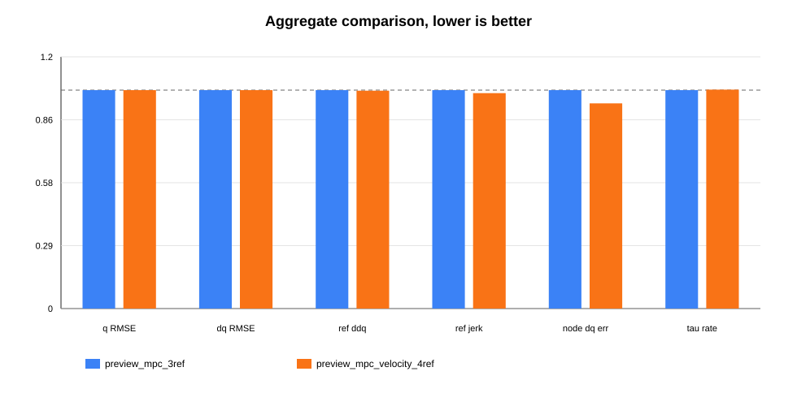
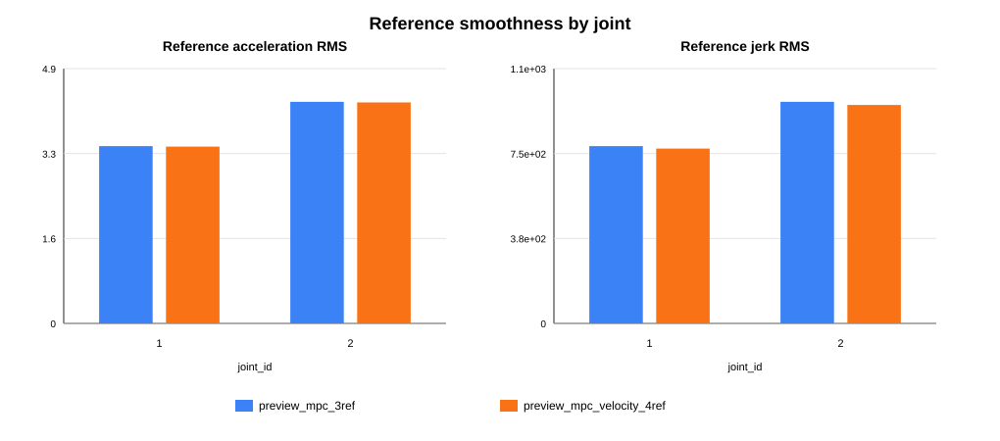
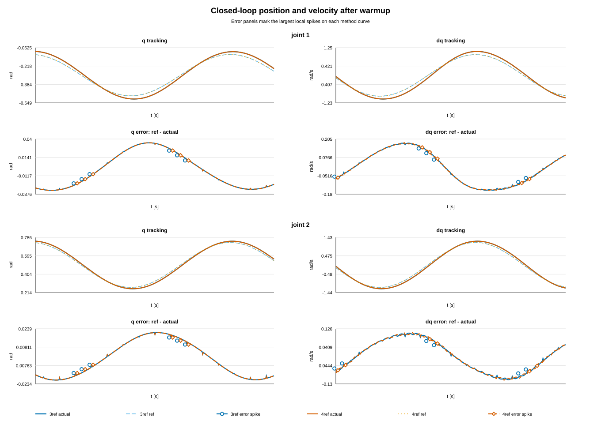

# 当前保留的 MPC 方法

本文描述当前工程保留的 MPC 参考生成方法。原三点方法保持不变：

```yaml
policy_interpolation: preview_mpc
policy_reference_points: 3
```

另新增一个独立四点速度参考变体：

```yaml
policy_interpolation: preview_mpc_velocity
policy_reference_points: 4
```

`policy_mpc_variant` 仍保持删除状态。`preview_mpc` 固定表示 **3 参考点 soft-preview MPC，且不加入 terminal velocity/acceleration 惩罚项**。`preview_mpc_velocity` 是单独方法，不改变旧三点方法的求解器和权重。

## 1. 问题定义

每个关节在一个策略周期 `T_p = policy_dt` 内接收 3 个策略位置参考：

$$
q_0^{\ast},\quad q_1^{\ast},\quad q_2^{\ast}
$$

控制周期为 `dt = control_dt`，每个策略周期包含：

$$
N_p = \mathrm{round}(T_p/dt)
$$

MPC 预览窗口覆盖 3 个策略周期：

$$
N_h = 3N_p
$$

状态定义为：

$$
x_k =
\begin{bmatrix}
q_k & \dot q_k & \ddot q_k
\end{bmatrix}^T
$$

决策变量是每个控制步的 jerk：

$$
J =
\begin{bmatrix}
j_0 & j_1 & \cdots & j_{N_h-1}
\end{bmatrix}^T
$$

求解完整 3 个策略周期窗口，但实际只执行第一个策略周期的参考序列；下一个策略周期重新滚动求解。

## 2. 线性预测模型

每一步假设 jerk 在一个控制步内保持常值：

$$
\dddot q(t) = j_i,\qquad t\in[i\,dt,(i+1)\,dt)
$$

离散积分为：

$$
\ddot q_{k+1} = \ddot q_k + dt\,j_k
$$

$$
\dot q_{k+1} = \dot q_k + dt\,\ddot q_k + \frac{1}{2}dt^2j_k
$$

$$
q_{k+1} = q_k + dt\,\dot q_k + \frac{1}{2}dt^2\ddot q_k + \frac{1}{6}dt^3j_k
$$

因为上述积分对 `j_i` 都是一次线性的，展开到整个窗口后可以写成：

$$
q = q_b + A_qJ,\qquad
\dot q = \dot q_b + A_vJ,\qquad
\ddot q = \ddot q_b + A_aJ
$$

其中 `q_b,\dot q_b,\ddot q_b` 是从当前初始状态出发、假设未来 jerk 全为 0 得到的基线轨迹；`A_q,A_v,A_a` 是由 `dt` 和积分关系决定的下三角响应矩阵。

对第 `k` 个预测点和第 `i` 个 jerk，若 `i < k`，令 `r=k-i`，当前实现使用：

$$
A_a(k,i) = dt
$$

$$
A_v(k,i) =
\frac{1}{2}dt^2\left[r^2-(r-1)^2\right]
$$

$$
A_q(k,i) =
\frac{1}{6}dt^3\left[r^3-(r-1)^3\right]
$$

若 `i >= k`，对应矩阵元素为 0。

## 3. 优化目标

当前方法最小化参考速度、参考加速度、jerk 和后两个预览点的位置误差：

$$
\min_J
\sum_{k=1}^{N_h}
\left(
w_v\dot q_k^2+
w_a\ddot q_k^2
\right)
+w_j\sum_{i=0}^{N_h-1}j_i^2
+w_p\left[
(q_{2N_p}-q_1^{\ast})^2+
(q_{3N_p}-q_2^{\ast})^2
\right]
+w_r\sum_{i=0}^{N_h-1}j_i^2
$$

权重来自当前 C++ 实现：

| 符号 | 代码常量 | 数值 | 作用 |
|---|---|---:|---|
| `w_p` | `w_preview_q` | `2.0e7` | 约束后两个策略点尽量贴合 |
| `w_v` | `w_path_v` | `3.0e-3` | 抑制参考速度 |
| `w_a` | `w_path_a` | `8.0e-5` | 抑制参考加速度 |
| `w_j` | `w_jerk` | `2.0e-9` | 抑制 jerk |
| `w_r` | `w_ridge` | `1.0e-10` | 数值正则化 |

该目标不包含 terminal velocity 或 terminal acceleration 惩罚。因此窗口末端的速度、加速度不被额外压到 0，而是由路径速度、路径加速度、jerk 和预览点位置误差共同决定。

## 3.1 四点速度参考变体

`preview_mpc_velocity` 使用 4 个策略位置点：

$$
q_0^{\ast},\quad q_1^{\ast},\quad q_2^{\ast},\quad q_3^{\ast}
$$

优化窗口仍覆盖前三个策略周期，即 `N_h=3N_p`。第 4 个点不作为新的位置预览终点，而是用于差分得到前三个策略点处的参考速度：

$$
v_i^{\ast}=\frac{q_{i+1}^{\ast}-q_i^{\ast}}{T_p},\qquad i=0,1,2
$$

该变体保留三点方法的原目标和原约束，并额外加入策略点速度软惩罚：

$$
w_{pv}\sum_{i=0}^{2}\left(\dot q_{(i+1)N_p}-v_i^{\ast}\right)^2
$$

当前实现中：

| 符号 | 代码常量 | 数值 | 作用 |
|---|---|---:|---|
| `w_pv` | `w_preview_v` | `1.0` | 软匹配前三个策略点的差分速度 |

这个权重刻意保持较小：它让策略点速度信息参与优化，但不把速度目标变成近似硬约束，避免显著增加参考加速度、jerk 和力矩变化率。

## 3.2 `preview_mpc_velocity` 的完整 QP 展开

四点速度参考变体和三点方法使用同一个状态、同一个 jerk 决策变量、同一个离散积分模型。令：

$$
m_i=(i+1)N_p,\qquad i=0,1,2
$$

其中 `m_i` 表示第 `i+1` 个策略周期末端在预测窗口中的采样行。再定义矩阵行向量：

$$
a_{q,i}^T=A_q(m_i,:),\qquad
a_{v,i}^T=A_v(m_i,:)
$$

则三个策略周期末端的位置和速度预测为：

$$
q_{m_i}=q_{b,m_i}+a_{q,i}^TJ
$$

$$
\dot q_{m_i}=\dot q_{b,m_i}+a_{v,i}^TJ
$$

四点策略输出为：

$$
q_0^{\ast},\quad q_1^{\ast},\quad q_2^{\ast},\quad q_3^{\ast}
$$

差分速度目标为：

$$
v_i^{\ast}=\frac{q_{i+1}^{\ast}-q_i^{\ast}}{T_p},\qquad i=0,1,2
$$

完整优化目标为：

$$
\begin{aligned}
\min_J\quad
&\sum_{k=1}^{N_h}
\left(
w_v\dot q_k^2+
w_a\ddot q_k^2
\right)
+w_j\sum_{i=0}^{N_h-1}j_i^2 \\
&+w_p\left[
\left(q_{2N_p}-q_1^{\ast}\right)^2+
\left(q_{3N_p}-q_2^{\ast}\right)^2
\right] \\
&+w_{pv}\sum_{i=0}^{2}
\left(\dot q_{m_i}-v_i^{\ast}\right)^2
+w_r\sum_{i=0}^{N_h-1}j_i^2
\end{aligned}
$$

硬约束仍然只有第一个策略点位置：

$$
q_{N_p}=q_0^{\ast}
$$

也就是：

$$
a_{q,0}^TJ=q_0^{\ast}-q_{b,m_0}
$$

代入线性预测式后，代码按下面的标准形式求解：

$$
\min_J\frac{1}{2}J^THJ+g^TJ
$$

$$
CJ=d
$$

其中：

$$
C=a_{q,0}^T,\qquad d=q_0^{\ast}-q_{b,m_0}
$$

按当前实现的 `H/g` 约定，各项贡献可以写为：

$$
H =
w_vA_v^TA_v+
w_aA_a^TA_a+
\left(w_j+w_r\right)I+
H_q+
H_{\dot q}
$$

$$
g =
w_vA_v^T\dot q_b+
w_aA_a^T\ddot q_b+
g_q+
g_{\dot q}
$$

位置软预览项为：

$$
H_q=
w_p\sum_{i=1}^{2}a_{q,i}a_{q,i}^T
$$

$$
g_q=
w_p\sum_{i=1}^{2}a_{q,i}
\left(q_{b,m_i}-q_i^{\ast}\right)
$$

新增的速度软预览项为：

$$
H_{\dot q}=
w_{pv}\sum_{i=0}^{2}a_{v,i}a_{v,i}^T
$$

$$
g_{\dot q}=
w_{pv}\sum_{i=0}^{2}a_{v,i}
\left(\dot q_{b,m_i}-v_i^{\ast}\right)
$$

当前代码中 `preview_mpc_velocity` 使用：

| 符号 | 代码常量 | 数值 |
|---|---|---:|
| `w_p` | `w_preview_q` | `2.0e7` |
| `w_{pv}` | `w_preview_v` | `1.0` |
| `w_v` | `w_path_v` | `3.0e-3` |
| `w_a` | `w_path_a` | `8.0e-5` |
| `w_j` | `w_jerk` | `2.0e-9` |
| `w_r` | `w_ridge` | `1.0e-10` |

求解 KKT 系统后，仍只输出第一个策略周期内的参考序列：

$$
\begin{bmatrix}
H & C^T\\
C & 0
\end{bmatrix}
\begin{bmatrix}
J\\
\lambda
\end{bmatrix}
=
\begin{bmatrix}
-g\\
d
\end{bmatrix}
$$

## 4. 约束

第一个策略点采用硬约束：

$$
q_{N_p} = q_0^{\ast}
$$

代入线性预测式：

$$
A_q(N_p,:)J = q_0^{\ast} - q_b(N_p)
$$

第 2、3 个策略点不是硬约束，而是通过目标函数中的软惩罚项逼近：

$$
q_{2N_p}\approx q_1^{\ast},\qquad q_{3N_p}\approx q_2^{\ast}
$$

这样做的目的：当前执行段必须准确到达第一个策略点，同时允许后续两个预览点参与平滑性折中，避免把远端参考强行变成不可调的边界条件。

## 5. QP 形式

将目标函数全部代入线性预测式后，可得到标准等式约束二次规划：

$$
\min_J \frac{1}{2}J^THJ + g^TJ
$$

$$
CJ=d
$$

其中：

$$
C=A_q(N_p,:),\qquad d=q_0^{\ast}-q_b(N_p)
$$

当前实现用 KKT 线性系统直接求解：

$$
\begin{bmatrix}
H & C^T\\
C & 0
\end{bmatrix}
\begin{bmatrix}
J\\
\lambda
\end{bmatrix}
=
\begin{bmatrix}
-g\\
d
\end{bmatrix}
$$

求得 `J` 后，使用 `q=q_b+A_qJ`、`\dot q=\dot q_b+A_vJ`、`\ddot q=\ddot q_b+A_aJ` 生成参考轨迹，并只输出第一个策略周期内的采样点。

## 6. 工程入口

核心实现位置：

- `include/reference_trajectory.hpp`
- `include/runtime_config.hpp`

推荐配置：

```yaml
controller:
  defaults:
    policy_interpolation: preview_mpc
    policy_reference_points: 3
```

速度参考变体配置：

```yaml
controller:
  defaults:
    policy_interpolation: preview_mpc_velocity
    policy_reference_points: 4
```

当前髋膝 PD 配置入口：

```text
config/h1_real_p3_selected_mpc_hip_knee_pd.yaml
config/h1_real_p3_velocity_mpc_hip_knee_pd.yaml
```

## 7. 两种方法的 MuJoCo 对比

对比脚本：

```powershell
python scripts\compare_mpc_velocity_variant.py --backend mujoco --duration 6.0 --warmup-s 3.2
```

实验条件：

- 控制器：`position_pd`
- 关节：`RightHipPitch` 和 `RightKnee`
- 控制周期：`control_dt = 0.002 s`
- 策略周期：`policy_dt = 0.05 s`
- 运动频率：`0.8 Hz`
- 扰动：无
- 统计窗口：丢弃前 `3.2 s` 启动混入段，只统计后续闭环数据
- 输出目录：`analysis_artifacts/mpc_velocity_compare/`

### 7.1 汇总指标

| 指标 | 3 点 `preview_mpc` | 4 点 `preview_mpc_velocity` | 变化 |
|---|---:|---:|---:|
| `q_rmse` | `0.0188231` | `0.0188227` | `-0.0018%` |
| `dq_rmse` | `0.0910163` | `0.0910280` | `+0.0128%` |
| `ref_dq_rms` | `0.748015` | `0.747985` | `-0.0040%` |
| `ref_ddq_rms` | `3.86194` | `3.85124` | `-0.2772%` |
| `ref_jerk_rms` | `885.172` | `872.861` | `-1.3908%` |
| `policy_node_dq_error_rms` | `0.0948123` | `0.0890670` | `-6.0596%` |
| `tau_applied_rms` | `2.30881` | `2.30880` | `-0.0006%` |
| `tau_rate_rms` | `28.9622` | `29.0224` | `+0.2075%` |

完整 CSV：

- [按关节指标](../analysis_artifacts/mpc_velocity_compare/metrics_by_joint.csv)
- [汇总指标](../analysis_artifacts/mpc_velocity_compare/aggregate_metrics.csv)
- [相对三点方法的变化](../analysis_artifacts/mpc_velocity_compare/comparison_vs_preview_mpc_3ref.csv)

### 7.2 按关节指标

| 方法 | 关节 | `q_rmse` | `dq_rmse` | `ref_ddq_rms` | `ref_jerk_rms` | `policy_node_dq_error_rms` | `tau_rate_rms` |
|---|---:|---:|---:|---:|---:|---:|---:|
| `preview_mpc` | 1 | `0.0231147` | `0.110807` | `3.43284` | `786.820` | `0.0842776` | `26.9339` |
| `preview_mpc` | 2 | `0.0145314` | `0.0712258` | `4.29105` | `983.525` | `0.105347` | `30.9906` |
| `preview_mpc_velocity` | 1 | `0.0231142` | `0.110814` | `3.42332` | `775.877` | `0.0791707` | `26.9846` |
| `preview_mpc_velocity` | 2 | `0.0145312` | `0.0712414` | `4.27915` | `969.846` | `0.0989634` | `31.0601` |

### 7.3 绘图

总体指标比例图：



参考平滑性对比：



闭环跟踪时序：

该图按关节分别绘制 `q tracking`、`q error`、`dq tracking` 和 `dq error`。蓝色表示三点基线 `preview_mpc_3ref`，橙红色表示四点速度参考变体 `preview_mpc_velocity_4ref`；误差面板中的蓝色圆点和橙红色菱形分别标出两种方法各自最明显的局部尖峰。为了避免两种方法尖峰重合时互相遮挡，尖峰标记做了轻微水平错位。



### 7.4 分析

从这次 MuJoCo 闭环结果看，`preview_mpc_velocity` 的主要收益在参考生成层：

- 策略点速度误差 RMS 从 `0.0948123` 降到 `0.0890670`，下降约 `6.06%`。这说明新增的差分速度目标确实进入了优化结果。
- 参考加速度 RMS 下降约 `0.28%`，参考 jerk RMS 下降约 `1.39%`。在当前权重 `w_preview_v=1.0` 下，速度项没有让轨迹变硬，反而带来轻微平滑收益。
- 位置跟踪 RMSE 几乎不变：`0.0188231` 到 `0.0188227`，只有 `0.0018%` 的变化，不能认为跟踪精度有实质提升。
- 速度跟踪 RMSE 略增 `0.0128%`，力矩变化率 RMS 略增 `0.2075%`。这两个变化很小，但说明速度项并非完全免费。

因此当前结论是：

> `preview_mpc_velocity` 更适合作为“速度一致性更好、参考略平滑”的候选方法，而不是已经证明能显著降低实际跟踪误差的新默认方法。若目标是保持最稳妥的实机默认入口，`preview_mpc` 仍应保留为基线；若目标是让策略点处的速度更符合策略位置序列的差分趋势，可以继续评估 `preview_mpc_velocity`。

后续如果要继续调参，建议优先扫描 `w_preview_v`。较大的速度权重会更强地压低策略点速度误差，但可能抬高参考加速度、jerk 和力矩变化率；当前 `1.0` 是较保守的软约束设置。
