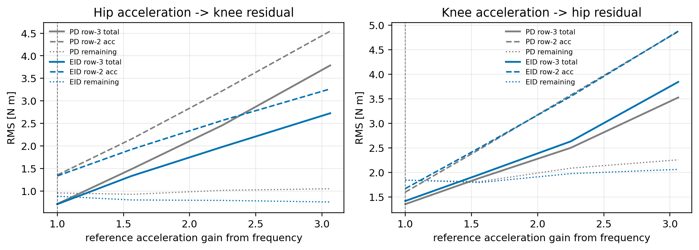
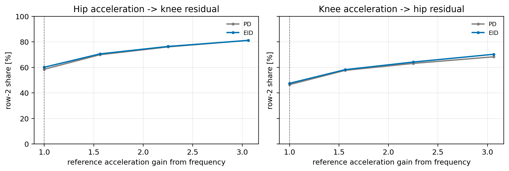

# 闭环 MuJoCo 实验：通过提高频率加大关节加速度

## 结论

实验保持髋/膝正弦参考的角度幅值不变，只提高参考频率。因为正弦运动的加速度幅值满足：

$$
\left|\ddot q\right|_{\max}
=
A(2\pi f)^2,
$$

所以频率从 `0.8 Hz` 提高到 `1.4 Hz` 时，参考加速度幅值约增加到：

$$
\left(\frac{1.4}{0.8}\right)^2
=
3.06
$$

倍。

实验结果说明两件事：

- 加速度提高后，关节间加速度传递力矩 $d^{acc}$ 确实变大，它在 $d^{acc}$ 与剩余项 $d^{other}$ 的 RMS 分量中占比明显升高；
- 局部单关节模型总残差 $d^{total}$ 没有变小，而是随加速度提高一起变大。

因此，“加速度变大 -> 传递力占比变大”成立；但“传递力占比变大 -> 总残差变小”不成立。

## 实验设置

控制器和轨迹来自原来的右髋 pitch / 右膝 pitch 反相联动配置：

```text
config/h1_real_p2_anti_hip_knee_pd.yaml
config/h1_real_p2_anti_hip_knee_eid.yaml
```

本实验只修改：

```text
controller.defaults.policy_frequency_hz
```

频率扫描为：

```text
0.8 Hz, 1.0 Hz, 1.2 Hz, 1.4 Hz
```

对应参考加速度倍率为：

| 频率 | 参考加速度倍率 |
| ---: | ---: |
| `0.8 Hz` | `1.00` |
| `1.0 Hz` | `1.56` |
| `1.2 Hz` | `2.25` |
| `1.4 Hz` | `3.06` |

每个频率点都重新运行闭环 MuJoCo 仿真，仿真时长 `8 s`，稳态分析窗口为：

```text
3.0 <= t_rel < 7.4 s
```

## 变量定义

下面直接写出每条曲线对应的物理量。

来源关节角加速度定义如下。对“髋影响膝”方向，它是右髋 pitch 的角加速度：

$$
a_h(t)=\ddot q_h(t).
$$

对“膝影响髋”方向，它是右膝 pitch 的角加速度：

$$
a_k(t)=\ddot q_k(t).
$$

这个量本身不是力矩，单位是 $\mathrm{rad/s^2}$。它表示来源关节在当前时刻加速得有多快。后面的加速度传递力矩 $d^{acc}$，就是由这个角加速度通过完整机器人动力学折合到另一个关节力矩通道里的结果。

对“髋影响膝”这个方向，来源关节是右髋 pitch，目标通道是右膝 pitch：

$$
d_{k \leftarrow h}^{acc}(t)
=
\tau_k(q_h,q_k,0,0,\ddot q_h,0)
-
\tau_k(q_h,q_k,0,0,0,0).
$$

这个量表示：只保留髋角加速度 $\ddot q_h$ 时，MuJoCo 完整逆动力学在膝通道中多算出来的力矩。等价地，它可以理解为髋角加速度通过完整惯量矩阵折合到膝通道的力矩：

$$
d_{k \leftarrow h}^{acc}(t)
\approx
M_{kh}(q)\ddot q_h(t).
$$

对“膝影响髋”这个方向，来源关节是右膝 pitch，目标通道是右髋 pitch：

$$
d_{h \leftarrow k}^{acc}(t)
=
\tau_h(q_h,q_k,0,0,0,\ddot q_k)
-
\tau_h(q_h,q_k,0,0,0,0)
\approx
M_{hk}(q)\ddot q_k(t).
$$

局部单关节模型总残差定义为：

$$
d_i^{total}(t)
=
\tau_i^{full}(t)
-
\tau_i^{local}(t),
\qquad i\in\{h,k\}.
$$

其中 $\tau_i^{full}$ 是 MuJoCo 完整机器人模型的逆动力学力矩：

$$
\tau_i^{full}(t)
=
\left[
\mathrm{ID}_{MuJoCo}(q(t),\dot q(t),\ddot q(t))
\right]_i.
$$

$\tau_i^{local}$ 是控制器内部的单关节近似模型：

$$
\tau_i^{local}(t)
=
J_i\ddot q_i(t)
+ b_i\dot q_i(t)
+ A_i\sin(q_i(t))
+ B_i\cos(q_i(t))
+ \tau_{0,i}.
$$

扣除加速度传递力矩后，剩余项定义为：

$$
d_k^{other}(t)
=
d_k^{total}(t)
-
d_{k \leftarrow h}^{acc}(t),
$$

$$
d_h^{other}(t)
=
d_h^{total}(t)
-
d_{h \leftarrow k}^{acc}(t).
$$

本文中的“加速度传递力占比”不是代数贡献率，而是 RMS 量级占比：

$$
\mathrm{share}
=
\frac{
\operatorname{RMS}(d^{acc})
}{
\operatorname{RMS}(d^{acc})
+
\operatorname{RMS}(d^{other})
}
\times 100\%.
$$

## 结果图

来源关节角加速度 $a_h(t)=\ddot q_h(t)$ 或 $a_k(t)=\ddot q_k(t)$ 的变化，用后面表格中的“实测 $\ddot q$ RMS”表示。由于角加速度的单位是 $\mathrm{rad/s^2}$，而下面几条曲线的单位是 $\mathrm{N\cdot m}$，所以图中只画力矩相关量，避免把不同单位混在同一纵轴上。

下图中，虚线是加速度传递力矩 RMS，即 $d_{k \leftarrow h}^{acc}$ 或 $d_{h \leftarrow k}^{acc}$；实线是局部单关节模型总残差 RMS，即 $d_k^{total}$ 或 $d_h^{total}$；点线是扣除加速度传递力矩后的剩余项 RMS，即 $d_k^{other}$ 或 $d_h^{other}$。



可以看到，提高频率后，$d^{acc}$ 和 $d^{total}$ 都会升高。也就是说，关节间加速度传递力更强了，但局部单关节模型总残差没有被消掉。

下图显示 $\operatorname{RMS}(d^{acc})$ 在 $\operatorname{RMS}(d^{acc})+\operatorname{RMS}(d^{other})$ 中的占比。



可以看到，加速度传递力占比确实随加速度提高而升高。这说明 $d^{acc}$ 越来越成为 $d^{total}$ 中的主导动态成分。

## 关键数值

原始频率 `0.8 Hz` 与最高频率 `1.4 Hz` 对比如下。

| 方法 | 方向 | 频率 | 参考加速度倍率 | 实测 $\ddot q$ RMS | $d^{acc}$ RMS | $d^{total}$ RMS | $d^{other}$ RMS | 加速度传递力占比 |
| --- | --- | ---: | ---: | ---: | ---: | ---: | ---: | ---: |
| PD | 髋 -> 膝 | `0.8` | `1.00` | `4.237` | `1.355` | `0.714` | `0.959` | `58.6%` |
| PD | 髋 -> 膝 | `1.4` | `3.06` | `14.339` | `4.546` | `3.787` | `1.051` | `81.2%` |
| PD | 膝 -> 髋 | `0.8` | `1.00` | `5.003` | `1.600` | `1.355` | `1.841` | `46.5%` |
| PD | 膝 -> 髋 | `1.4` | `3.06` | `15.343` | `4.866` | `3.525` | `2.258` | `68.3%` |
| EID | 髋 -> 膝 | `0.8` | `1.00` | `4.175` | `1.335` | `0.709` | `0.885` | `60.1%` |
| EID | 髋 -> 膝 | `1.4` | `3.06` | `10.296` | `3.265` | `2.726` | `0.758` | `81.2%` |
| EID | 膝 -> 髋 | `0.8` | `1.00` | `5.229` | `1.672` | `1.420` | `1.846` | `47.5%` |
| EID | 膝 -> 髋 | `1.4` | `3.06` | `15.409` | `4.876` | `3.842` | `2.063` | `70.3%` |

## 如何理解

这个实验回答的是：在真正闭环实验里，如果通过提高轨迹频率来提高髋膝角加速度，关节间传递力是否会变得更重要。

答案是会。$d^{acc}$ 的 RMS 明显增大，占比也明显提高。

但 $d^{total}$ 并不会因此变小。原因是 $d^{acc}$ 本身就是 $d^{total}$ 的一部分。把加速度做大，相当于把这部分耦合扰动做大；它会让总残差更由加速度耦合主导，但不会自动抵消局部单关节模型没解释的部分。

因此，正文里更准确的表述应该是：

> 提高髋膝联动频率后，关节角加速度增大，关节间加速度传递力矩 $d^{acc}$ 的 RMS 和占比均明显提高。这说明局部单关节模型总残差 $d^{total}$ 中的主导动态成分确实来自对方关节加速度折合项。但该项增强并不会降低 $d^{total}$；相反，总残差随耦合加速度增强而增大。因此，加速度传递力是残差的主要来源，而不是用来抵消残差的补偿项。

