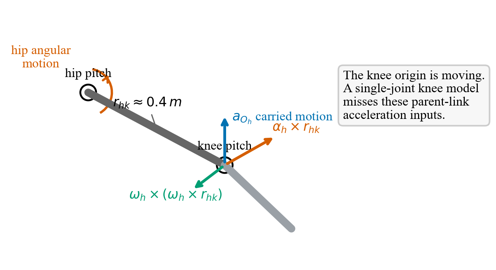
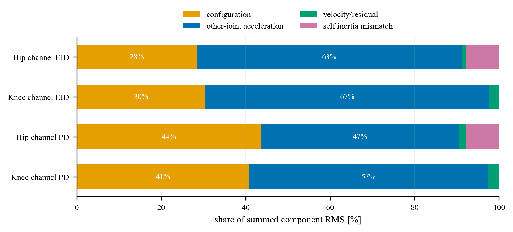
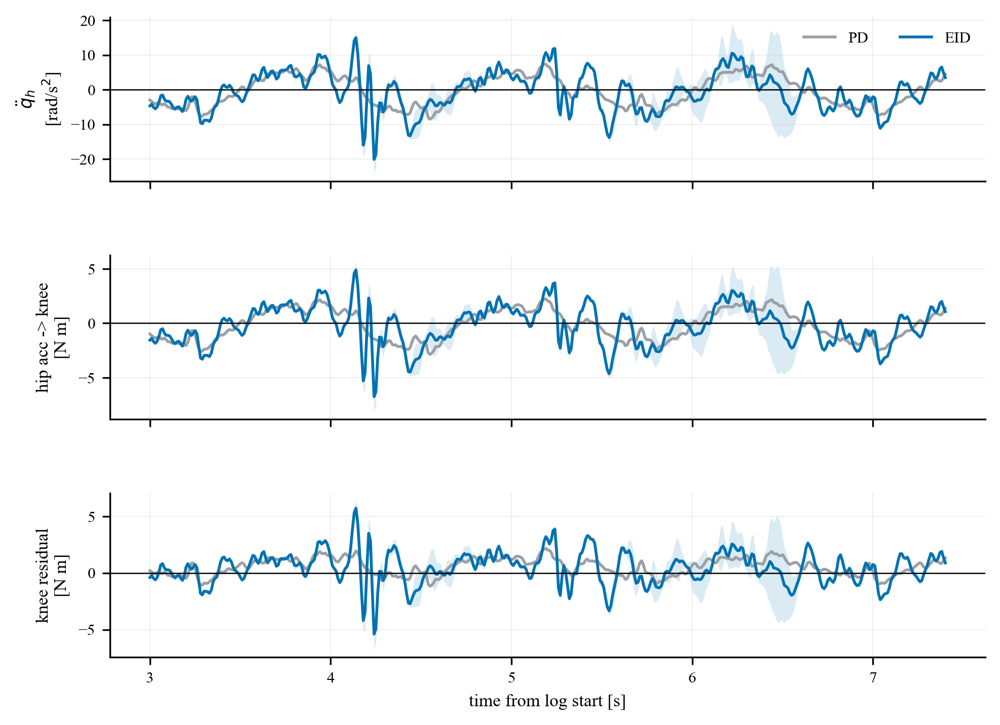
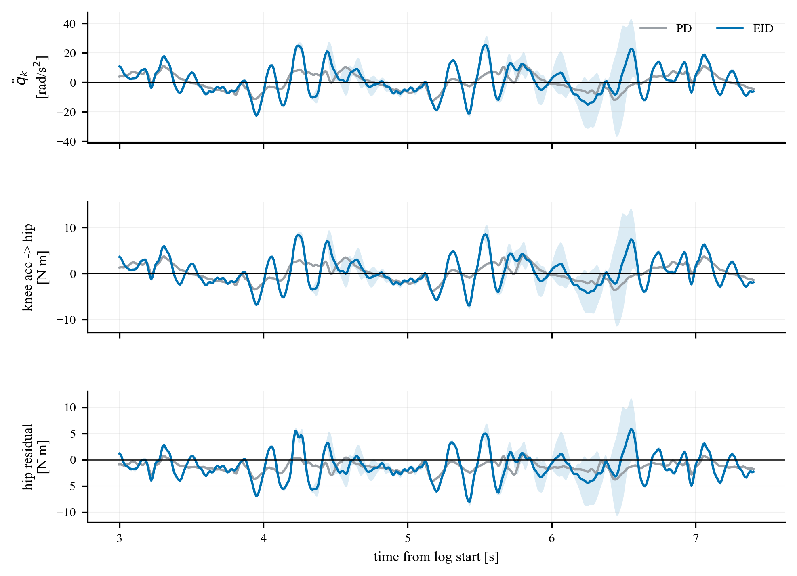

# 髋膝联动时，两个关节互相带来的扰动是什么样的

## 结论

右髋 pitch 与右膝 pitch 反相联动时，两个关节互相带来的主要扰动，是“对方关节的角加速度通过连杆惯性折合到本关节力矩通道”的动态耦合项。

沿 5 次 PD 和 5 次 EID 实测轨迹，用 MuJoCo 完整逆动力学计算得到：

| 方法 | 髋给膝的动态耦合 RMS | 膝给髋的动态耦合 RMS | 膝通道总模型残差 RMS | 髋通道总模型残差 RMS |
| --- | ---: | ---: | ---: | ---: |
| EID | 2.066 N·m | 3.716 N·m | 1.752 N·m | 3.330 N·m |
| PD | 1.400 N·m | 1.786 N·m | 0.916 N·m | 1.616 N·m |

这组数值说明三点。

第一，扰动不是一个固定偏置，而是一条随联动轨迹正负振荡的力矩曲线。对方关节加速度换向，折合到本关节通道的惯性力矩也换向。

第二，速度耦合不是主项。两个方向的速度相关项 RMS 都只有约 `0.06--0.08 N·m`，比加速度折合项小一个量级以上。

第三，在这组轨迹里，膝给髋的动态耦合比髋给膝更大。EID 下膝加速度折合到髋通道的 RMS 为 `3.720 N·m`，高于髋加速度折合到膝通道的 `2.060 N·m`。

## 扰动是怎么产生的

髋膝联动时，膝关节不是固定在惯性系里的一个独立转轴。右膝 pitch 是右髋 pitch link 的下游关节，膝原点会跟着髋段一起运动。只要髋段有角速度或角加速度，膝原点就会获得由父级连杆带来的非惯性加速度。



膝原点的惯性系加速度至少包含：

$$
a_{O_k}
= a_{O_h}
+ \alpha_h \times r_{hk}
+ \omega_h \times (\omega_h \times r_{hk}).
$$

其中 $O_h$ 是髋 pitch 原点，$O_k$ 是膝 pitch 原点，$r_{hk}$ 是从髋原点指向膝原点的连杆偏置。对膝控制器的局部单关节模型来说，后两项不是膝自己的 $\dot q_k,\ddot q_k$，但它们确实会在膝通道里变成力矩需求。于是，完整动力学看到的是一个髋膝耦合系统；局部单关节模型看到的则是“突然冒出来”的输入残差。

反过来也一样。膝关节加速时，下游腿段的惯性反作用会折合到髋 pitch 力矩通道。由于髋在上游，髋通道承担了下游腿段运动的反作用，所以膝给髋的耦合在当前轨迹下更大。

## 扰动大小占比

下图把每个通道的局部模型残差拆成四类 RMS 分量，并把它们按“各分量 RMS 之和”归一化为百分比。这个百分比不是代数求和贡献，而是用来显示量级占比：哪一类项大，哪一类项小。



图中的四类分量可以这样理解：

- `other-joint acceleration`：对方关节的角加速度折合到本关节通道的力矩。例如膝通道里的这一项，就是髋角加速度通过连杆惯性折合出来的力矩。
- `velocity / residual`：和速度相关的耦合项，以及反事实拆分后剩下的很小残余。它主要检查“是不是速度项在主导”。
- `configuration`：同一个关节姿态下，MuJoCo 完整模型的重力/构型项与控制器局部模型的重力近似之间的差别。
- `self inertia mismatch`：本关节自己的等效惯量近似误差。例如膝局部模型只用一个常数 $J_k$ 表示惯量，而完整模型里的有效惯量会随姿态和耦合关系变化。

读这张图时，重点看蓝色部分。蓝色表示“对方关节加速度折合项”。

在 EID 轨迹下：

- 膝通道中，髋加速度折合项约占各分量 RMS 总量的 `67%`；
- 髋通道中，膝加速度折合项约占各分量 RMS 总量的 `63%`；
- 速度相关项只占很窄的一条，说明速度耦合不是主要来源；
- 髋通道还存在约 `8%` 的自身惯量近似差异，但仍小于膝加速度折合项。

在 PD 轨迹下：

- 膝通道中，髋加速度折合项约占 `57%`；
- 髋通道中，膝加速度折合项约占 `47%`；
- 配置/重力残差占比更高，说明 PD 轨迹下动态加速度耦合没有 EID 那么突出。

这张图把前面的结论变得更直观：髋膝互扰的主角是对方关节加速度，不是速度项。

## 扰动在时间上长什么样

髋给膝的扰动链条如下。第一行是髋角加速度，第二行是髋角加速度折合到膝通道的力矩，第三行是膝通道相对局部单关节模型的总残差。

“控制器内部的单关节局部模型”指的是控制器实际使用的简化动力学模型。控制器没有在每个控制周期里调用完整机器人动力学来同时计算髋、膝和其他关节的耦合力矩，而是把每个关节近似看成一个独立的一维系统，分别计算各自的力矩需求。

这里的“单关节”是指：计算第 $i$ 个关节力矩时，只使用这个关节自己的角度 $q_i$、角速度 $\dot q_i$、角加速度 $\ddot q_i$。这里的“局部”是指：这个模型只描述第 $i$ 个关节本通道的等效惯量、阻尼和重力近似，不包含另一个关节的运动输入。例如在膝关节局部模型里，不会出现髋角加速度 $\ddot q_h$ 折合到膝通道的项；在髋关节局部模型里，也不会出现膝角加速度 $\ddot q_k$ 折合到髋通道的项。

因此，局部单关节模型不是 MuJoCo 的完整髋膝模型，也看不到另一个关节；它只按下面这个一维公式计算本关节应该需要多少力矩：

$$
\tau_i^{local}
= J_i \ddot q_i
+ b_i \dot q_i
+ A_i \sin(q_i)
+ B_i \cos(q_i)
+ \tau_{0,i},
\qquad i \in \{h,k\}.
$$

也就是说，$\tau_i^{local}$ 是一个显式公式计算值：对每一个采样时刻，把日志中的 $q_i(t)$、$\dot q_i(t)$ 和由 $\dot q_i(t)$ 平滑求导得到的 $\ddot q_i(t)$ 代入上式，就得到该时刻的 $\tau_i^{local}(t)$。其中 $J_i$、$b_i$、$A_i$、$B_i$、$\tau_{0,i}$ 来自控制器配置文件里的单关节 `plant` 参数。这个量不是 MuJoCo 计算结果，也不是电机实测力矩，而是控制器内部局部模型认为“单看这个关节自身运动时应该需要的力矩”。

这套 `plant` 模型也正是 EID 控制器在线前馈和观测器预测所用的模型。代码里的 `forwardModel()` 使用的是同一个一维动力学关系：

$$
\ddot q_i
=
\frac{
u_i
-
b_i\dot q_i
-
A_i\sin q_i
-
B_i\cos q_i
-
\tau_{0,i}
}{J_i}.
$$

把上式移项，就得到前面的 $\tau_i^{local}$ 公式。因此，离线分析里的 $\tau_i^{local}$ 和 EID 前馈模型使用的是同一个局部单关节动力学假设。区别在于：离线分析是把实测轨迹的 $q_i(t)$、$\dot q_i(t)$、$\ddot q_i(t)$ 代入公式，用来和 MuJoCo 完整逆动力学比较；在线 EID 前馈则是在 `analyticInverseModel()` 里根据参考轨迹的下一步 $q_i^{ref}(t+\Delta t)$、$\dot q_i^{ref}(t+\Delta t)$ 反解前馈力矩 $u_i^\star$。

完整 MuJoCo 逆动力学给出的力矩记为 $\tau_i^{full}$。这里的 $\tau_i^{full}$ 不是实测电机输出，也不是控制器发出的命令。它的含义更接近于“运动回放后的力矩反推”：先指定机器人在这一时刻的关节位置 $q$、关节速度 $\dot q$ 和关节加速度 $\ddot q$，再让 MuJoCo 根据完整机器人模型回答一个问题：如果机器人真的要按照这个状态运动，第 $i$ 个关节需要承担多少力矩。

这里的 $q$ 表示当前姿态，$\dot q$ 表示当前速度，$\ddot q$ 表示当前加速度。本文把右髋 pitch 和右膝 pitch 的实测联动轨迹写入这三个量，基座和其他关节保持 MuJoCo 标称姿态，然后调用 `mj_inverse` 做逆动力学计算。

`mj_inverse` 是 MuJoCo 里的逆动力学函数。它做的事可以理解为：已知机器人“正在怎样运动”，反过来计算“要产生这种运动，各关节需要多少广义力”。在代码实现中，调用 `mj_inverse(model, data)` 之后，MuJoCo 会把计算结果写入 `data.qfrc_inverse`；本文再从这个数组里取出右髋 pitch 和右膝 pitch 对应的力矩通道。因此：

$$
\tau_i^{full}
=
\left[
\mathrm{ID}_{MuJoCo}(q,\dot q,\ddot q)
\right]_i
$$

其中 $\mathrm{ID}_{MuJoCo}$ 表示 MuJoCo 完整模型的逆动力学计算，方括号下标 $i$ 表示只取第 $i$ 个关节通道。在本文这组计算里，$i=h$ 表示右髋 pitch，$i=k$ 表示右膝 pitch。所以，$\tau_i^{full}$ 可以理解为“完整模型在这个髋膝联动状态下认为该关节需要承担的力矩”。图里的第三行就是：

$$
d_i^{total}
=
\tau_i^{full}
- \tau_i^{local}.
$$

它的意思是：完整机器人动力学认为这个关节通道需要的力矩，减去控制器内部单关节模型已经能解释的力矩，剩下那部分就是局部模型没看见的东西。对膝通道来说，这里面会包含髋运动折合过来的力矩；对髋通道来说，这里面会包含膝运动反作用折合过来的力矩。它不是人为额外加进去的扰动，而是完整动力学与局部单关节近似之间的差。

为了避免把第二行和第三行混在一起，这里把图里的三行按计算定义拆开说清楚。以第一张图“髋加速度到膝通道”为例。第一行画的是实测髋角加速度：

$$
\ddot q_h(t)
=
\frac{d\dot q_h(t)}{dt}.
$$

实际计算时，$\ddot q_h(t)$ 由日志中的髋角速度 $\dot q_h(t)$ 经过平滑求导得到。

第二行画的是“髋加速度单独折合到膝通道的力矩”，记为 $d_{k \leftarrow h}^{acc}(t)$。令 $e_h$ 表示只在髋关节加速度通道为 1 的选择向量，则本文先构造一个反事实逆动力学力矩：

$$
\tau_{k}^{(h\text{-}acc)}(t)
=
\left[
\mathrm{ID}_{MuJoCo}
\left(
q(t),
0,
\ddot q_h(t)e_h
\right)
\right]_k .
$$

这里的含义是：姿态保持为当前实测姿态 $q(t)$，所有关节速度置零，只保留髋关节加速度 $\ddot q_h(t)$，再取 MuJoCo 完整逆动力学输出中的膝通道力矩。为了去掉同一姿态下的静态重力项，再计算

$$
\tau_{k}^{g}(t)
=
\left[
\mathrm{ID}_{MuJoCo}
\left(
q(t),
0,
0
\right)
\right]_k .
$$

于是第二行曲线定义为

$$
d_{k \leftarrow h}^{acc}(t)
=
\tau_{k}^{(h\text{-}acc)}(t)
-
\tau_{k}^{g}(t).
$$

因此，第二行回答的是：如果在当前姿态下只让髋关节产生加速度，完整机器人模型会在膝电机通道中产生多少惯性耦合力矩。由于 $\tau_{k}^{(h\text{-}acc)}$ 和 $\tau_{k}^{g}$ 使用同一个 $q(t)$，相减后同一姿态下的重力和静态构型影响被抵消，剩下的主要就是髋加速度经由连杆惯性折合到膝通道的力矩。

第三行画的是膝通道总残差 $d_k^{total}(t)$。它使用完整实测运动状态：

$$
\tau_k^{full}(t)
=
\left[
\mathrm{ID}_{MuJoCo}
\left(
q(t),
\dot q(t),
\ddot q(t)
\right)
\right]_k ,
$$

再减去控制器内部膝单关节模型给出的力矩：

$$
\tau_k^{local}(t)
=
J_k\ddot q_k(t)
+
b_k\dot q_k(t)
+
A_k\sin q_k(t)
+
B_k\cos q_k(t)
+
\tau_{0,k}.
$$

所以第三行曲线定义为

$$
d_k^{total}(t)
=
\tau_k^{full}(t)
-
\tau_k^{local}(t).
$$

也就是说，第二行是第三行里的一个主要来源，但不是第三行本身。第三行还可能包含速度相关耦合、重力或构型近似误差、膝自身等效惯量近似误差等。图中第二行和第三行波形接近，说明膝通道总残差的主要形状确实来自髋加速度耦合。

当前控制器配置里的参数如下，来自 `config/h1_real_p2_anti_hip_knee_eid.yaml` 中对应关节的 `plant` 配置；代码里对应 `include/eid_controller.hpp` 的 `gravityTorque(q)`、`forwardModel()` 和 `analyticInverseModel()`。

| 关节 | $J_i$ | $b_i$ | $A_i$ | $B_i$ | $\tau_{0,i}$ |
| --- | ---: | ---: | ---: | ---: | ---: |
| 右髋 pitch | `1.00508532` | `1` | `15.7100627` | `2.79723089` | `0` |
| 右膝 pitch | `0.2501484` | `1` | `4.14117407` | `-2.09365203` | `0` |



这张图的读法很直接：第一行的髋角加速度正负振荡；第二行的膝端耦合力矩跟着振荡；第三行的膝通道总残差又与第二行保持相近的波形。也就是说，膝端看到的很多“扰动形状”，不是随机噪声，而是髋加速度通过完整动力学折合出来的。

膝给髋的扰动链条如下。第一行是膝角加速度，第二行是膝角加速度折合到髋通道的力矩，第三行是髋通道相对局部单关节模型的总残差。

第二张图的计算方法完全对称，只是把方向换成“膝到髋”。令 $e_k$ 表示只在膝关节加速度通道为 1 的选择向量，则第二行定义为

$$
d_{h \leftarrow k}^{acc}(t)
=
\tau_{h}^{(k\text{-}acc)}(t)
-
\tau_{h}^{g}(t),
$$

其中

$$
\tau_{h}^{(k\text{-}acc)}(t)
=
\left[
\mathrm{ID}_{MuJoCo}
\left(
q(t),
0,
\ddot q_k(t)e_k
\right)
\right]_h,
\qquad
\tau_{h}^{g}(t)
=
\left[
\mathrm{ID}_{MuJoCo}
\left(
q(t),
0,
0
\right)
\right]_h.
$$

第三行则是髋通道总残差：

$$
d_h^{total}(t)
=
\tau_h^{full}(t)
-
\tau_h^{local}(t),
$$

其中

$$
\tau_h^{full}(t)
=
\left[
\mathrm{ID}_{MuJoCo}
\left(
q(t),
\dot q(t),
\ddot q(t)
\right)
\right]_h,
$$

$$
\tau_h^{local}(t)
=
J_h\ddot q_h(t)
+
b_h\dot q_h(t)
+
A_h\sin q_h(t)
+
B_h\cos q_h(t)
+
\tau_{0,h}.
$$

因此，第二张图第二行回答的是“膝加速度单独会在髋电机通道里造成多少惯性耦合力矩”；第三行回答的是“完整机器人模型和髋单关节局部模型之间总共差多少”。



这一方向更强。EID 轨迹下，膝角加速度峰值更密集，折合到髋通道的力矩振荡也更大。曲线说明：髋通道的残差并不是只由髋自身轨迹决定，下游膝关节的加速度会明显进入髋通道。

## 定量结果

稳态分析窗口为：

$$
3.0 \le t_{rel} < 7.4\ \mathrm{s}.
$$

RMS 结果如下，单位均为 `N·m`：

| 方法 | 髋加速度 -> 膝 | 髋速度 -> 膝 | 髋 -> 膝动态耦合 | 膝通道总残差 | 膝加速度 -> 髋 | 膝速度 -> 髋 | 膝 -> 髋动态耦合 | 髋通道总残差 |
| --- | ---: | ---: | ---: | ---: | ---: | ---: | ---: | ---: |
| EID | 2.060 | 0.070 | 2.066 | 1.752 | 3.720 | 0.064 | 3.716 | 3.330 |
| PD | 1.390 | 0.064 | 1.400 | 0.916 | 1.791 | 0.061 | 1.786 | 1.616 |

分时段结果如下：

| 时段 | 方法 | 髋 -> 膝动态耦合 RMS | 膝 -> 髋动态耦合 RMS |
| --- | --- | ---: | ---: |
| `3.0--4.0 s` | EID | 1.634 | 2.600 |
| `3.0--4.0 s` | PD | 1.490 | 1.873 |
| `4.0--5.4 s` | EID | 2.161 | 3.418 |
| `4.0--5.4 s` | PD | 1.430 | 1.777 |
| `5.4--7.4 s` | EID | 2.214 | 4.418 |
| `5.4--7.4 s` | PD | 1.330 | 1.746 |

可以看到，EID 轨迹下的耦合增强不是只发生在某一个瞬间，而是在多个时段都存在。尤其 `5.4--7.4 s`，膝给髋的动态耦合 RMS 达到 `4.418 N·m`，明显高于 PD 的 `1.746 N·m`。

## 计算定义

右髋 pitch 与右膝 pitch 的完整动力学可写成：

$$
\begin{bmatrix}
\tau_h \\
\tau_k
\end{bmatrix}
=
\begin{bmatrix}
M_{hh} & M_{hk} \\
M_{kh} & M_{kk}
\end{bmatrix}
\begin{bmatrix}
\ddot q_h \\
\ddot q_k
\end{bmatrix}
+ C(q,\dot q)\dot q
+ g(q).
$$

对膝通道而言，髋带来的主要动态耦合是：

$$
d_{k \leftarrow h}^{acc}
= M_{kh}(q)\ddot q_h.
$$

对髋通道而言，膝带来的主要动态耦合是：

$$
d_{h \leftarrow k}^{acc}
= M_{hk}(q)\ddot q_k.
$$

速度相关耦合由 MuJoCo 反事实计算得到：

$$
d_{k \leftarrow h}^{vel}
= \tau_k(q,\dot q_h,\dot q_k,0,0)
- \tau_k(q,0,\dot q_k,0,0),
$$

$$
d_{h \leftarrow k}^{vel}
= \tau_h(q,\dot q_h,\dot q_k,0,0)
- \tau_h(q,\dot q_h,0,0,0).
$$

动态耦合定义为：

$$
d_{k \leftarrow h}^{dyn}
= d_{k \leftarrow h}^{acc}
+ d_{k \leftarrow h}^{vel},
$$

$$
d_{h \leftarrow k}^{dyn}
= d_{h \leftarrow k}^{acc}
+ d_{h \leftarrow k}^{vel}.
$$

总残差定义为完整逆动力学力矩减去控制器局部单关节模型力矩：

$$
d_k^{total}
=
\tau_k^{full}
- \tau_k^{local},
\qquad
d_h^{total}
=
\tau_h^{full}
- \tau_h^{local}.
$$

因此，动态耦合 $d_{k \leftarrow h}^{dyn}$ 和 $d_{h \leftarrow k}^{dyn}$ 是总残差里最关心的那一部分：它们只看“一个关节的运动如何折合成另一个关节通道里的力矩”。总残差还会包含局部模型自身的惯量近似、重力近似和剩余小项。

这个定义不包含外部注入力矩。它回答的是：沿着实测髋膝联动轨迹，完整动力学会把一个关节的运动折合成另一个关节通道中的多大力矩输入。

## 实验和输出

脚本：

```text
scripts/analyze_hip_knee_mutual_coupling.py
```

输出目录：

```text
analysis_artifacts/hip_knee_mutual_coupling/
```

主要输出：

```text
hip_knee_mutual_coupling_timeseries.csv
hip_knee_mutual_coupling_summary.csv
hip_knee_mutual_coupling_aggregate.csv
figures/hip_knee_non_inertial_mechanism.png
figures/coupling_component_share.png
figures/hip_acc_to_knee_torque_link.png
figures/knee_acc_to_hip_torque_link.png
figures/mutual_dynamic_coupling_timeseries.png
figures/local_model_residual_timeseries.png
figures/mutual_coupling_rms.png
```

计算步骤为：

1. 从日志读取右髋 pitch 与右膝 pitch 的 $q,\dot q$；
2. 用 `81 ms` Savitzky-Golay 平滑微分估计 $\ddot q$；
3. 将右髋 pitch 与右膝 pitch 状态写入 MuJoCo；
4. 调用 `mj_inverse` 得到完整逆动力学力矩；
5. 通过反事实输入分离对方加速度项和对方速度项；
6. 与控制器局部单关节模型相减，得到局部模型残差。

本分析只重放右髋 pitch 与右膝 pitch 两个自由度，基座和其他关节保持 MuJoCo 标称姿态。因此，结果用于说明髋膝局部耦合的形状和量级，不等同于完整全身动力学重放。
