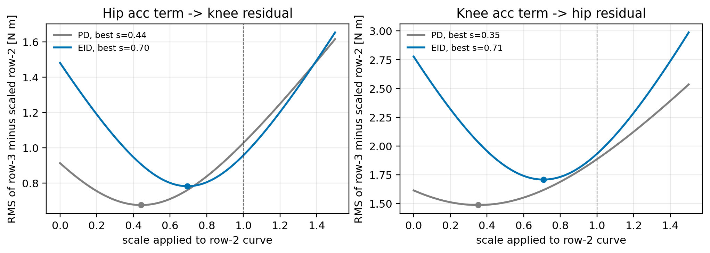
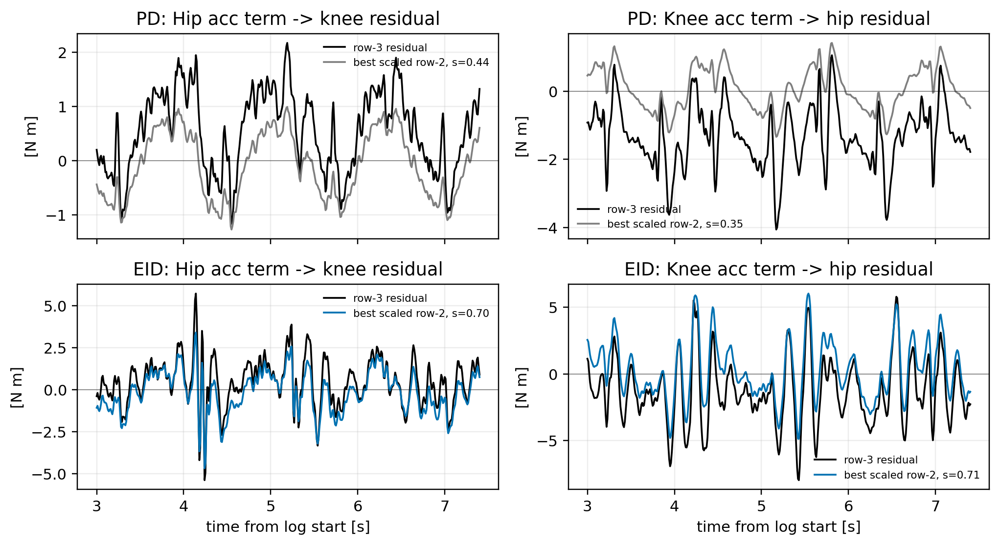

# 图上第 2 行数据缩放解释第 3 行残差报告

## 结论

本报告只做图上已有数据的曲线缩放，不改变实验轨迹，不重新运行 MuJoCo，也不改变 MuJoCo 输入。操作就是：把图中的第 2 行曲线乘上一个系数 $s$，再从第 3 行总残差中扣掉它，看剩下的残差能降到多小。

这就是老师说的“在图上把第 2 行数据乘个倍数”的口径。

结论是：第 2 行确实能解释第 3 行残差中的主要振荡成分，尤其在 EID 轨迹下更明显。但最优系数不是继续超过原始第 2 行，而是大约取原始第 2 行的 `70%`。

| 方向 | 方法 | 最优系数 $s^*$ | 第 3 行原始 RMS | 扣除后剩余 RMS | RMS 降低 | 平方意义下解释比例 |
| --- | --- | ---: | ---: | ---: | ---: | ---: |
| 髋加速度折合项 -> 膝通道总残差 | EID | `0.695` | `1.481 N·m` | `0.782 N·m` | `47.2%` | `72.1%` |
| 膝加速度折合项 -> 髋通道总残差 | EID | `0.708` | `2.778 N·m` | `1.708 N·m` | `38.5%` | `62.2%` |
| 髋加速度折合项 -> 膝通道总残差 | PD | `0.443` | `0.913 N·m` | `0.676 N·m` | `26.0%` | `45.2%` |
| 膝加速度折合项 -> 髋通道总残差 | PD | `0.352` | `1.614 N·m` | `1.486 N·m` | `7.9%` | `15.2%` |

这里的 $s^*=0.695$ 可以这样读：对 EID 的“髋加速度折合项 -> 膝通道总残差”来说，把第 2 行取为原幅值的 `69.5%` 后，最能解释第 3 行。扣掉这一项后，第 3 行残差 RMS 从 `1.481 N·m` 降到 `0.782 N·m`。

如果把“放大第 2 行”理解为“从 0 开始逐步增加第 2 行的权重”，那么 EID 的最优点约为 `0.70` 倍原第 2 行。如果理解为“在原图第 2 行的基础上继续超过 100%”，那么不会让剩余残差更小，因为最优点已经位于 $s<1$。

## 这个操作的目的

第 3 行是总残差，里面混合了多种来源：对方关节加速度耦合、速度相关项、重力/构型差异、自身惯量近似误差和其他剩余项。

第 2 行只表示其中一类来源：对方关节加速度折合到本关节通道的力矩。

因此，这个缩放试验的目的不是做控制补偿，也不是让机器人真实残差变小，而是检验：

$$
\text{第 3 行总残差}
\approx
s \times \text{第 2 行加速度折合项}
+ \text{剩余项}.
$$

如果某个 $s$ 能让剩余项明显变小，说明第 2 行确实解释了第 3 行中的主要形状。如果扣除后仍然剩很多，说明第 3 行里还有其他来源。

## 计算定义

记第 2 行为：

$$
x(t)=d_i^{acc}(t),
$$

记第 3 行为：

$$
y(t)=d_i^{total}(t).
$$

对给定缩放系数 $s$，扣除第 2 行后的剩余残差为：

$$
e_s(t)=y(t)-s x(t).
$$

选择 $s$ 使 $e_s(t)$ 的 RMS 最小：

$$
s^*=
\arg\min_s
\operatorname{RMS}\left(y(t)-s x(t)\right).
$$

不加额外常值偏置时，最优系数有闭式解：

$$
s^*
=
\frac{\sum_t x(t)y(t)}
{\sum_t x^2(t)}.
$$

这里不加常值偏置，是为了只检验第 2 行这条曲线本身能解释多少第 3 行，而不把平均偏差也混进来。

本报告采用原图的均值曲线口径：先把每次重复试验插值到统一时间轴，再对同一方法下的重复曲线取均值，最后在稳态窗口

```text
3.0 <= t_rel < 7.4 s
```

内计算 $s^*$ 和 RMS。

## 倍率扫描结果

下图横轴是施加在第 2 行上的缩放系数 $s$，纵轴是扣除后的剩余残差 RMS：

$$
\operatorname{RMS}\left(y(t)-s x(t)\right).
$$

虚线 $s=1$ 表示使用原始第 2 行幅值。曲线最低点表示最优缩放系数。



图中可以看到，EID 的两个最优点分别在 `0.70` 和 `0.71` 附近。也就是说，第 2 行的形状与第 3 行高度相关，但原始第 2 行的幅值略偏大；继续把它放到超过 $s=1$ 会让扣除后的残差重新变大。

## 最优缩放后的曲线对比

下图把第 3 行总残差和 $s^*$ 倍第 2 行叠在一起。黑线是第 3 行，彩色线是最优缩放后的第 2 行。



EID 下，两条曲线在主要振荡位置上能够对上，说明第 2 行确实抓住了第 3 行的主要动态形状。对 PD 来说，髋到膝方向还能解释一部分，膝到髋方向解释能力较弱，说明该方向的第 3 行残差中其他成分占得更多。

## 结果解释

这个结果支持一个更清楚的说法：

第 2 行不是“额外施加的扰动”，而是第 3 行总残差中的一个主要物理来源。通过数据层面的最优缩放，可以量化它对第 3 行的解释能力。

对 EID 轨迹而言：

- 髋加速度折合项可以把膝通道总残差的 RMS 从 `1.481 N·m` 降到 `0.782 N·m`；
- 膝加速度折合项可以把髋通道总残差的 RMS 从 `2.778 N·m` 降到 `1.708 N·m`；
- 平方意义下，第 2 行分别解释了约 `72.1%` 和 `62.2%` 的第 3 行波动。

因此，报告中可以说：第 3 行残差的主要振荡成分，与对方关节加速度折合项高度一致；但第 3 行并不等于第 2 行，剩余部分仍包含局部单关节模型没有解释的其他动力学项。

## 输出文件

本次分析脚本：

```text
scripts/analyze_row2_data_projection.py
```

输出文件：

```text
analysis_artifacts/hip_knee_mutual_coupling/row2_data_projection_summary.csv
analysis_artifacts/hip_knee_mutual_coupling/row2_data_projection_curves.csv
analysis_artifacts/hip_knee_mutual_coupling/figures/row2_data_projection_gain_scan.png
analysis_artifacts/hip_knee_mutual_coupling/figures/row2_data_projection_gain_scan.pdf
analysis_artifacts/hip_knee_mutual_coupling/figures/row2_data_projection_overlay.png
analysis_artifacts/hip_knee_mutual_coupling/figures/row2_data_projection_overlay.pdf
```
