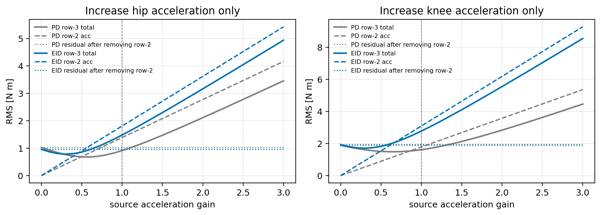
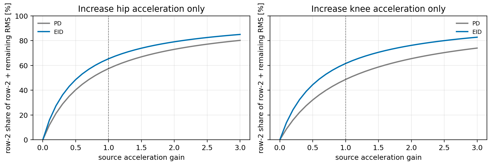

# 只加大来源关节加速度时，第 2 行占比和第 3 行残差如何变化

## 结论

这次检验的不是放大整段运动轨迹，也不是把第 2 行曲线做后处理缩放，而是只加大“来源关节”的角加速度。

也就是说：

- 髋给膝时，只把右髋 pitch 的 $\ddot q_h$ 乘以倍率 $\gamma$；
- 膝给髋时，只把右膝 pitch 的 $\ddot q_k$ 乘以倍率 $\gamma$；
- $q$ 和 $\dot q$ 保持不变，目标关节的运动也保持不变。

结果可以分成两句话：

第一，来源关节加速度越大，第 2 行表示的“对方关节加速度折合力矩”确实越大，它在分量 RMS 中的占比也会升高。

第二，第 3 行总残差不会因此变小。相反，在原始加速度倍率 $\gamma=1$ 之后继续增大加速度，第 3 行总残差 RMS 会继续增大。

所以，老师这个思路中“传递力占比会变大”是对的；但“因此第 3 行总残差会更小”不成立。更准确的说法是：加速度越大，残差越主要由关节间加速度传递力解释，但残差本身并不会被这个传递力抵消掉。

## 为什么会这样

把第 3 行总残差拆成两部分看：

$$
d_i^{total}(t)
=
d_i^{acc}(t)
+
d_i^{other}(t).
$$

其中 $d_i^{acc}(t)$ 是第 2 行，也就是对方关节加速度折合到本关节通道的力矩；$d_i^{other}(t)$ 是第 3 行里剩下的部分，包括配置/重力差异、自身惯量近似误差、速度相关项和其他剩余项。

如果只把来源关节加速度放大 $\gamma$ 倍，那么第 2 行会变成：

$$
d_i^{acc,\gamma}(t)
=
\gamma d_i^{acc}(t).
$$

第 3 行则变成：

$$
d_i^{total,\gamma}(t)
=
\gamma d_i^{acc}(t)
+
d_i^{other}(t).
$$

因此，放大加速度会把传递力本身做大，也会把包含这项传递力的总残差一起做大。除非 $\gamma d_i^{acc}(t)$ 正好和 $d_i^{other}(t)$ 反向抵消，否则第 3 行不会因为第 2 行变大而变小。

在当前数据里，原始点 $\gamma=1$ 已经在总残差最小点的右侧。若不限制 $\gamma$ 必须大于 1，使第 3 行 RMS 最小的加速度倍率反而小于 1：

| 方向 | 方法 | 使第 3 行 RMS 最小的 $\gamma$ | 若只允许从原始加速度继续增大 |
| --- | --- | ---: | ---: |
| 髋加速度折合项 -> 膝通道总残差 | EID | `0.305` | 最小点是 `1.000` |
| 膝加速度折合项 -> 髋通道总残差 | EID | `0.292` | 最小点是 `1.000` |
| 髋加速度折合项 -> 膝通道总残差 | PD | `0.557` | 最小点是 `1.000` |
| 膝加速度折合项 -> 髋通道总残差 | PD | `0.648` | 最小点是 `1.000` |

这说明：如果从当前实验点继续加大来源关节加速度，不会得到更小的第 3 行总残差。

## 计算口径

本报告使用已有 MuJoCo 逆动力学分解结果。由于逆动力学对关节加速度是线性的，在 $q$ 和 $\dot q$ 不变时，来源关节加速度乘以 $\gamma$ 后，第 2 行加速度折合项也随之乘以 $\gamma$。因此可以直接在已有分解结果上做精确扫描。

稳态窗口为：

```text
3.0 <= t_rel < 7.4 s
```

采用原图的均值曲线口径：先把每次重复试验插值到统一时间轴，再对同一方法下的重复曲线取均值，最后计算 RMS。

## RMS 变化

下图中：

- 虚线表示第 2 行加速度折合力矩 RMS；
- 实线表示第 3 行总残差 RMS；
- 点线表示从第 3 行里扣除第 2 行后剩下的部分。



可以看到，随着加速度倍率 $\gamma$ 增大，第 2 行变大，第 3 行也变大；扣除第 2 行后的剩余部分基本不变。

原始倍率 $\gamma=1$ 与加速度放大到 $\gamma=2$ 的对比如下：

| 方向 | 方法 | $\gamma$ | 第 2 行 RMS | 第 3 行总残差 RMS | 扣除第 2 行后的剩余 RMS |
| --- | --- | ---: | ---: | ---: | ---: |
| 髋加速度折合项 -> 膝通道总残差 | EID | `1` | `1.809 N·m` | `1.481 N·m` | `0.957 N·m` |
| 髋加速度折合项 -> 膝通道总残差 | EID | `2` | `3.618 N·m` | `3.165 N·m` | `0.957 N·m` |
| 膝加速度折合项 -> 髋通道总残差 | EID | `1` | `3.094 N·m` | `2.778 N·m` | `1.932 N·m` |
| 膝加速度折合项 -> 髋通道总残差 | EID | `2` | `6.189 N·m` | `5.554 N·m` | `1.932 N·m` |
| 髋加速度折合项 -> 膝通道总残差 | PD | `1` | `1.388 N·m` | `0.913 N·m` | `1.027 N·m` |
| 髋加速度折合项 -> 膝通道总残差 | PD | `2` | `2.775 N·m` | `2.113 N·m` | `1.027 N·m` |
| 膝加速度折合项 -> 髋通道总残差 | PD | `1` | `1.789 N·m` | `1.614 N·m` | `1.885 N·m` |
| 膝加速度折合项 -> 髋通道总残差 | PD | `2` | `3.577 N·m` | `2.838 N·m` | `1.885 N·m` |

这个表很关键：加速度放大 2 倍后，第 2 行约放大 2 倍；第 3 行总残差也明显变大；但扣除第 2 行后的剩余项没有变。

## 占比变化

下图显示第 2 行在“第 2 行 RMS + 扣除第 2 行后的剩余 RMS”中的占比：



这个占比会随着 $\gamma$ 增大而上升。例如 EID 下：

| 方向 | $\gamma=1$ 时第 2 行占比 | $\gamma=2$ 时第 2 行占比 | $\gamma=3$ 时第 2 行占比 |
| --- | ---: | ---: | ---: |
| 髋加速度折合项 -> 膝通道总残差 | `65.4%` | `79.1%` | `85.0%` |
| 膝加速度折合项 -> 髋通道总残差 | `61.6%` | `76.2%` | `82.8%` |

因此，“加大加速度会让两个关节间传递力的占比变大”这个判断是成立的。

但这个占比变大，并不等于第 3 行总残差变小。它表示的是：总残差越来越主要由第 2 行这个加速度传递项构成；不是说总残差被消掉了。

## 可以怎么写进正文

可以把这件事表述为：

在数据层面只增大来源关节加速度时，对方关节加速度折合项随倍率近似线性增大，其 RMS 占比明显提高。这说明关节间加速度传递力确实是总残差中的主导动态来源。然而，第 3 行总残差并不会因此降低；在原始实验点之后继续增大加速度，完整动力学中的总残差也随之增大。换言之，加速度放大会增强耦合扰动的主导性，但不会把局部单关节模型的总残差消除。

## 输出文件

脚本：

```text
scripts/analyze_source_acceleration_gain.py
```

结果文件：

```text
analysis_artifacts/hip_knee_mutual_coupling/source_acceleration_gain_summary.csv
analysis_artifacts/hip_knee_mutual_coupling/source_acceleration_gain_best.csv
analysis_artifacts/hip_knee_mutual_coupling/figures/source_acceleration_gain_rms.png
analysis_artifacts/hip_knee_mutual_coupling/figures/source_acceleration_gain_rms.pdf
analysis_artifacts/hip_knee_mutual_coupling/figures/source_acceleration_gain_share.png
analysis_artifacts/hip_knee_mutual_coupling/figures/source_acceleration_gain_share.pdf
```
