# H1 右髋-右膝输入域 EID 与 Preview-MPC 第一轮实物实验报告

实验日期：2026-06-23  
实验对象：Unitree H1 右髋俯仰关节与右膝关节  
实验阶段：第一轮悬挂或机械保护条件下的低风险实物验证

## 摘要

本轮实验围绕四个问题展开：输入域 EID 在无扰动条件下是否安全有效，输入域 EID 在扰动条件下是否降低相对 PD 的误差，Preview-MPC 是否能降低参考激励和力矩变化量，以及 EID 的观测器增益 $K_o$ 与输入补偿强度 $K_u$ 在无扰动和软件扰动条件下的稳定可用区间。

结果显示，输入域 EID 在 P1 无扰动实验中降低髋、膝和协调误差，且未观察到批量运行失败；在 P2-H 髋人工扰动实验中，EID 的全稳态误差也低于 PD。补充的 P2D 双关节软件力矩扰动实验给出了明确扰动窗口：在 $[+6,-4]\ \mathrm{N\cdot m}$ 平滑力矩脉冲下，EID 将髋窗口 RMSE 降低 18.2%，协调窗口 RMSE 降低 6.1%，但膝窗口 RMSE 上升 10.0%，且力矩活动增加。Preview-MPC 2 点参考在 P3 中将参考加速度 RMS 降低约 93.5%，参考 jerk RMS 降低约 98.8%，同时降低力矩变化量。P4D 带软件扰动扫描显示，O0 在扰动开始后无法覆盖完整扰动窗口，O4/O5 均能稳定完成；增大 $K_o$ 能降低扰动窗口误差，而增大 $K_u$ 几乎不改善窗口 RMSE，只放大 EID 补偿量。

本轮最主要的限制是：P2-H 的人工扰动没有记录开始/结束时间；P2D/P4D 虽然补齐了可复现的软件扰动窗口，但该扰动是在命令侧叠加的力矩偏置，不等价于外部物理接触力。因此，本文可以支持“输入端等效扰动”的实物结论，物理外扰抗扰结论仍需后续用弹簧秤、绑带或其他可测外力方式补充。

## 1. 实验目的

第一轮实物实验只回答以下四个工程问题。

| 编号 | 问题 | 对应实验 | 本轮回答状态 |
|---|---|---|---|
| Q1 | 输入域 EID 在无扰动低幅髋膝运动中是否没有明显副作用 | P1 | 已回答 |
| Q2 | 输入域 EID 在扰动下是否降低误差，且不增加髋膝协调误差 | P2-H、P2D | 已补充软件扰动窗口；物理外扰仍需补充 |
| Q3 | Preview-MPC 是否降低参考加速度、参考 jerk 或力矩变化量，同时不破坏跟踪 | P3 | 已回答 |
| Q4 | $K_o$ 与 $K_u$ 如何影响 EID 稳定性、误差和力矩代价 | P4、P4D | 已回答无扰动和软件扰动部分 |

## 2. 控制算法概述

本节给出当前实验所使用控制器的核心结构，便于读者理解后续参数和指标。完整递推关系见《控制算法说明》，本文只保留与实验结论直接相关的部分。

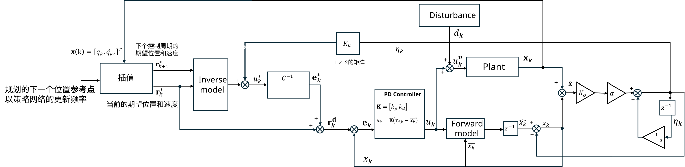

**图 1.** 输入域 EID 控制算法框图。参考生成器提供当前控制周期和下一控制周期的参考位置、参考速度；解析逆模型给出标称前馈力矩；EID 估计通道根据实测状态与标称预测状态之间的偏差形成输入端补偿；最终控制力矩作用于机器人关节，并通过实测状态闭环更新估计量。

### 2.1 参考生成与最终参考

实验中的轨迹首先由正弦策略参考产生。该原始策略参考只描述理想运动目标，不一定直接作为电机每个控制周期的最终参考。控制器还会经过插值、Preview-MPC 或启动混入处理，得到最终参考。

时序图中三条曲线的含义如下。

| 曲线 | 含义 | 在图中的样式 |
|---|---|---|
| 原始策略参考 | 由正弦策略直接生成的理想位置和速度 | 黑色点线 |
| 最终参考 | 控制器实际使用的参考，包含插值、Preview-MPC 和启动混入 | 蓝色虚线 |
| 实测状态 | 机器人关节反馈的位置和速度 | 橙色实线 |

启动混入用于避免控制开始瞬间从当前关节角直接跳到正弦轨迹位置。本轮实验的启动混入时间为 3.0 s，因此时序图前 3 s 中，最终参考会从实测初始状态平滑接入原始策略参考。

### 2.2 输入域 EID 控制律核心

对每个关节，控制器维护一个标称预测状态和一个 EID 估计量。标称预测状态来自单关节动力学模型，EID 估计量用于描述真实系统相对标称模型的等效偏差。两者相加后得到中心反馈状态。

核心关系可写为：

$$
\bar{x}_k=\hat{x}_k+\eta_k
$$

其中，$\hat{x}_k$ 为标称预测状态，$\eta_k$ 为 EID 估计量，$\bar{x}_k$ 为中心反馈状态。

EID 估计量通过 $K_u$ 映射成输入端力矩补偿：

$$
\eta_{u,k}=k_{u,q}\eta_{q,k}+k_{u,\dot q}\eta_{\dot q,k}
$$

解析逆模型先根据当前参考和下一步参考计算标称前馈力矩 $u_k^\star$。输入域 EID 再从前馈力矩中扣除估计到的等效输入偏差：

$$
u_{k,\mathrm{ff}}=u_k^\star-\eta_{u,k}
$$

随后，控制器将修正后的前馈力矩转换为等效目标状态，并围绕中心反馈状态进行 PD 型反馈，得到最终命令力矩。$K_o$ 决定 EID 估计量对状态偏差的响应强度；$K_u$ 决定估计量映射到输入补偿力矩的强度。

因此，$K_o$ 更接近“估计器增益”，$K_u$ 更接近“补偿强度”。$K_o$ 过小会导致估计通道不足，$K_o$ 或 $K_u$ 过大则可能增加力矩活动、噪声敏感性或高频成分。

## 3. 实验设置与参数

### 3.1 关节与执行条件

本轮只启用两个下肢关节。所有实验均应理解为悬挂或机械保护条件下的台架实验，而不是自由站立实验。

| 关节 | joint id | 角色 | 主要观察量 |
|---|---:|---|---|
| RightHipPitch | 1 | 髋俯仰跟踪；P2-H 扰动对象 | 髋误差、髋力矩、协调误差 |
| RightKnee | 2 | 膝关节跟踪；非受扰通道观察 | 膝误差、膝力矩、协调误差 |

### 3.2 通用控制与安全参数

| 符号 | 含义 | 代码符号 | 本轮取值 |
|---|---|---|---:|
| $T_s$ | 控制周期 | `control_dt` | 0.002 s |
| $T_p$ | 策略参考采样周期 | `policy_dt` | 0.05 s |
| $t_\mathrm{blend}$ | 启动参考混入时间 | `startup_blend_duration_s` | 3.0 s |
| $\tau_{\max}$ | 命令力矩限幅 | `tau_limit` | 100 N·m |
| $\dot{\tau}_{\max}$ | EID 力矩变化率限制 | `tau_slew_rate` | 100 N·m/s |
| $\dot q_\mathrm{trip}$ | 实测速度硬停阈值 | `measured_speed_trip` | 6.0 rad/s |
| $k_{p,\mathrm{hold}}$ | safe-hold 位置增益 | `safe_hold.kp` | 6.0 |
| $k_{d,\mathrm{hold}}$ | safe-hold 速度增益 | `safe_hold.kd` | 1.0 |

### 3.3 关节模型与限幅参数

| 符号 | 含义 | 代码符号 | RightHipPitch，ID 1 | RightKnee，ID 2 |
|---|---|---|---:|---:|
| $J_\mathrm{eff}$ | 等效惯量 | `plant.Jeff` | 1.00508532 | 0.2501484 |
| $b$ | 阻尼系数 | `plant.b` | 1.0 | 1.0 |
| $A$ | 重力项 $\sin q$ 系数 | `plant.gravityA` | 15.7100627 | 4.14117407 |
| $B$ | 重力项 $\cos q$ 系数 | `plant.gravityB` | 2.79723089 | -2.09365203 |
| $\tau_0$ | 常值力矩偏置 | `plant.tau0` | 0.0 | 0.0 |
| $q_{\min}$ | 位置下界 | `joint_limits.q_min` | -3.14 rad | -0.26 rad |
| $q_{\max}$ | 位置上界 | `joint_limits.q_max` | 2.53 rad | 2.05 rad |
| $\dot q_{\max}$ | 速度上界 | `joint_limits.dq_max` | 23 rad/s | 14 rad/s |
| $\tau_{\max}$ | 实际命令力矩限幅 | `joint_limits.tau_max` | 100 N·m | 100 N·m |
| $\tau_{\max,\mathrm{plant}}$ | 模型力矩上界 | `plant.tau_max` | 200 N·m | 300 N·m |

### 3.4 控制器参数

PD 与 EID 的反馈增益均使用 $k_p=120.0$、$k_d=5.0$。PD 通过电机位置模式下发参考位置、参考速度和电机侧 $k_p/k_d$；EID 通过输入域补偿计算命令力矩。因此，力矩代价比较优先使用执行器反馈或估计力矩 $\tau_\mathrm{est}$，而不是 `tau_cmd`。

| 符号 | 含义 | 代码符号 | 基准值 |
|---|---|---|---:|
| $k_p$ | 位置反馈增益 | `kp` | 120.0 |
| $k_d$ | 速度反馈增益 | `kd` | 5.0 |
| $k_{o,q}$ | EID 位置观测器增益 | `observer_gain_q` | 0.8 |
| $k_{o,\dot q}$ | EID 速度观测器增益 | `observer_gain_dq` | 0.2 |
| $k_{u,q}$ | EID 位置输入补偿增益 | `ku_q` | 12.0 |
| $k_{u,\dot q}$ | EID 速度输入补偿增益 | `ku_dq` | 1.0 |
| $\alpha$ | EID 估计低通滤波系数 | `filter_alpha` | 0.85 |

P4 使用相对缩放扫描 $K_o$ 与 $K_u$。

| 扫描 | 组别 | $K_o$ 缩放 | $K_u$ 缩放 | $k_{o,q}$ | $k_{o,\dot q}$ | $k_{u,q}$ | $k_{u,\dot q}$ |
|---|---|---:|---:|---:|---:|---:|---:|
| $K_o$ | O0 | 0.00 | 1.00 | 0.0 | 0.00 | 12.0 | 1.00 |
| $K_o$ | O1 | 0.25 | 1.00 | 0.2 | 0.05 | 12.0 | 1.00 |
| $K_o$ | O2 | 0.50 | 1.00 | 0.4 | 0.10 | 12.0 | 1.00 |
| $K_o$ | O3 | 0.75 | 1.00 | 0.6 | 0.15 | 12.0 | 1.00 |
| $K_o$ | O4 | 1.00 | 1.00 | 0.8 | 0.20 | 12.0 | 1.00 |
| $K_o$ | O5 | 1.25 | 1.00 | 1.0 | 0.25 | 12.0 | 1.00 |
| $K_u$ | U1 | 1.00 | 0.50 | 0.8 | 0.20 | 6.0 | 0.50 |
| $K_u$ | U2 | 1.00 | 0.75 | 0.8 | 0.20 | 9.0 | 0.75 |
| $K_u$ | U3 | 1.00 | 1.00 | 0.8 | 0.20 | 12.0 | 1.00 |
| $K_u$ | U4 | 1.00 | 1.25 | 0.8 | 0.20 | 15.0 | 1.25 |

### 3.5 参考轨迹与实验矩阵

| 实验 | 控制方案 | 相位关系 | 频率 Hz | 髋中心/幅值 rad | 膝中心/幅值 rad | 扰动 | 重复次数 |
|---|---|---|---:|---:|---:|---|---:|
| P1 | PD vs EID | 同相 | 0.86112 | -0.300 / 0.1859 | 0.500 / 0.232375 | 无 | 每组 5 |
| P2-H | PD vs EID | 反相 | 0.80000 | -0.300 / 0.22308 | 0.500 / 0.278850 | 髋人工扰动 | 每组 5 |
| P2D | PD vs EID | 反相 | 0.80000 | -0.300 / 0.22308 | 0.500 / 0.278850 | 双关节软件力矩扰动 | 每组 5 |
| P3 | quintic vs preview2，PD | 同相 | 0.80000 | -0.300 / 0.1859 | 0.500 / 0.232375 | 无 | 每组 2 |
| P4 $K_o$ | EID | 反相 | 0.80000 | -0.300 / 0.22308 | 0.500 / 0.278850 | 无 | 每组 3 |
| P4 $K_u$ | EID | 反相 | 0.80000 | -0.300 / 0.22308 | 0.500 / 0.278850 | 无 | 每组 3 |
| P4D $K_o$ | EID | 反相 | 0.80000 | -0.300 / 0.22308 | 0.500 / 0.278850 | 双关节软件力矩扰动 | 每组 3 |
| P4D $K_u$ | EID | 反相 | 0.80000 | -0.300 / 0.22308 | 0.500 / 0.278850 | 双关节软件力矩扰动 | 每组 3 |

P3 中 quintic 指零速五次样条参考，preview2 指 2 点 Preview-MPC 参考生成。P2-H 中人工扰动只记录了扰动对象和方式，未记录扰动开始/结束时间。

P2D 和 P4D 使用同一个可复现软件力矩扰动。扰动在控制器输出后、最终安全限幅前叠加到命令力矩中：

$$
\tau_d(t)=s(t)
\begin{bmatrix}
+6\\
-4
\end{bmatrix}
\ \mathrm{N\cdot m}
$$

其中第一项对应 RightHipPitch，第二项对应 RightKnee。$s(t)$ 为 half-cosine 平滑矩形窗，$4.0$--$4.2\ \mathrm{s}$ 平滑上升，$4.2$--$5.2\ \mathrm{s}$ 保持，$5.2$--$5.4\ \mathrm{s}$ 平滑下降。该扰动用于验证输入端等效扰动抑制，不等同于外部物理接触力。

## 4. 概念与指标定义

为使结果表和图可以独立阅读，本节先定义报告中反复出现的概念。

| 概念 | 定义 |
|---|---|
| $q$ | 关节位置，单位为 rad |
| $\dot q$ | 关节速度，单位为 rad/s |
| 参考 | 控制器希望关节达到的位置和速度 |
| 原始策略参考 | 由正弦策略直接计算得到的理想参考 |
| 最终参考 | 经过插值、Preview-MPC 和启动混入后，控制器实际使用的参考 |
| 实测状态 | 机器人反馈的真实关节位置和速度 |
| PD | 位置-速度反馈控制，使用电机位置模式下发参考位置、参考速度和反馈增益 |
| 输入域 EID | 在控制输入端补偿等效扰动的控制方法，本轮只使用逐关节解耦输入补偿 |
| Preview-MPC | 利用未来参考点生成更平滑参考的预览式参考生成方法 |
| $K_o$ | EID 观测器增益，决定估计量对状态偏差的响应强度 |
| $K_u$ | EID 输入补偿强度，决定估计量转换为补偿力矩的强度 |
| P2-H | P2 中髋关节受到人工轻扰动的子工况 |
| P2D | P2 的软件扰动补充实验，髋膝同时叠加平滑力矩脉冲 |
| P4D | P4 的软件扰动补充扫描，使用与 P2D 相同的力矩脉冲 |
| 无扰动扫描 | 不施加外部扰动，只观察参数变化对跟踪、力矩和稳定性的影响 |
| 软件力矩扰动 | 在命令侧叠加的等效输入扰动，用于提高扰动时间窗和幅值的可复现性 |

RMSE 是均方根误差，用于描述一段时间内误差的平均大小。RMSE 越小，表示该指标越接近参考目标。其计算方式为：

$$
\mathrm{RMSE}=\sqrt{\frac{1}{N}\sum_{i=1}^{N}e(t_i)^2}
$$

单关节跟踪误差表示某个关节的最终参考与实测状态之间的差：

$$
e_j(t)=q_{\mathrm{ref},j}(t)-q_j(t)
$$

协调误差用于描述髋膝相对运动是否保持正确。它不只看单个关节是否跟准，而是看“膝相对髋”的实际角度是否等于“膝相对髋”的参考角度：

$$
e_{\mathrm{coord}}(t)=
\left[q_{\mathrm{knee}}(t)-q_{\mathrm{hip}}(t)\right]
-
\left[q_{\mathrm{ref},\mathrm{knee}}(t)-q_{\mathrm{ref},\mathrm{hip}}(t)\right]
$$

协调 RMSE 就是对 $e_{\mathrm{coord}}(t)$ 计算 RMSE。它用于判断两个关节之间的相对节奏、相位和姿态关系是否被控制器破坏。

力矩相关指标包括 $\tau_\mathrm{est}$ RMS 和 $\Delta \tau_\mathrm{est}$ RMS。$\tau_\mathrm{est}$ 是执行器反馈或估计到的关节力矩，$\tau_\mathrm{est}$ RMS 表示平均力矩负担；$\Delta \tau_\mathrm{est}$ RMS 表示相邻采样点之间力矩变化量的均方根，反映力矩输入是否更粗糙、更活跃。

参考加速度 RMS 和参考 jerk RMS 用于评价参考轨迹平滑性。加速度是速度变化率，jerk 是加速度变化率。二者越小，通常表示参考轨迹越平滑，对执行器的高频激励越少。

## 5. 数据处理方法

所有定量结果均使用实验开始后 $t_\mathrm{rel}\ge 3.0\ \mathrm{s}$ 的稳态段，避开启动混入阶段。每个表格中的数值为重复实验的均值；图中的误差线表示重复实验标准差。

P2D 和 P4D 另计算扰动窗口指标。完整扰动窗口定义为 $4.0\le t_\mathrm{rel}<5.4\ \mathrm{s}$，其中 $4.2$--$5.2\ \mathrm{s}$ 为恒定扰动平台段，$5.4$--$7.4\ \mathrm{s}$ 作为恢复观察段。若某次日志没有覆盖完整扰动窗口，该次不用于完整窗口均值，并在结果表中单独标注完整次数。

代表性时序图均从实验开始时刻绘制，即横轴使用 $t_\mathrm{rel}=t-t_0$。时序图中，黑色点线表示原始策略参考，蓝色虚线表示最终参考，橙色实线表示实测状态。

主要指标如下。

| 指标 | 单位 | 用途 |
|---|---|---|
| 髋/膝 RMSE | rad | 单关节跟踪精度 |
| 协调误差 RMSE | rad | 髋膝相对运动是否被破坏 |
| $\tau_\mathrm{est}$ RMS | N·m | 执行器负担 |
| $\Delta \tau_\mathrm{est}$ RMS | N·m/sample | 力矩粗糙度或输入变化强度 |
| 参考加速度 RMS | rad/s² | P3 参考平滑性 |
| 参考 jerk RMS | rad/s³ | P3 高阶参考激励 |

## 6. 结果

### 6.1 P1/P2-H：输入域 EID 的跟踪收益

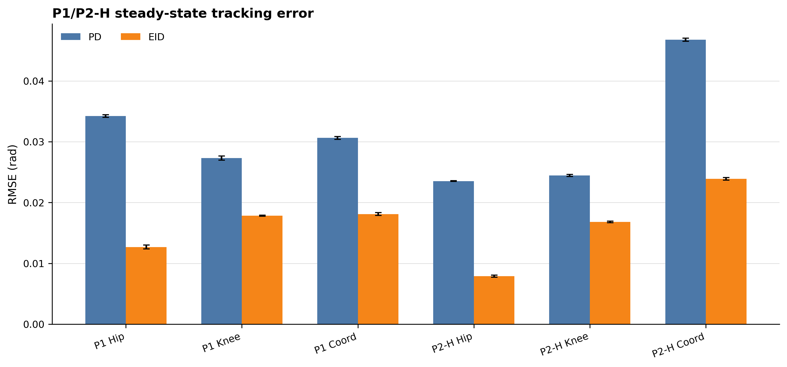

**图 2.** P1 无扰动与 P2-H 髋人工扰动实验的稳态 RMSE 对比。EID 在两个实验中均降低髋、膝和协调误差。

| 实验 | 指标 | PD | EID | EID 相对变化 |
|---|---|---:|---:|---:|
| P1 | 髋 RMSE rad | 0.0342 | 0.0127 | -62.9% |
| P1 | 膝 RMSE rad | 0.0273 | 0.0178 | -34.7% |
| P1 | 协调 RMSE rad | 0.0306 | 0.0181 | -40.9% |
| P2-H | 髋 RMSE rad | 0.0235 | 0.0079 | -66.4% |
| P2-H | 膝 RMSE rad | 0.0244 | 0.0168 | -31.2% |
| P2-H | 协调 RMSE rad | 0.0468 | 0.0239 | -48.9% |

P1 结果支持输入域 EID 通过无扰动门槛验证：在没有外扰时，EID 没有引入更大的跟踪误差或协调误差，且各项 RMSE 均低于 PD。P2-H 的全稳态统计也显示 EID 的误差低于 PD，说明在髋人工扰动实验中，EID 没有使非受扰膝关节误差增加。

但是，P2-H 不能直接写成严格的扰动窗口抗扰结论。由于人工推的开始/结束时间没有进入日志，本轮只能报告全稳态段指标，不能计算受扰窗口 RMSE、峰值误差或恢复时间。

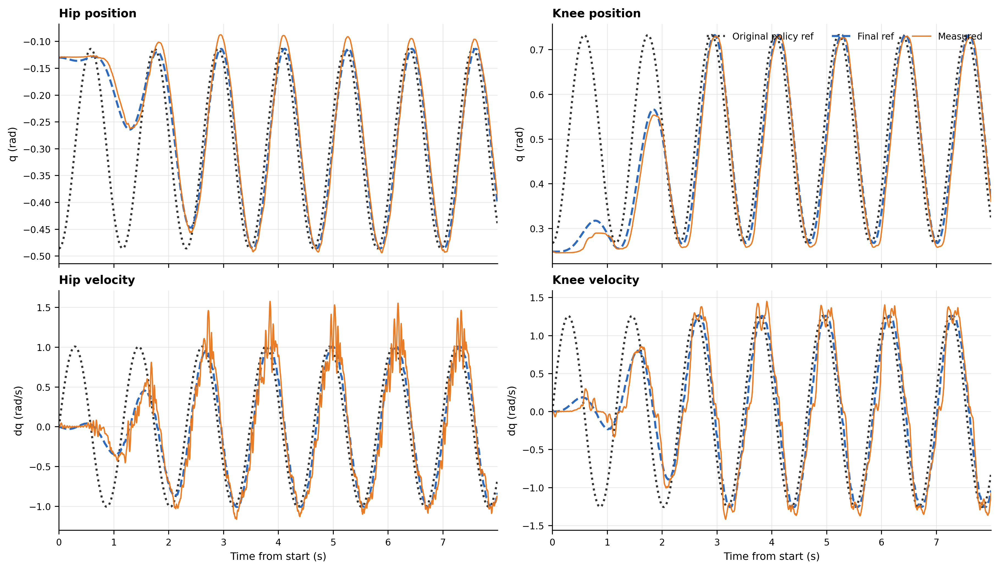

**图 3.** P1 输入域 EID 代表性时序，重复 r01。位置和速度均从 0 s 开始绘制，可见启动混入阶段最终参考逐步接入原始策略参考；稳态段中实测状态跟随最终参考。

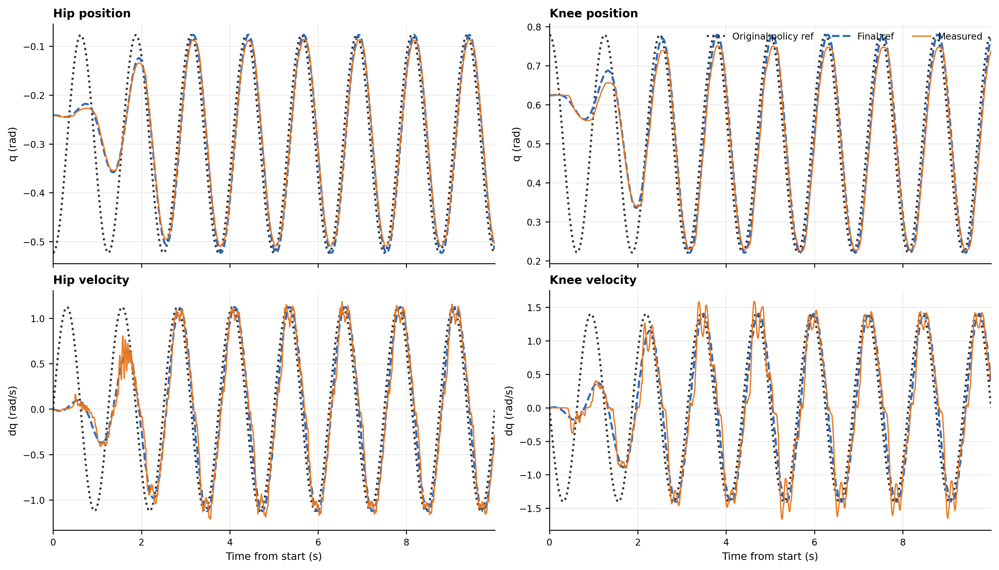

**图 4.** P2-H 输入域 EID 代表性时序，重复 r01。该图展示髋人工扰动实验中的位置和速度跟踪，但由于人工扰动窗口未记录，图中不标注扰动区间。

### 6.2 P1/P2-H：输入域 EID 的力矩代价

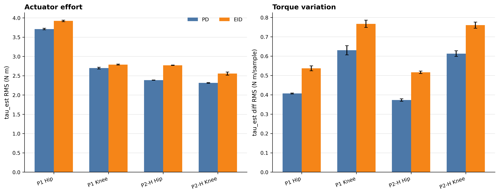

**图 5.** P1/P2-H 的 $\tau_\mathrm{est}$ RMS 与 $\Delta \tau_\mathrm{est}$ RMS 对比。EID 的跟踪收益伴随更高的力矩变化量。

| 实验 | 指标 | PD | EID | EID 相对变化 |
|---|---|---:|---:|---:|
| P1 | 髋 $\tau_\mathrm{est}$ RMS N·m | 3.7098 | 3.9202 | +5.7% |
| P1 | 膝 $\tau_\mathrm{est}$ RMS N·m | 2.6972 | 2.7873 | +3.3% |
| P1 | 髋 $\Delta \tau_\mathrm{est}$ RMS | 0.4067 | 0.5370 | +32.0% |
| P1 | 膝 $\Delta \tau_\mathrm{est}$ RMS | 0.6302 | 0.7669 | +21.7% |
| P2-H | 髋 $\tau_\mathrm{est}$ RMS N·m | 2.3849 | 2.7706 | +16.2% |
| P2-H | 膝 $\tau_\mathrm{est}$ RMS N·m | 2.3128 | 2.5547 | +10.5% |
| P2-H | 髋 $\Delta \tau_\mathrm{est}$ RMS | 0.3728 | 0.5164 | +38.5% |
| P2-H | 膝 $\Delta \tau_\mathrm{est}$ RMS | 0.6130 | 0.7603 | +24.0% |

EID 的主要代价不是平均力矩 RMS 大幅上升，而是力矩变化量上升。该现象与输入域补偿的控制作用一致：补偿通道降低跟踪误差的同时，也增加了力矩变化量。该结果将力矩频谱和 EID 内部补偿量 $\eta_u$ 确定为后续扩大工况前需要同步报告的诊断指标。

### 6.3 P2D：双关节软件力矩扰动

P2D 使用与 P2-H 相同的反相髋膝轨迹，但将扰动改为可复现的软件力矩脉冲。扰动窗口为 $4.0$--$5.4\ \mathrm{s}$，髋关节叠加 $+6\ \mathrm{N\cdot m}$，膝关节叠加 $-4\ \mathrm{N\cdot m}$。P2D 因此可以计算严格的窗口 RMSE、峰值误差和窗口力矩代价。

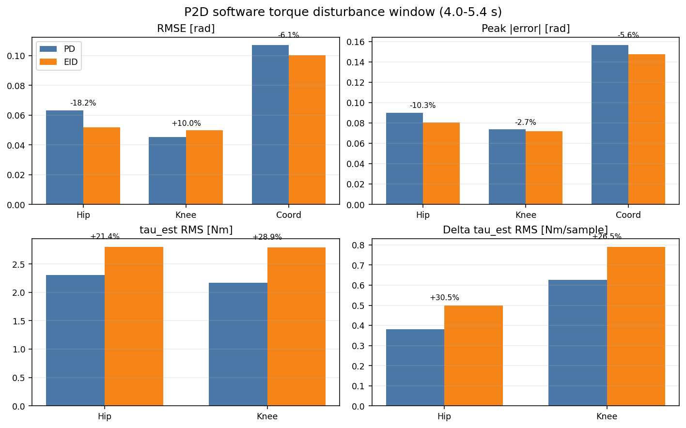

**图 6.** P2D 双关节软件力矩扰动窗口指标。EID 降低髋窗口 RMSE、协调窗口 RMSE 和峰值误差，但膝窗口 RMSE 略高于 PD，且 $\tau_\mathrm{est}$ RMS 与 $\Delta \tau_\mathrm{est}$ RMS 均上升。

| 指标 | PD | EID | EID 相对变化 |
|---|---:|---:|---:|
| 髋窗口 RMSE rad | 0.0631 | 0.0516 | -18.2% |
| 膝窗口 RMSE rad | 0.0452 | 0.0498 | +10.0% |
| 协调窗口 RMSE rad | 0.1069 | 0.1004 | -6.1% |
| 髋峰值误差 rad | 0.0898 | 0.0806 | -10.3% |
| 膝峰值误差 rad | 0.0738 | 0.0718 | -2.7% |
| 协调峰值误差 rad | 0.1563 | 0.1475 | -5.6% |
| 髋 $\tau_\mathrm{est}$ RMS N·m | 2.3096 | 2.8035 | +21.4% |
| 膝 $\tau_\mathrm{est}$ RMS N·m | 2.1675 | 2.7948 | +28.9% |
| 髋 $\Delta \tau_\mathrm{est}$ RMS | 0.3816 | 0.4979 | +30.5% |
| 膝 $\Delta \tau_\mathrm{est}$ RMS | 0.6254 | 0.7909 | +26.5% |

P2D 的结论比 P2-H 更严格，因为扰动窗口和幅值进入了日志。EID 在双关节软件扰动下降低了髋关节窗口误差和协调误差，但下降幅度小于 P1/P2-H 的全稳态统计；膝关节窗口 RMSE 略有上升。这说明当前逐关节输入域 EID 对软件等效负载的收益主要体现在髋通道和协调峰值抑制，不能概括为所有窗口指标均低于 PD。

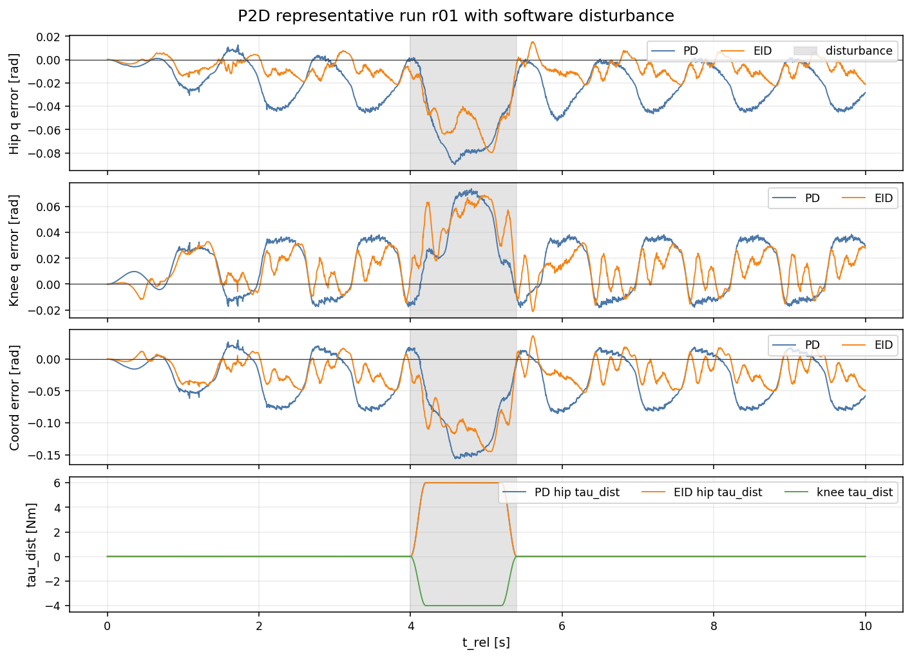

**图 7.** P2D 代表性时序，重复 r01。灰色区域为 $4.0$--$5.4\ \mathrm{s}$ 软件扰动窗口。EID 在髋误差和协调误差峰值上低于 PD，但膝误差曲线在扰动窗口内与 PD 接近。

P2D 同时给出了力矩代价：EID 的 $\tau_\mathrm{est}$ RMS 和 $\Delta \tau_\mathrm{est}$ RMS 都高于 PD。因此，带扰动结果需要同时报告误差收益和力矩变化量，而不能只依据 RMSE 评价控制效果。P2D 中 EID 的一次重复在扰动结束后未跑满 10 s，但该日志覆盖完整扰动窗口，因此纳入窗口统计；恢复段统计只基于覆盖恢复窗口的日志解释。

### 6.4 P3：Preview-MPC 参考生成

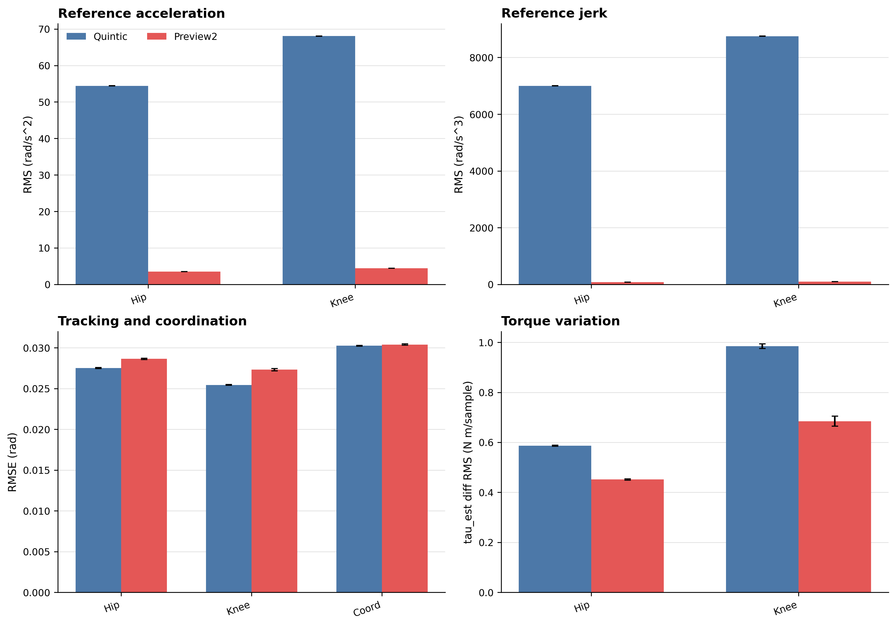

**图 8.** P3 中零速五次样条与 2 点 Preview-MPC 的参考激励、跟踪误差和力矩变化量对比。Preview-MPC 大幅降低参考高阶激励，并降低力矩变化量。

| 指标 | quintic | preview2 | preview2 相对变化 |
|---|---:|---:|---:|
| 髋参考加速度 RMS rad/s² | 54.4358 | 3.5301 | -93.5% |
| 膝参考加速度 RMS rad/s² | 68.0448 | 4.4126 | -93.5% |
| 髋参考 jerk RMS rad/s³ | 7000.8924 | 80.7808 | -98.8% |
| 膝参考 jerk RMS rad/s³ | 8751.1154 | 100.9760 | -98.8% |
| 髋 RMSE rad | 0.0275 | 0.0286 | +4.1% |
| 膝 RMSE rad | 0.0254 | 0.0273 | +7.4% |
| 协调 RMSE rad | 0.0302 | 0.0304 | +0.5% |
| 髋 $\Delta \tau_\mathrm{est}$ RMS | 0.5866 | 0.4515 | -23.0% |
| 膝 $\Delta \tau_\mathrm{est}$ RMS | 0.9848 | 0.6846 | -30.5% |

Preview-MPC 的主要结果是参考加速度和 jerk 大幅下降，且 $\Delta \tau_\mathrm{est}$ RMS 下降。其代价是髋/膝 RMSE 小幅上升，但协调误差几乎不变。该结果支持将 preview2 作为降低参考尖峰和力矩粗糙度的参考生成候选。

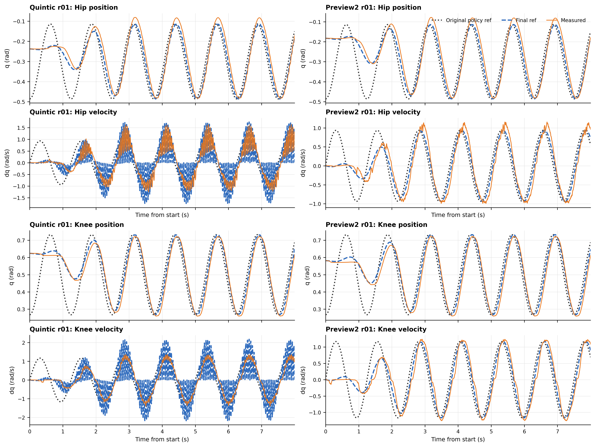

**图 9.** P3 代表性时序，重复 r01。左列为零速五次样条，右列为 2 点 Preview-MPC。Preview-MPC 的速度参考明显更平滑，与图 8 中参考加速度和 jerk 降低的统计结果一致。

### 6.5 P4：$K_o$ 与 $K_u$ 无扰动扫描

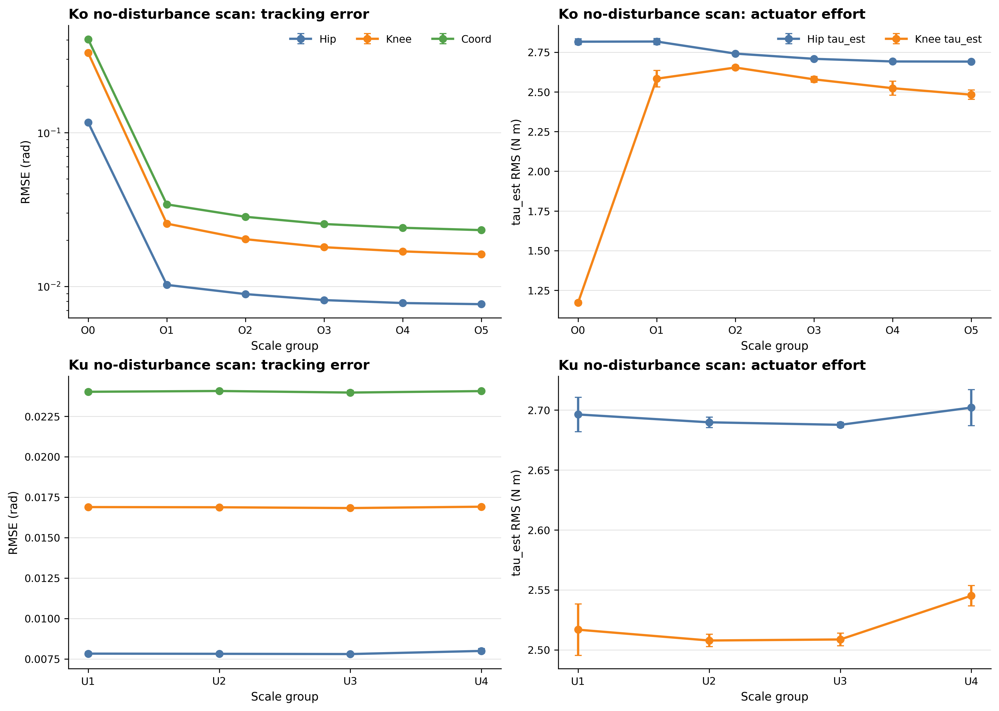

**图 10.** P4 的 $K_o$ 与 $K_u$ 无扰动扫描。$K_o$ 从 O0 到 O5 降低跟踪误差；$K_u$ 在无扰动条件下对误差影响很小。

#### $K_o$ 扫描结果

| 组别 | $K_o$ 缩放 | 髋 RMSE rad | 膝 RMSE rad | 协调 RMSE rad | 髋 $\tau_\mathrm{est}$ RMS | 膝 $\tau_\mathrm{est}$ RMS |
|---|---:|---:|---:|---:|---:|---:|
| O0 | 0.00 | 0.1164 | 0.3295 | 0.4041 | 2.8165 | 1.1723 |
| O1 | 0.25 | 0.0102 | 0.0256 | 0.0341 | 2.8175 | 2.5834 |
| O2 | 0.50 | 0.0089 | 0.0203 | 0.0283 | 2.7415 | 2.6537 |
| O3 | 0.75 | 0.0081 | 0.0180 | 0.0254 | 2.7086 | 2.5793 |
| O4 | 1.00 | 0.0078 | 0.0169 | 0.0240 | 2.6919 | 2.5235 |
| O5 | 1.25 | 0.0077 | 0.0162 | 0.0232 | 2.6911 | 2.4826 |

O0 的跟踪误差高于其他组，说明关闭观测器增益后 EID 内部预测与实测之间存在较大偏差。O1 到 O5 的误差随 $K_o$ 增大逐步下降，且 $\tau_\mathrm{est}$ RMS 没有明显恶化。无扰动数据表明，O4/O5 均处于本轮测试覆盖的稳定运行区间；O5 的 RMSE 略低于 O4，但二者差异较小。

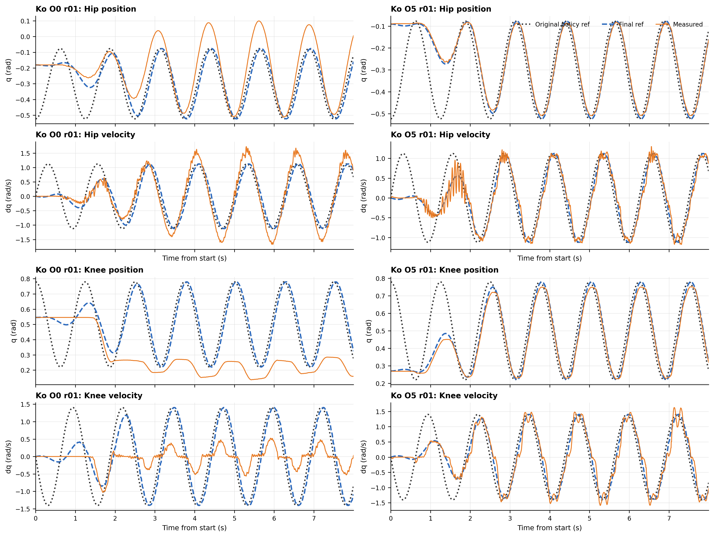

**图 11.** P4 $K_o$ 最小与最大组的代表性时序，重复 r01。O0 关闭观测器增益后，尤其膝关节位置和速度跟踪明显偏离最终参考；O5 的跟踪误差低于 O0。

#### $K_u$ 扫描结果

| 组别 | $K_u$ 缩放 | 髋 RMSE rad | 膝 RMSE rad | 协调 RMSE rad | 髋 $\tau_\mathrm{est}$ RMS | 膝 $\tau_\mathrm{est}$ RMS |
|---|---:|---:|---:|---:|---:|---:|
| U1 | 0.50 | 0.0078 | 0.0169 | 0.0240 | 2.6963 | 2.5168 |
| U2 | 0.75 | 0.0078 | 0.0169 | 0.0241 | 2.6898 | 2.5078 |
| U3 | 1.00 | 0.0078 | 0.0168 | 0.0240 | 2.6877 | 2.5086 |
| U4 | 1.25 | 0.0080 | 0.0169 | 0.0241 | 2.7021 | 2.5451 |

$K_u$ 在无扰动条件下几乎不改变跟踪误差，这说明当前 $K_u$ 扫描主要验证了无扰动稳定性，而不是扰动抑制能力。U4 有一次完整日志后的异常返回记录，因此仅凭无扰动结果不能支持提高 $K_u$ 的结论。后文 P4D 使用明确软件扰动窗口进一步比较 U1--U4。

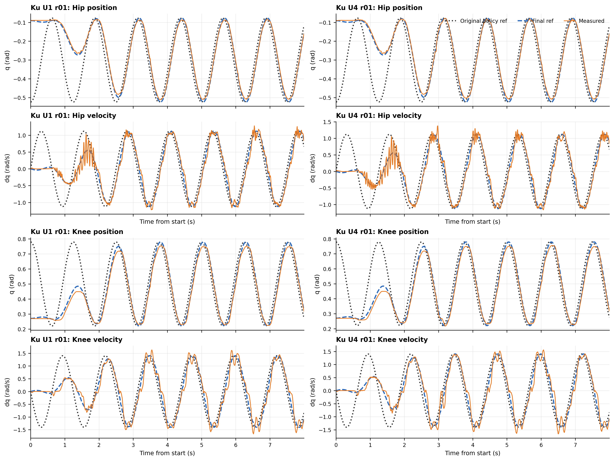

**图 12.** P4 $K_u$ 最小与最大组的代表性时序，重复 r01。U1 与 U4 在无扰动条件下的时序差异较小，与扫描统计中 $K_u$ 对 RMSE 影响有限的结论一致。

### 6.6 P4D：带软件扰动的 $K_o$ 与 $K_u$ 扫描

P4D 使用与 P2D 相同的 $[+6,-4]\ \mathrm{N\cdot m}$ 双关节软件力矩脉冲。该实验直接回答：无扰动下可用的 $K_o/K_u$ 参数，在明确扰动窗口下是否仍稳定，以及增益变化是否真的改善窗口抗扰。

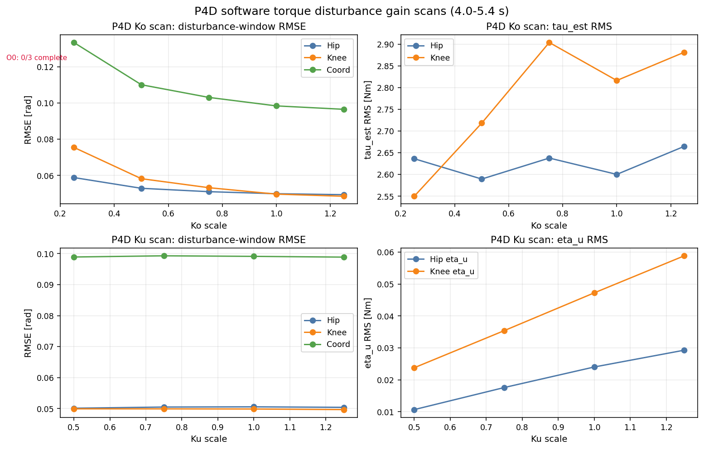

**图 13.** P4D 带软件扰动增益扫描。$K_o$ 增大时扰动窗口 RMSE 下降；$K_u$ 扫描中窗口 RMSE 几乎不变，但 $\eta_u$ RMS 随 $K_u$ 增大。

#### P4D $K_o$ 扫描结果

| 组别 | $K_o$ 缩放 | 完整运行 | 完整扰动窗口 | 髋窗口 RMSE | 膝窗口 RMSE | 协调窗口 RMSE | 髋 $\tau_\mathrm{est}$ RMS | 膝 $\tau_\mathrm{est}$ RMS |
|---|---:|---:|---:|---:|---:|---:|---:|---:|
| O0 | 0.00 | 0/3 | 0/3 | - | - | - | - | - |
| O1 | 0.25 | 2/3 | 3/3 | 0.0588 | 0.0755 | 0.1334 | 2.6362 | 2.5498 |
| O2 | 0.50 | 2/3 | 3/3 | 0.0529 | 0.0582 | 0.1101 | 2.5895 | 2.7183 |
| O3 | 0.75 | 2/3 | 3/3 | 0.0510 | 0.0532 | 0.1031 | 2.6378 | 2.9040 |
| O4 | 1.00 | 3/3 | 3/3 | 0.0499 | 0.0497 | 0.0984 | 2.6002 | 2.8164 |
| O5 | 1.25 | 3/3 | 3/3 | 0.0494 | 0.0485 | 0.0965 | 2.6647 | 2.8815 |

O0 在三次重复中均于约 4.29 s 结束，未覆盖完整扰动窗口，因此不能计算完整窗口抗扰指标。这一点比无扰动 P4 更严格地说明：关闭观测器增益的 EID 通道不具备带扰动可用性。

O1 到 O5 均覆盖完整扰动窗口，且窗口 RMSE 随 $K_o$ 增大逐步下降。O4 和 O5 三次重复均完整跑满 10 s。O5 的窗口误差最低，但相对 O4 的下降幅度较小，同时髋、膝 $\tau_\mathrm{est}$ RMS 略高。该结果说明，在本轮软件扰动条件下，O4 与 O5 构成误差和力矩代价相邻的两组高增益结果，而非单一最优结论。

#### P4D $K_u$ 扫描结果

| 组别 | $K_u$ 缩放 | 完整运行 | 髋窗口 RMSE | 膝窗口 RMSE | 协调窗口 RMSE | 髋 $\eta_u$ RMS | 膝 $\eta_u$ RMS |
|---|---:|---:|---:|---:|---:|---:|---:|
| U1 | 0.50 | 3/3 | 0.0501 | 0.0499 | 0.0989 | 0.0107 | 0.0238 |
| U2 | 0.75 | 3/3 | 0.0505 | 0.0499 | 0.0993 | 0.0176 | 0.0354 |
| U3 | 1.00 | 3/3 | 0.0506 | 0.0499 | 0.0991 | 0.0240 | 0.0473 |
| U4 | 1.25 | 3/3 | 0.0504 | 0.0497 | 0.0989 | 0.0293 | 0.0589 |

$K_u$ 扫描与无扰动 P4 的结论一致：在当前扰动幅值下，改变 $K_u$ 几乎不改变髋、膝或协调窗口 RMSE。不同的是，P4D 明确显示 $\eta_u$ RMS 随 $K_u$ 增大而上升。也就是说，在本轮软件扰动条件下，提高 $K_u$ 主要增加补偿量活动，而没有带来可辨识的窗口 RMSE 收益。

## 7. 讨论

### 7.1 输入域 EID 的结果范围

P1、P2-H 和 P2D 的结果共同表明，输入域 EID 在本轮右髋-右膝台架实验中降低了部分误差指标。P1 和 P2-H 中，EID 降低跟踪误差和协调误差；P2D 中，EID 在明确软件扰动窗口内降低髋关节误差、协调误差和峰值误差。该结论限于悬挂或机械保护条件下的双关节实验。

同时，EID 的力矩变化量增加也很明确。P1/P2-H 和 P2D 均显示 EID 带来更高的 $\Delta \tau_\mathrm{est}$ RMS；P4D 还显示提高 $K_u$ 会放大 $\eta_u$ RMS 而不明显改善窗口误差。因此，本轮结果需要同时以误差指标和力矩活动指标解释。

### 7.2 P2 结论边界

P2-H 与 P2D 的证据边界不同。P2-H 是人工髋扰动，结论限定为“髋人工扰动工况下的全稳态统计结果”，因为没有扰动时间戳，不能计算扰动窗口指标。P2D 是软件力矩扰动，时间窗和幅值明确，因此支持扰动窗口 RMSE 和峰值误差结论。

但是，P2D 的扰动是在命令侧叠加的力矩偏置，而不是外部物理接触力。因此，P2D 支持 EID 对输入端等效扰动的实物结论，不能单独替代物理外扰实验。

### 7.3 Preview-MPC 的工程价值

Preview-MPC 的结果较为清晰：它降低参考高阶激励，同时没有明显破坏协调误差。该结果表明，preview2 参考生成与降低参考边界处的速度、加速度和力矩变化量相关。

### 7.4 P4 参数选择

从无扰动和软件扰动稳定性角度看，O0 均不满足本轮测试要求。P4D 中 O0 三次均未覆盖完整扰动窗口，比无扰动 P4 更清楚地暴露了关闭观测器增益后的风险。O4 和 O5 均完成三次带扰动重复，O5 的误差略低，力矩代价略高。

$K_u$ 在无扰动和软件扰动下都没有带来明显 RMSE 收益。P4D 中 U1--U4 的窗口误差几乎重合，但 $\eta_u$ RMS 随 $K_u$ 增大。因此，本轮结果不支持通过提高 $K_u$ 获得额外抗扰收益。

## 8. 结论

本轮实验得到以下结论：

1. 输入域 EID 通过 P1 无扰动门槛验证，在本轮低幅双关节台架实验中未观察到批量运行失败。
2. 在 P2-H 髋人工扰动实验的全稳态统计中，EID 低于 PD；P2D 软件扰动窗口中，EID 降低髋窗口 RMSE 18.2%、协调窗口 RMSE 6.1%，但膝窗口 RMSE 上升 10.0%。
3. Preview-MPC 2 点参考降低参考加速度、参考 jerk 和力矩变化量，同时只带来小幅跟踪 RMSE 上升。
4. $K_o$ 扫描显示 O0 不满足本轮无扰动和软件扰动条件；O4/O5 均完成 P4D 完整重复，且 O5 的窗口误差略低、力矩 RMS 略高。
5. $K_u$ 扫描显示 U1--U4 的窗口 RMSE 差异很小，而 $\eta_u$ RMS 随 $K_u$ 增大。
6. P2D/P4D 的结论属于输入端等效扰动结论，不能替代物理外扰结论。

## 9. 后续工作

根据本轮实验的证据边界，后续工作包括以下内容。

| 优先级 | 内容 | 目的 |
|---:|---|---|
| 1 | 用弹簧秤、绑带或可测加载装置补充物理外扰 P2/P4 | 将软件等效扰动结论与真实外部接触力区分开 |
| 2 | 固定少量候选参数后重复物理扰动实验 | 验证候选参数在真实扰动下的误差和力矩代价 |
| 3 | 对 P2D/P4D 的 $\tau_\mathrm{est}$、$\Delta \tau_\mathrm{est}$、$\eta_u$ 做频谱分析 | 判断软件扰动和 EID 是否引入高频力矩成分 |
| 4 | 对 P2D/P4D 补充恢复时间统计 | 判断扰动结束后的恢复过程 |
| 5 | 在物理扰动窗口结果明确后再扩大幅值或频率 | 避免在参数和扰动边界未闭环前扩大实验暴露面 |

## 附：数据来源

本文使用 2026-06-23 批量实验日志生成的统计结果。P1/P2-H/P3/P4 汇总表位于 `analysis_artifacts/real_experiment_summary/`，P2D/P4D 补充汇总表位于 `analysis_artifacts/real_p2d_p4d_summary/`，图像位于 `docs/figures/`。正文只报告面向读者的关键指标；逐次实验明细可在汇总表中追溯。
