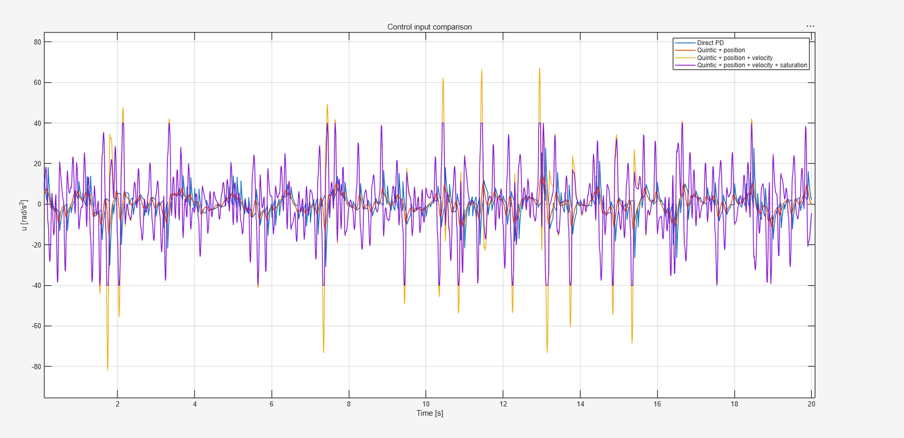

#eid-rl 5.22结果汇报

​																											蒋可轩

本周实验聚焦eid控制器在强化学习上的部署展开，以官方例程为baseline，对比eid控制器训练存在的问题。

在eid部署中，我们保留了两个功能以供后续的训练，一方面是将插值后的点用pd控制器来追踪（后续称之为pd-only），另一个功能便是完整的eid控制器（后续称之为eid-full）。

（蓝线为baseline，紫线为pd-only，橙色线为eid-full，图中存在的断点为训练过程中的意外中断，忽略即可）

我们实验发现，使用pd-only可以实现步态的跟踪，关注他与baseline之间的对比，我们可以看到pd-only弱于baseline的奖励，这可以初步说明插值存在一些问题。

需要注意的是，对比pd-only和baseline，我们可以观察到以下现象，action_rate（评价策略输出 action 是否平滑），feet_contact_forces（脚底接触力），base_angular_velocity （机身角速度惩罚）等项均比baseline高，正常情况下，我们会认为这是好事，策略网络输出的参考角度变得柔顺。但结合joint_acc（关节加速度惩罚项）来看，pd-only的joint_acc明显比baseline的要低很多，因此我们可以合理的将这部分归因为以下内容：pd-only采用的五次样条插值，该插值方法中我们需要一个参考加速度和参考速度，在这里我们设置末端加速度为0和参考速度为差分速度，这导致实际规划出来的角速度是非常震荡的，后续我们用pd控制器来跟踪插值出来的角速度会导致最终的力矩输入变得极其震荡，这个执行器震荡的效果反过来影响策略网络的输出，使其变得保守。

针对这个观点，我进行了以下测试验证，对于一个二阶积分器来说，我设定了三个对比方法：1.直接用pd控制器跟踪未插值的参考点；2.插值后跟踪角度；3.插值后跟踪角度和角速度。

| Method                             | RMSE_10ms | Energy      | Max u     |
| ---------------------------------- | --------- | ----------- | --------- |
| PD direct ZOH reference            | 0.191875  | 598.232842  | 30.913155 |
| Quintic + PD position              | 0.188591  | 369.695914  | 15.009874 |
| Quintic + PD position and velocity | 0.045976  | 6181.753264 | 81.847387 |

可以看到结果，虽然3的跟踪效果最好，但他的控制输入极其震荡，控制输入能量也极大，这对于机器人来说是不好的现象。所以后续我们应该考虑设计一个更好的插值方法，主要有两个方向，考虑速度和加速度约束的最忧插值方法或者是考虑给五次样条插值设计一个合理的末端加速度。

接下来回归eid-full模式，其reward远远低于baseline（300<400)。且其learning_rate过早的降到了接近0的值，这说明eid-full过早的结束了自己的探索步伐，但其in_vel_cmd_levels尚未开展更高速度的学习，同时其大部分指标都远远低于baseline，如果直接在训练全程引入eid，我们的策略网络输出就是坏的。

关注eid引入之后的内部补偿量，观察数值会发现，eid进行的补偿中，角速度占据了绝大部分量，根据前面的分析，我们追踪的这个参考点角速度引起了控制输入的震荡，同时也导致了eid内部补偿量被角速度主导，这同样说明了我们插值得到的角速度是极其不健康的。

另外我们在策略训练中绝大部分时间策略网络的输出始终在被我们的eid补偿，这部分补偿没有办法直观的被策略网络观测到，因此策略网络处于一种失去方向的环境中，难以寻找到真正的有价值的方向。

因此后续工作的重点应放在以下方面：
1.寻找一个好的插值方法

2.修改eid在强化学习上的训练逻辑，因为eid中存在补偿量以及正逆模型的两次映射，若是过早的开启eid可能导致我们的控制器跟踪的角度修正是经过各种噪声放大的。因此应该采取这样的训练逻辑：底层控制器选用pd-only，训练成功后切换到eid模式，训练初期要关闭环境中的噪声，稳定后再加入噪声进行训练，防止噪声过早引入导致我们的eid补偿量过多，策略网络失去方向。