# 基于 EID 的人形机器人关节解耦控制与强化学习训练实验分析报告


## 摘要

本阶段工作的原始目标，是用改进的 EID（Equivalent Input Disturbance，等效输入扰动）底层控制结构增强人形机器人关节控制的抗扰能力，并尝试通过底层关节解耦降低上层强化学习策略的学习难度。理想情况下，RL 只需要学习运动学层面的关节目标或步态节律，EID 负责吸收未建模动力学、外部扰动和关节耦合，从而提高跟踪精度、训练效率和 sim-to-real 鲁棒性。

当前实验结果表明，这一目标在概念上仍然有价值，但当前实现尚未达到可直接用于全身 RL 训练的状态。单关节右膝实验中，EID 能够稳定工作；但在右髋俯仰和右膝同时控制时，独立单关节 SISO-EID 模型无法解释髋-膝 MIMO 耦合动力学，观测器残差被逆模型放大，导致虚拟目标偏移、力矩饱和和高频 chattering。强化学习实验中，pd-only 至少能完成步态跟踪，而 eid-full 的 reward 明显低于 baseline，learning rate 过早下降，说明完整 EID 补偿直接进入训练闭环后破坏了策略学习环境。

更完整的因果链不是简单的“EID 不稳定”，而是：

```text
RL 离散动作
  -> OpenLoop 分段插值引入不健康速度和高阶导数激励
  -> PD/EID 速度通道被激发
  -> SISO-EID 在髋-膝耦合系统中模型失配
  -> eta_dq、u_star、r_d 被逆模型放大
  -> 力矩饱和与无 slew-rate 限制形成 chattering
  -> RL observation 与 action semantics 被污染
  -> 策略学习变保守或失去方向
```

因此，后续不应直接放弃 EID，而应先修正参考生成和 pd-only 基线，再把 EID 作为 observer 或低增益辅助补偿逐步引入；若目标是真正实现关节间解耦，则需要从独立单关节 EID 升级到包含髋-膝耦合动力学的 MIMO 控制结构，或采用动力学前馈 + DOB/EID 的剩余扰动观测框架。

## 1. 研究目标与实验问题

当前人形机器人 RL 步态控制中，常见做法是上层策略输出关节期望位置，底层 PD 控制器负责跟踪：

$$
\tau = K_p(q_d-q) + K_d(\dot q_d-\dot q)
$$

这种接口简单、稳定、容易训练，但它本质上是局部误差反馈，并不显式处理关节间动力学耦合、外界扰动、未建模摩擦、执行器延迟和接触冲击。对于全身人形机器人，这意味着 RL 策略需要在训练中间接适应大量底层动力学复杂性。

本研究希望探索一种更主动的底层控制接口：

$$
\text{RL 负责运动学规划}
\quad + \quad
\text{EID 负责动力学补偿与抗扰}
$$

如果这一假设成立，上层策略面对的系统会更接近被底层控制器整形后的低阶、弱耦合对象。理论上，这可以减少 RL 对复杂动力学的学习负担，并让策略更专注于步态节律、足端接触和身体稳定。

围绕这一目标，本阶段实验主要回答三个问题：

1. 当前 EID 结构在单关节跟踪任务中是否稳定？
2. 当前 EID 结构在髋-膝双关节耦合任务中是否仍然稳定？
3. 当前 EID 结构直接用于 RL 训练时，是否优于官方 baseline 和 pd-only？

实验结果给出的回答是：单关节可行，双关节耦合下失稳，直接进入 RL 训练会明显破坏学习。

## 2. 当前控制实现

### 2.1 EID 控制链路

当前 EID 控制链路可以从 `eid_control.m`、`include/eid_controller.hpp` 和运行日志 debug signal 中对应起来。核心变量包括 `eta_q`、`eta_dq`、`u_star`、`r_d_q`、`r_d_dq`、`u_raw` 和 `u_t`。

每个控制周期中，控制器先用扰动估计修正内部预测状态：

$$
\bar{x} = \hat{x} + \eta
$$

然后用扰动估计修正下一步参考：

$$
r_{c,k+1}=r^*_{k+1}-\eta_k
$$

再通过解析逆模型计算等效补偿输入：

$$
u^* = inverse\_model(r^*_k, r_{c,k+1}-r^*_k, T_s)
$$

该补偿输入不直接叠加到 PD 力矩上，而是被映射成虚拟目标：

$$
r_d = r^* + K^\dagger u^*
$$

最后由 PD 跟踪虚拟目标并输出力矩：

$$
e = r_d - \bar{x}
$$

$$
u_{raw} = K_{pd}e
$$

$$
u_t = limit(u_{raw})
$$

这说明当前 eid-full 不是“PD + 小幅扰动补偿”的简单结构，而是会通过 `u_star` 和 `r_d` 重写底层追踪目标。如果 `eta` 的主要来源是外界扰动，这种结构可以主动补偿；如果 `eta` 的主要来源是插值噪声、模型失配或多关节耦合误差，这条链路会把错误残差继续放大。

### 2.2 解析逆模型中的高增益通道

当前逆模型采用半隐式 Euler 离散动力学。位置通道反推力矩时包含：

$$
\tau_q =
bias + J_{eff}
\frac{q_{target,k+1}-q_k-T_s\dot q_k}{T_s^2}
$$

速度通道反推力矩时包含：

$$
\tau_{\dot q} =
bias + J_{eff}
\frac{\dot q_{target,k+1}-\dot q_k}{T_s}
$$

其中 `bias` 包含粘性阻尼、重力拟合项和常值偏置。`1/T_s^2` 不是代码错误，而是由离散运动学自然得到：

$$
q_{k+1}=q_k+T_s\dot q_k+T_s^2\ddot q_k
$$

因此：

$$
\ddot q_k =
\frac{q_{k+1}-q_k-T_s\dot q_k}{T_s^2}
$$

当 `T_s = 0.002s` 时，`T_s^2 = 4e-6`。对于 `J_eff ≈ 1.0` 的髋关节，只有 `0.001 rad` 的下一步位置预测误差，也会对应约 `250 N·m` 的力矩请求，已经超过右髋 `200 N·m` 量级的力矩限幅。这解释了为什么位置误差看似很小，但力矩和速度已经进入异常状态。

### 2.3 当前参考生成器

当前配置中，大部分 EID 测试仍使用 `policy_interpolation: open_loop`，策略周期为：

$$
T_p = 0.05s
$$

也就是说，RL 或策略参考每 50 ms 给出一个关节目标，底层控制器以更高频率运行。`include/reference_trajectory.hpp` 中的 OpenLoop 插值器按策略周期分段，每段用五次多项式生成高频参考。

当前 OpenLoop 的边界状态来自策略位置序列：

$$
x_k^{ref}
=
\left[
q_k^{policy},
\frac{q_k^{policy}-q_{k-1}^{policy}}{T_p},
0
\right]
$$

即位置来自策略边界点，速度来自后向差分，加速度强制为 0。该设计能在每个 segment 内生成平滑五次多项式，但它没有继承上一段实际输出状态，也没有使用真实反馈状态作为下一段初始状态。因此它是 reference-continuous，但不是 state-consistent。

代码中还存在 `ClosedLoop`、`RlSmoothed` 和 `Ruckig` 等模式。后续路线应优先评估这些更接近执行器约束或闭环状态的参考生成方式。

## 3. 实验设计与结果

### 3.1 RL 训练对比：baseline、pd-only、eid-full (来自蒋可轩的实验和相关分析)

强化学习部署中保留了两种 EID 相关功能分支：

| 模式 | 含义 | 目的 |
|---|---|---|
| baseline | 官方例程中的默认控制结构 | 训练效果参照 |
| pd-only | 对插值后的参考点使用 PD 跟踪 | 分离插值/参考生成和 EID 补偿的影响 |
| eid-full | 使用完整 EID 控制器 | 检验 EID 补偿是否能改善 RL 学习 |

训练曲线中，蓝线为 baseline，紫线为 pd-only，橙色线为 eid-full。图中存在的断点来自训练过程意外中断，不作为主要结论依据。

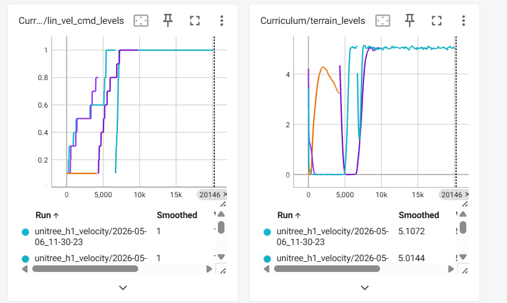

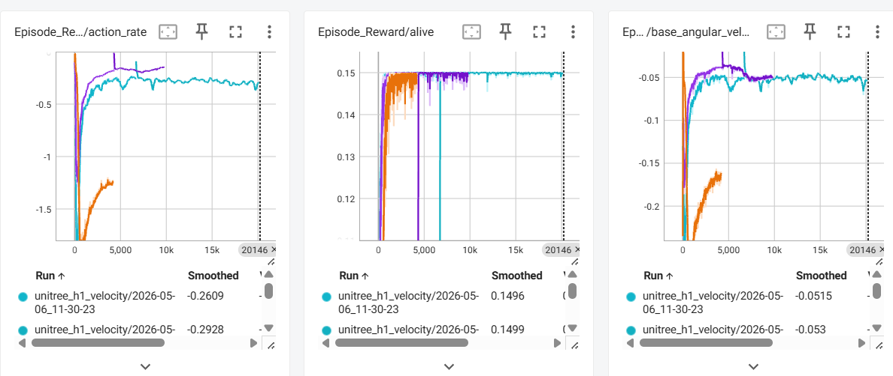

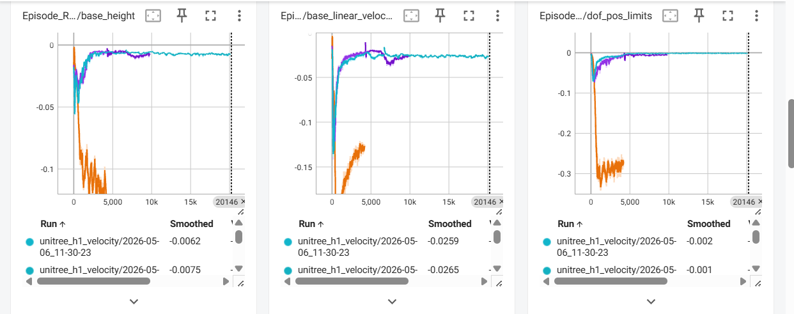

实验观察如下：

1. pd-only 可以实现步态跟踪，但整体 reward 弱于 baseline。这说明插值和底层参考生成本身已经影响训练质量。
2. pd-only 中部分曲线看似更平滑，但 joint_acc 相关表现明显变差，说明底层执行器仍可能存在由插值速度或高阶导数引起的震荡。
3. eid-full 的 reward 明显低于 baseline，记录中约为 `300 < 400`；learning_rate 过早降到接近 0，`in_vel_cmd_levels` 尚未展开更高速度学习。
4. eid-full 中 EID 补偿量主要被速度通道主导，策略输出长期被底层补偿改写，而这些补偿状态并没有被策略完整观测。

EID 内部补偿诊断图也支持这一点。`eta_dq` 的主导作用说明速度通道和插值参考对 EID 链路影响很大。

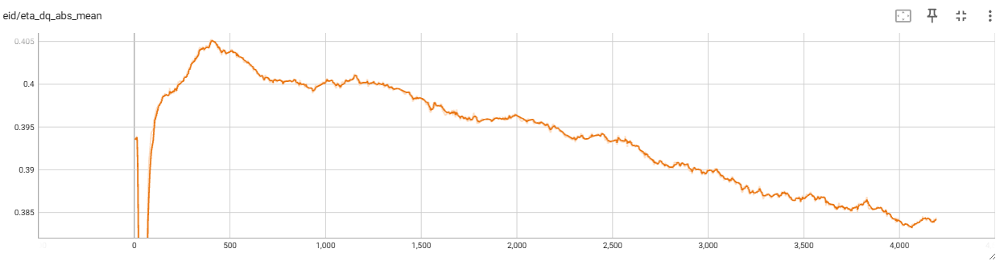

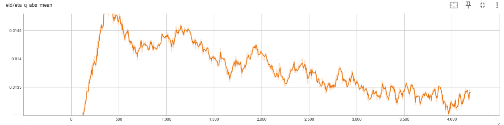

因此，eid-full 的失败不能简单解释为“EID 理论无效”。更准确地说，当前 EID 在训练早期把策略探索、插值速度、模型误差和耦合残差一起估计为等效扰动，并通过逆模型和虚拟目标重写了动作结果，破坏了 RL 的动作-状态-奖励因果关系。

### 3.2 插值二阶积分器实验

为了验证插值速度是否会放大底层控制输入，对一个二阶积分器比较了三种跟踪方式：

| Method | RMSE_10ms | Energy | Max u |
|---|---:|---:|---:|
| PD direct ZOH reference | 0.191875 | 598.232842 | 30.913155 |
| Quintic + PD position | 0.188591 | 369.695914 | 15.009874 |
| Quintic + PD position and velocity | 0.045976 | 6181.753264 | 81.847387 |


该结果说明两个关键问题。

第一，只看 RMSE 会误判控制质量。`Quintic + PD position and velocity` 的 RMSE 最小，但控制能量达到 `6181.75`，最大输入达到 `81.85`，远高于另外两种方法。

第二，速度跟踪是高风险项。当前五次样条使用差分速度作为边界速度，并强制边界加速度为 0；当 PD 同时跟踪插值位置和插值速度时，误差变小，但代价是控制输入能量和峰值大幅上升。这与 RL 实验中 pd-only 的问题一致，也解释了为什么 EID 补偿会被速度项主导。

### 3.3 单关节右膝 EID 稳定性

单关节测试中，其它关节保持静止，只控制右膝 RightKnee。稳态统计窗口为 `1.0s-15.0s`。

| case | joint | dq_ref_abs_max | dq_actual_abs_max | dq_actual_std | q_rmse | u_t_abs_mean | u_t_sat_90pct_frac | eta_dq_abs_mean | r_d_q_abs_max |
|---|---|---:|---:|---:|---:|---:|---:|---:|---:|
| single_knee | RightKnee | 0.0628326 | 0.0608538 | 0.042385 | 0.0096283 | 0.0401678 | 0.00% | 0.0100076 | 0.833492 |

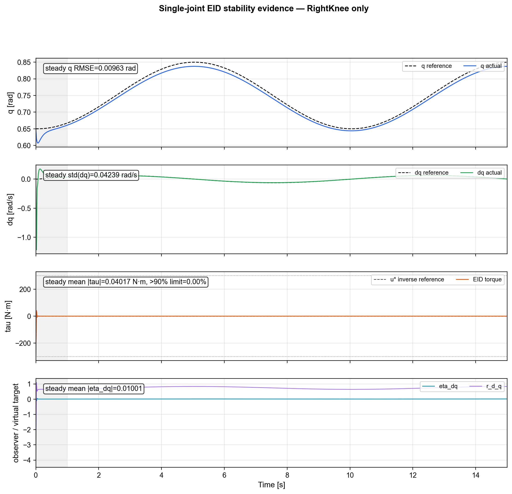

结论是：当前 EID 在低维、弱耦合的单关节场景中可以稳定工作。右膝位置平滑跟踪参考，速度与参考同量级，力矩几乎为零，`eta_dq` 很小。这一点很重要，因为它说明 EID 本身不是在所有场景下天然不稳定，问题来自其适用边界和当前部署方式。

### 3.4 双关节髋-膝 EID 测试

双关节测试中，其它关节保持静止，同时控制 RightHipPitch 和 RightKnee。右膝使用与单关节测试相同的参考，因此如果右膝在双关节下出现震荡，不能归因于右膝参考本身变激烈。

| case | joint | dq_ref_abs_max | dq_actual_abs_max | dq_actual_std | q_rmse | u_t_abs_mean | u_t_sat_90pct_frac | eta_dq_abs_mean | r_d_q_abs_max |
|---|---|---:|---:|---:|---:|---:|---:|---:|---:|
| dual_hip_knee | RightHipPitch | 0.125665 | 2.62062 | 1.61987 | 0.013594 | 179.937 | 81.71% | 0.580819 | 3.74258 |
| dual_hip_knee | RightKnee | 0.0628326 | 4.80317 | 2.92225 | 0.0124712 | 145.504 | 0.00% | 0.692333 | 4.64672 |

与单关节右膝相比，右膝 `dq_actual_std` 从 `0.0424 rad/s` 增加到 `2.922 rad/s`，约为 69 倍；右膝平均力矩从 `0.040 N·m` 增加到 `145.5 N·m`；右髋平均力矩达到 `179.9 N·m`，且 `81.71%` 的时间接近 90% 以上力矩限幅。

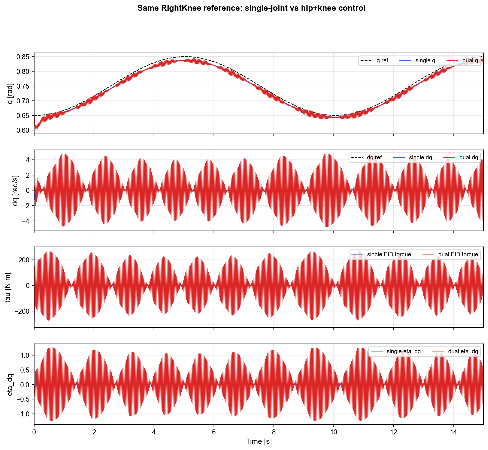

内部诊断图显示，双关节测试中 `u_star` 和 `u_t` 出现接近限幅的高频切换，`r_d_q` 被推到数 rad 量级，`eta_dq` 与速度和力矩震荡同频。

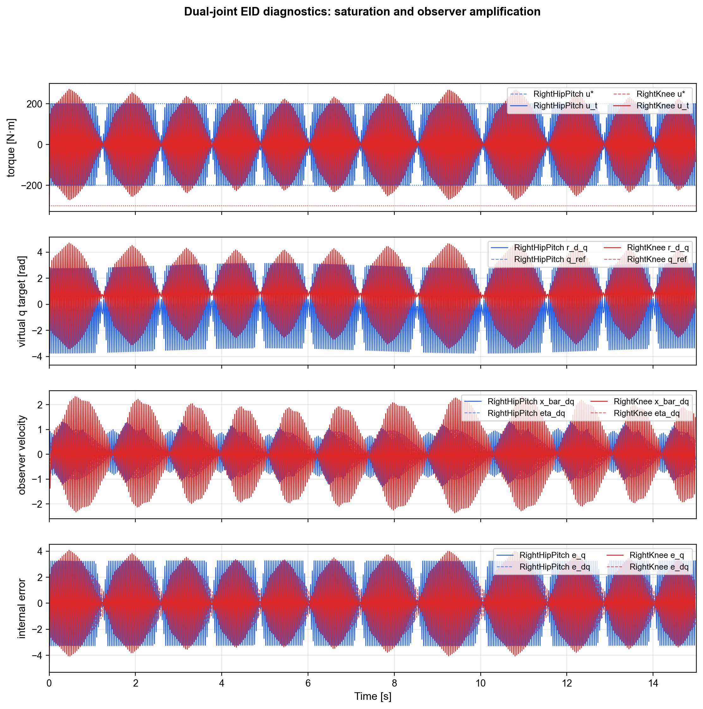

定量柱状图进一步说明，双关节测试中的速度标准差、平均力矩占比和 `eta_dq` 都远高于单关节测试。

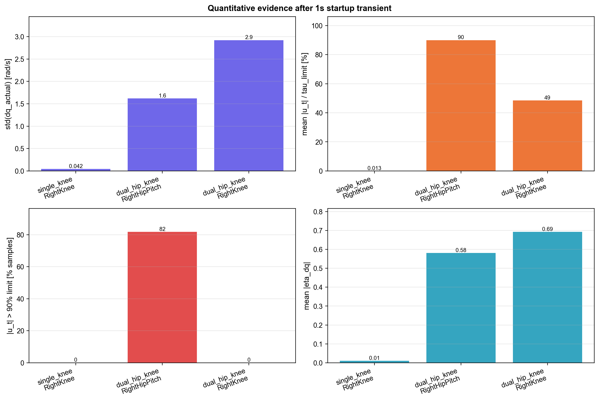

在局部放大窗口中，位置曲线仍然较平滑，但速度和力矩快速正负交替。这说明位置 RMSE 不大并不代表控制健康；力矩和速度已经暴露出高频闭环振荡。

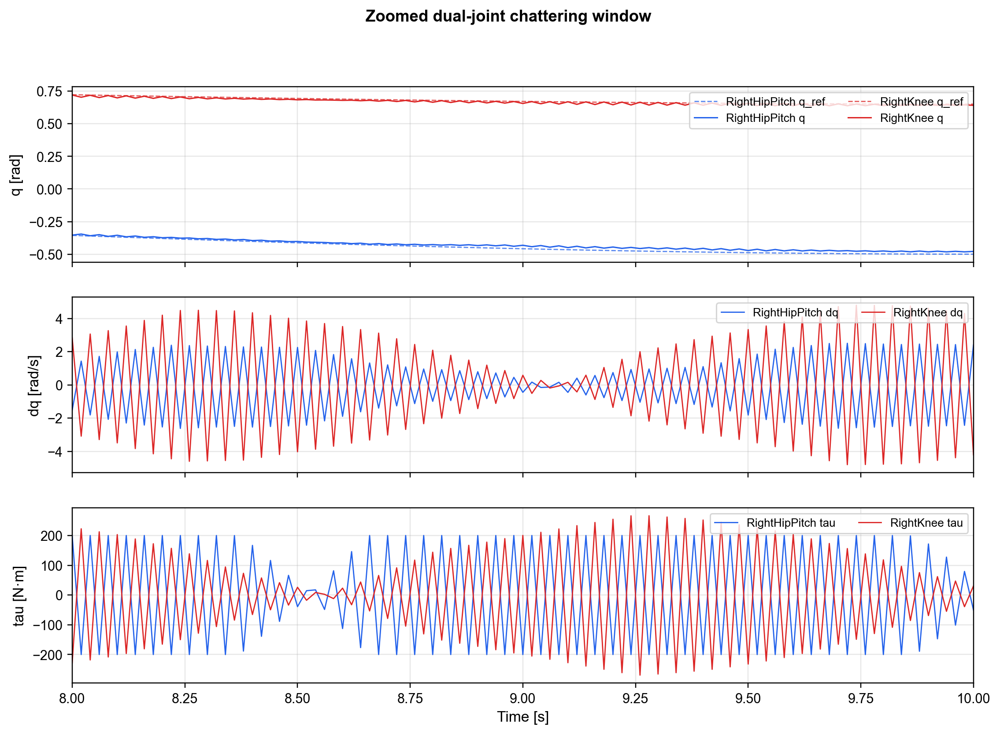

机制链路可以概括为：

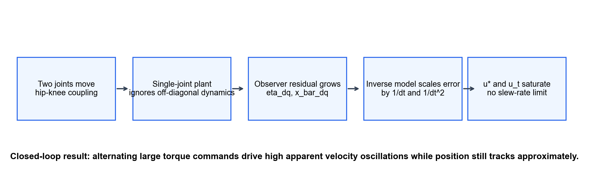

```text
双关节同时运动
  -> 髋-膝动力学耦合增强
  -> 单关节 EID 模型无法解释耦合项
  -> 观测器残差 eta_dq / x_bar_dq 增大
  -> 逆模型通过 1/T_s 与 1/T_s^2 放大误差
  -> u_star / u_t 进入饱和
  -> 无力矩变化率限制时产生高频 chattering
```

### 3.5 控制周期 sweep

为了检验增大 EID 控制周期是否能削弱 `1/T_s^2` 放大，测试中保持物理积分步长为 2 ms，只将 EID 控制周期改为 4 ms、10 ms、20 ms。

| case | joint | dt_s | q_rmse | dq_actual_std | u_t_abs_mean | u_t_sat_90pct_frac | eta_dq_abs_mean | r_d_q_abs_max |
|---|---|---:|---:|---:|---:|---:|---:|---:|
| right_hip_pitch_and_knee | RightHipPitch | 0.004 | 0.0457625 | 3.26879 | 179.462 | 80.29% | 1.16711 | 3.74321 |
| right_hip_pitch_and_knee | RightHipPitch | 0.010 | 0.187003 | 7.86596 | 177.432 | 81.00% | 2.8031 | 3.74321 |
| right_hip_pitch_and_knee | RightHipPitch | 0.020 | 0.318272 | 12.2657 | 170.86 | 74.43% | 4.10211 | 3.74321 |
| right_hip_pitch_and_knee | RightKnee | 0.004 | 0.0258482 | 5.81319 | 142.092 | 0.00% | 1.38522 | 4.19942 |
| right_hip_pitch_and_knee | RightKnee | 0.010 | 0.145055 | 14.5204 | 152.495 | 2.00% | 3.22078 | 3.54734 |
| right_hip_pitch_and_knee | RightKnee | 0.020 | 0.403879 | 20.3123 | 113.799 | 0.00% | 4.283 | 2.43763 |
| right_knee_only | RightKnee | 0.004 | 0.00588969 | 0.0429245 | 0.0406984 | 0.00% | 0.0199346 | 0.833668 |
| right_knee_only | RightKnee | 0.010 | 0.00606197 | 0.0446625 | 0.0423387 | 0.00% | 0.0492358 | 0.834175 |
| right_knee_only | RightKnee | 0.020 | 0.0283172 | 0.0478659 | 0.0453382 | 0.00% | 0.0965015 | 0.835053 |

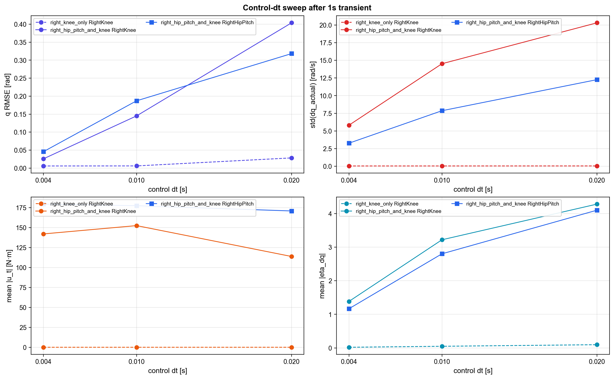

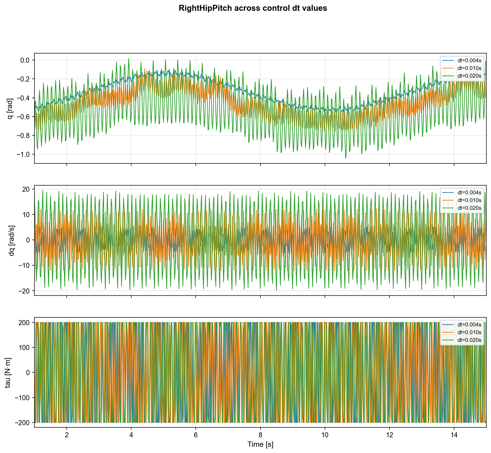

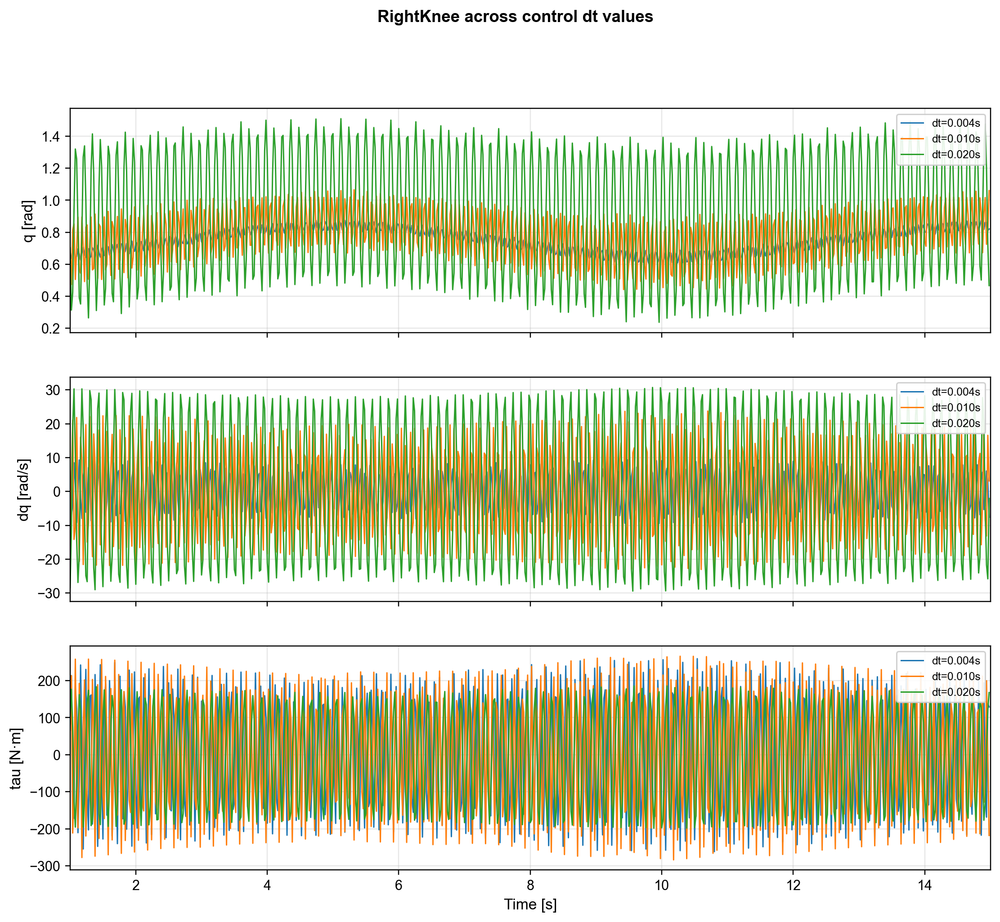

结果显示，单膝测试仍然稳定，只是误差略有上升；双关节测试随控制周期增大明显恶化。右膝 `dq_actual_std` 从 `5.81 rad/s` 增加到 `20.31 rad/s`，右髋从 `3.27 rad/s` 增加到 `12.27 rad/s`。

这说明简单增大控制周期不是解决方案。虽然 `T_s` 变大能降低逆模型位置项的瞬时增益，但也降低了闭环更新频率，使强耦合系统中的模型误差和约束反力在更长开环区间内积累。在当前实验中，后者是主导效应。

## 4. 机理分析

### 4.1 OpenLoop 插值是第一类激励源

OpenLoop 的问题不是“五次多项式本身不好”，而是它在每个策略周期重新构造局部规划问题，并假设系统已经位于策略边界状态：

$$
\left[
q_k^{policy},
\frac{q_k^{policy}-q_{k-1}^{policy}}{T_p},
0
\right]
$$

真实机器人或底层 reference generator 未必处在这个状态。于是每 50 ms 会出现 reference state 与 plant state 或上一段 reference state 的 mismatch：

$$
e_q = q_d-q
$$

$$
e_{\dot q} = \dot q_d-\dot q
$$

$$
e_{\ddot q} = \ddot q_d-\ddot q
$$

对普通 PD 来说，这会表现为周期性 D 项刺激；对 EID 来说，它会成为观测器 innovation 或等效输入扰动。

此外，差分速度本质上是离散微分器：

$$
\dot q_k^{ref}
=
\frac{q_k^{policy}-q_{k-1}^{policy}}{T_p}
$$

由于 `T_p = 0.05s`，位置动作中的小扰动会以 `1/T_p = 20` 的系数进入速度通道。再加上边界加速度强制为 0，五次多项式为了满足边界条件会在段内产生额外加速度和 jerk 调整。即使单段内达到 `C^2` 连续，段与段之间通常也不能保证 jerk 连续。

因此，OpenLoop 会把 RL 低频位置动作中的抖动转化为速度噪声、加速度整形和高阶导数激励。这是 pd-only 弱于 baseline、eid-full 速度补偿被激发的重要原因。

### 4.2 SISO-EID 假设不适用于当前髋-膝 MIMO 系统

右髋俯仰与右膝的真实动力学是耦合系统：

$$
M(q)\ddot q + C(q,\dot q)\dot q + g(q) + J_c(q)^T\lambda = \tau
$$

展开到第 `i` 个关节：

$$
\tau_i =
M_{ii}(q)\ddot q_i
+ M_{ij}(q)\ddot q_j
+ h_i(q,\dot q)
+ g_i(q)
+ [J_c(q)^T\lambda]_i
$$

当前 EID 每个关节使用独立单关节模型：

$$
\tau_i =
J_{eff,i}\ddot q_i
+ b_i\dot q_i
+ A_i\sin(q_i)
+ B_i\cos(q_i)
+ \tau_{0,i}
$$

该模型没有显式包含非对角惯性耦合、速度耦合、双关节姿态相关重力项，也没有描述其它关节被保持静止时引入的约束反力。

当只动右膝时，右髋近似固定，耦合项较弱，单关节近似可以成立。当右髋和右膝同时运动时，`M_ij(q)ddq_j`、`C(q,dq)dq` 和耦合重力项都会变大。此时每个单关节 EID 都会把另一关节造成的动力学影响估计为外部扰动：

$$
\Delta_i =
\tau_i^{real}
-
\tau_i^{single\ joint\ model}
$$

这就是双关节测试中 `eta_dq` 大幅增加的根本原因。

### 4.3 虚拟目标污染

当前 EID 将 `u_star` 映射为虚拟目标：

$$
r_d = r^* + K^\dagger u^*
$$

当 `u_star` 因模型失配或参考 mismatch 接近饱和时，`K^\dagger u^*` 会把 `r_d` 推离真实参考。实验中：

| joint | 真实参考范围 | max \|r_d_q\| |
|---|---:|---:|
| RightHipPitch | 约 -0.5 到 -0.1 rad | 3.74258 rad |
| RightKnee | 约 0.65 到 0.85 rad | 4.64672 rad |

这意味着底层 PD 实际追踪的已经不是上层希望执行的物理目标，而是由观测器残差和逆模型共同生成的补偿目标。对 RL 来说，动作语义被改变：

$$
a_t \Rightarrow r^*
$$

变成：

$$
a_t \Rightarrow r^* \Rightarrow \eta \Rightarrow u^* \Rightarrow r_d \Rightarrow \tau
$$

如果策略 observation 中没有充分包含这些中间状态，训练问题会变成带有隐藏底层动态的 partially observable MDP，credit assignment 会变差。

### 4.4 饱和和无 slew-rate 限制导致 chattering

当前测试配置中 `tau_slew_rate = 0`，表示力矩只做幅值限幅，不限制相邻控制周期之间的变化率。控制器中虽然实现了 slew-rate limiter，但配置为 0 时不会生效。

当观测器残差和逆模型使 `u_raw` 接近饱和时，如果下一周期残差符号改变，力矩可以直接从正限幅附近跳到负限幅附近：

$$
+saturation
\leftrightarrow
-saturation
$$

这会形成典型的 saturation-induced oscillation 或 limit-cycle chattering。局部放大图中速度和力矩同频正负交替，正是这一机制的表现。

### 4.5 为什么 PD 反而更适合当前 RL

PD 并不比 EID 更“智能”，但它提供了更稳定的 impedance interface。策略输出目标位置，底层产生与误差成比例的弹簧-阻尼式力矩。其动作语义较稳定：

$$
q_d \rightarrow \tau \rightarrow q,\dot q,\text{base motion}
$$

EID-full 中，动作会被不可见的 `eta`、`u_star` 和 `r_d` 重写：

$$
q_d
\rightarrow
\eta,u^*,r_d
\rightarrow
\tau
\rightarrow
q,\dot q,\text{base motion}
$$

如果这些中间状态在训练初期由噪声、插值速度和模型失配主导，策略就很难判断奖励变化来自自身动作，还是来自底层补偿器的二次修正。因此在当前阶段，PD 表现更好不是因为它的控制精度更高，而是因为它对 RL 更可预测、更少隐藏状态、更不主动追逐高频残差。

## 5. 客观结论

当前实验不应被总结为“EID 不如 PD”或“EID 理论失败”。更准确的判断是：

1. EID 在单关节右膝任务中可以稳定工作，说明当前结构在弱耦合条件下有可行性。
2. 当前 SISO-EID 不适合直接处理髋-膝强耦合 MIMO 系统；双关节耦合项会被观测器误估为等效输入扰动。
3. OpenLoop 插值不是旁枝问题，而是当前失败链路的第一类激励源之一。它把离散策略动作转化为不健康速度和高阶导数激励。
4. 逆模型中的 `1/T_s` 和 `1/T_s^2` 通道会把很小的下一步预测误差变成很大的力矩请求。
5. `u_star` 饱和后会通过 `r_d` 污染底层追踪目标，使 PD 追踪一个远离真实参考的虚拟目标。
6. 无力矩变化率限制会把饱和后的残差符号变化转化为高频 chattering。
7. 在 RL 训练中，eid-full 引入了策略不可完全观测的隐藏补偿动态，破坏了稳定的动作-奖励因果关系。

因此，当前 EID 的问题主要来自“参考生成、SISO 建模、逆模型高增益、饱和保护、RL 可观测性”五个环节的叠加，而不是某个单一模块失效。
