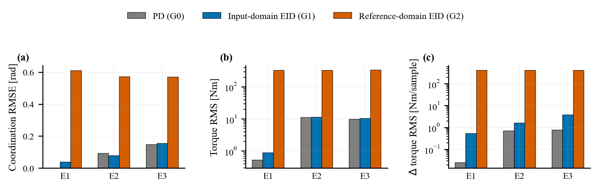
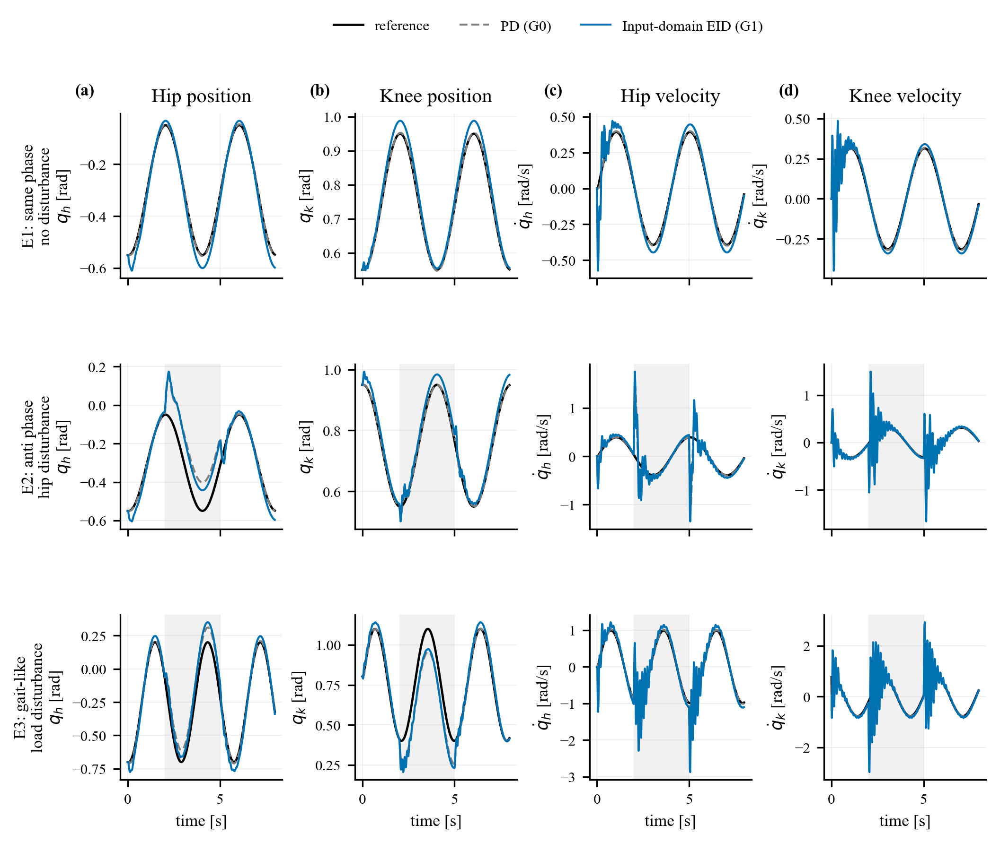
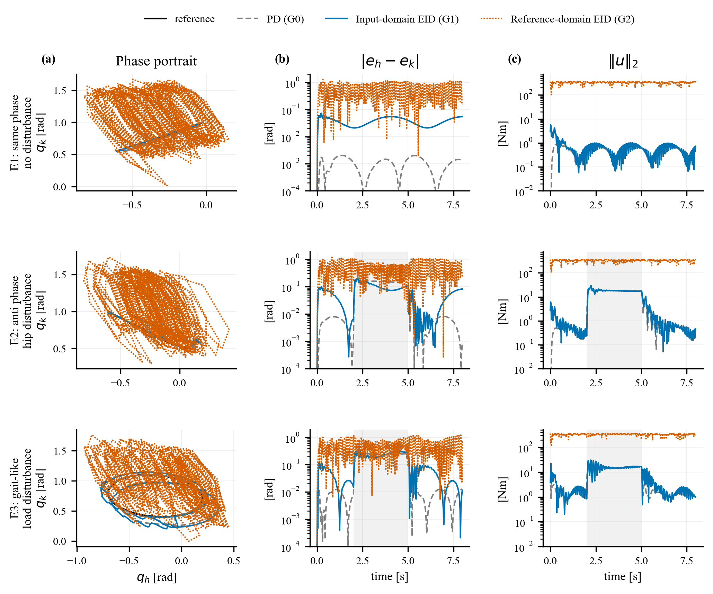
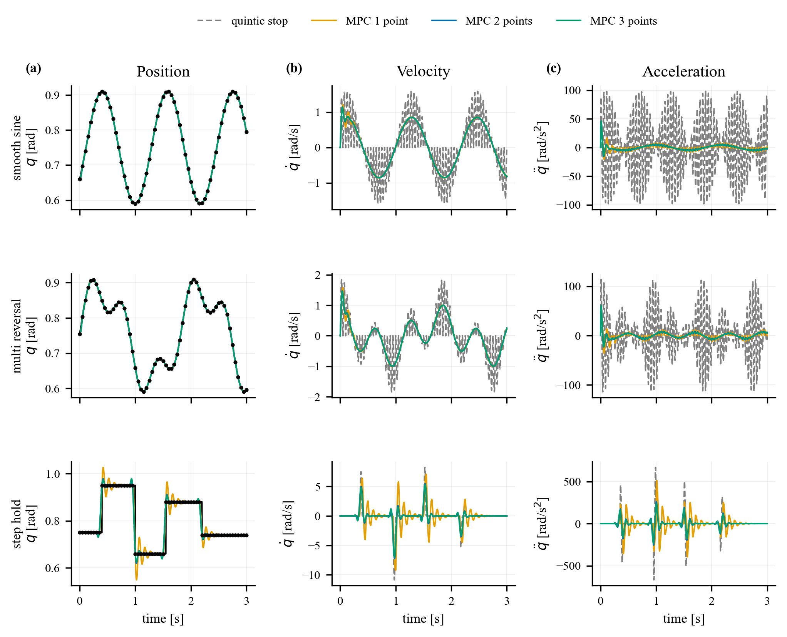
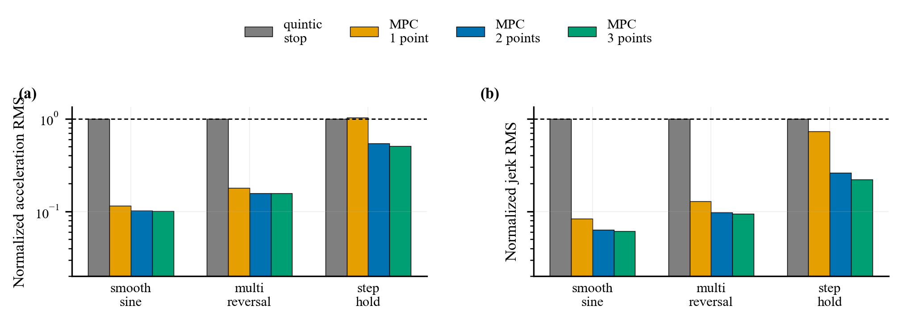
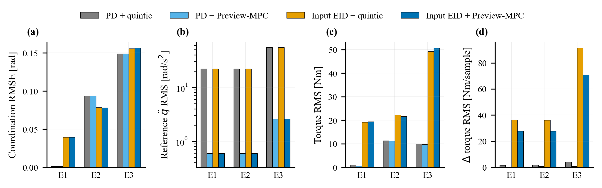
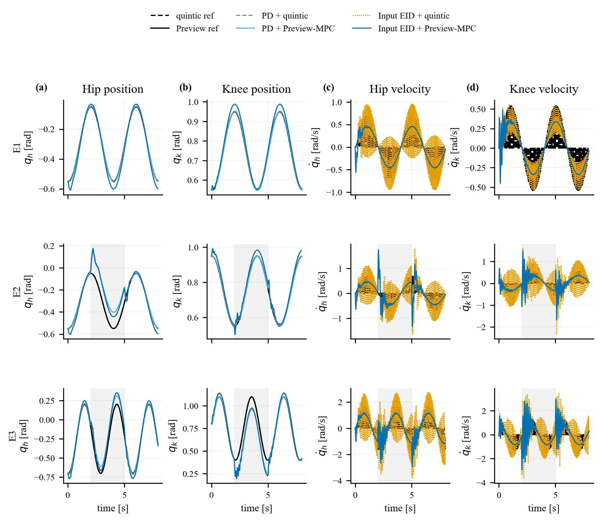
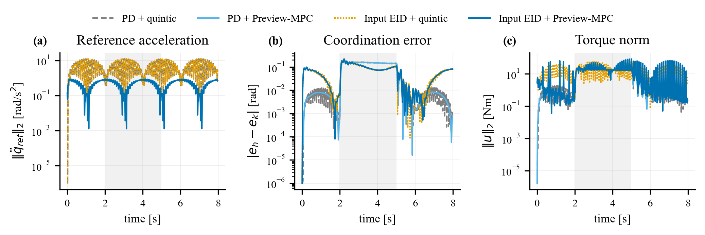

# 膝髋联合运动中输入域 EID、参考域补偿和 Preview-MPC插值 的仿真分析 &下一步计划


## 目录

- [摘要](#摘要)
- [1. 结论先行](#1-结论先行)
- [2. 控制结构](#2-控制结构)
- [3. 输入域与参考域的结构差异](#3-输入域与参考域的结构差异)
- [4. 仿真设计](#4-仿真设计)
- [5. 闭环仿真结果](#5-闭环仿真结果)
- [6. 参考生成层：Preview-MPC 插值与闭环接入结果](#6-参考生成层preview-mpc-插值与闭环接入结果)
- [7. 讨论](#7-讨论)
  - [7.1 为什么参考域补偿在本实验中表现较差](#71-为什么参考域补偿在本实验中表现较差)
  - [7.2 输入域补偿的当前限制](#72-输入域补偿的当前限制)
  - [7.3 参考生成与补偿域的分工](#73-参考生成与补偿域的分工)
- [8. 下一步计划](#8-下一步计划)
  - [8.1 计划一：实物实验验证](#81-计划一实物实验验证)
    - [8.1.1 最小实验清单](#811-最小实验清单)
    - [8.1.2 必须记录的数据](#812-必须记录的数据)
    - [8.1.3 必须计算的指标](#813-必须计算的指标)
    - [8.1.4 必须交付的图](#814-必须交付的图)
    - [8.1.5 阶段判断标准](#815-阶段判断标准)
    - [8.1.6 实物实验配套：输入域 EID 参数回退与耦合扩展](#816-实物实验配套输入域-eid-参数回退与耦合扩展)
    - [8.1.7 实物实验配套：Preview-MPC 约束化接入](#817-实物实验配套preview-mpc-约束化接入)
  - [8.2 计划二：理论调参](#82-计划二理论调参)
    - [1. 先写出局部线性化模型](#1-先写出局部线性化模型)
    - [2. $k_p,k_d$ 的调参：先按二阶闭环极点设计](#2-k_pk_d-的调参先按二阶闭环极点设计)
    - [3. $k_p,k_d$ 的稳定性约束](#3-k_pk_d-的稳定性约束)
    - [4. 逆模型权重 $w_q,w_{\dot q}$ 的意义](#4-逆模型权重-w_qw_dot-q-的意义)
    - [5. EID 部分的误差动力学推导](#5-eid-部分的误差动力学推导)
    - [6. $\alpha,K_o$ 的调参推导](#6-alphak_o-的调参推导)
    - [7. $K_u=[k_{u,q},k_{u,\dot q}]$ 的调参推导](#7-k_uk_uqk_udot-q-的调参推导)
    - [8. 一个完整调参流程](#8-一个完整调参流程)
    - [9. 调参时各参数的作用总结](#9-调参时各参数的作用总结)
    - [10. 推荐的最终调参顺序](#10-推荐的最终调参顺序)
    - [11. 最核心的调参公式汇总](#11-最核心的调参公式汇总)
  - [8.3 计划三：新的学习策略方案](#83-计划三新的学习策略方案)
    - [1. 核心思想](#1-核心思想)
    - [2. 频率与时间尺度](#2-频率与时间尺度)
    - [3. 系统分层](#3-系统分层)
    - [4. 策略输入](#4-策略输入)
    - [5. 策略输出](#5-策略输出)
    - [6. q0 的处理](#6-q0-的处理)
    - [7. q2、q3 的作用](#7-q2q3-的作用)
    - [8. Preview-MPC 参考生成器](#8-preview-mpc-参考生成器)
    - [9. 给底层控制器的参考接口](#9-给底层控制器的参考接口)
    - [10. 滚动时域执行流程](#10-滚动时域执行流程)
    - [11. 跨周期 overlap consistency](#11-跨周期-overlap-consistency)
    - [12. 训练奖励 / 损失](#12-训练奖励--损失)
    - [13. 推荐接入顺序](#13-推荐接入顺序)
    - [14. 推荐参数](#14-推荐参数)
    - [15. 必须记录的指标](#15-必须记录的指标)
    - [16. 最终总结](#16-最终总结)

## 摘要

本文比较了膝髋联合运动中的两类 EID 补偿方式：输入域补偿与参考域补偿，并结合 Preview-MPC 插值结果讨论参考生成层的设计。

核心结论是：在当前控制结构和仿真设置下，输入域补偿更适合作为 EID 的主路线。它将 EID 解释为等效输入扰动，并在力矩端进行补偿；参考域补偿则把同一估计量用于修改下一步参考，会改变原始轨迹，并通过逆模型放大位置和速度通道中的估计误差。膝髋联合运动尤其依赖两关节之间的相对关系，因此参考端修正更容易引入协调误差。

9 组闭环仿真结果显示，参考域补偿在三类测试工况中均出现较大的协调误差、力矩 RMS 和力矩变化量，并触及髋膝力矩限幅。输入域补偿在所有工况下都明显优于参考域补偿；在单髋扰动工况中，它还降低了髋关节跟踪误差和膝髋协调误差。不过，当前结果还不能说明输入域补偿已经全面优于无 EID 的 PD 基线，因为无扰动和步态型负载工况仍需要继续调参。

Preview-MPC 插值实验表明，当策略层能够提供 2 到 3 个未来点时，纯运动学 Preview-MPC 可以降低参考轨迹的加速度和 jerk RMS。进一步的闭环 MuJoCo 控制实验显示，2 点 Preview-MPC 接入 PD 和输入域 EID 后，能够显著降低参考加速度和力矩变化量，而跟踪误差与膝髋协调误差基本不变。该结果支持采用分层设计：参考生成器负责产生平滑、趋势一致的原始参考；EID 补偿负责在力矩端处理模型误差和外扰。

## 1. 结论

1. 输入域补偿是当前更稳妥的 EID 解释方式。EID 本身表示等效输入扰动，因此放在输入端补偿更符合物理含义，也更便于限幅、滤波和独立调参。
2. 参考域补偿不建议作为膝髋联合运动的默认方案。它会直接修改下一步参考，容易破坏膝髋之间的相对运动关系，并可能通过逆模型放大估计噪声。
3. 输入域补偿目前是“方向正确但尚未调完”。它相对参考域补偿优势明显，但相对 PD 基线只在单髋扰动场景中表现出更直接的收益。
4. Preview-MPC 更适合作为参考生成层，而不是 EID 补偿的替代品。闭环实验显示它的主要收益是降低参考加速度和力矩变化量，而不是直接改变扰动恢复能力。
5. 如果进入实物实验，应优先验证输入域 EID 和 Preview-MPC，不建议在自由站立或高功率条件下测试参考域 EID。

## 2. 控制结构

图 1 给出当前控制器的数据流。控制器在每个周期读取测量状态 $x_k=[q_k,\dot q_k]^T$，从参考生成器取得 $r_k$ 和 $r_{k+1}$，由解析逆模型计算标称前馈力矩 $u_k^*$，再由 EID 估计量构造输入补偿项 $\eta_{u,k}$。反馈项围绕中心反馈状态

$$
\bar x_k=\hat x_k+\eta_k
$$

构造，而不是直接围绕测量状态构造。


单关节输入域补偿的控制律为

$$
u_k=u_k^*-\eta_{u,k}+K(r_k-\bar x_k).
$$

其中

$$
\eta_{u,k}=k_{u,q}\eta_{q,k}+k_{u,\dot q}\eta_{\dot q,k}.
$$

参考域补偿不显式构造 $\eta_{u,k}$，而是先修改下一步参考：

$$
r_{k+1}^c=r_{k+1}-\eta_k,
$$

并使用

$$
u_k^*=\hat{\mathcal I}(r_k,r_{k+1}^c-r_k)
$$

作为前馈力矩。该结构使 EID 估计量通过逆模型进入力矩通道。

## 3. 输入域与参考域的结构差异

EID 表示 equivalent input disturbance，即等效输入扰动。按照该定义，输入域补偿在力矩端抵消扰动估计：

$$
u_k=u_k^*-\eta_{u,k}+K(r_k-\bar x_k).
$$

参考域补偿则将同一估计量用于参考轨迹修正：

$$
r_{k+1}^c=r_{k+1}-\eta_k.
$$

该做法隐含地将 $\eta_k$ 解释为“下一步参考状态的修正量”。在当前控制器中，$\eta_k$ 是由状态偏差更新得到的 EID 估计，而不是由轨迹规划器生成的期望轨迹修正。因此，参考域补偿会混合扰动估计和轨迹生成两个功能。

参考域补偿还会通过逆模型放大 EID 噪声。解析逆模型的位置目标反解项含有

$$
\frac{q_{k+1}^{tar}-q_k^*-T_s\dot q_k^*}{T_s^2},
$$

速度目标反解项含有

$$
\frac{\dot q_{k+1}^{tar}-\dot q_k^*}{T_s}.
$$

当 $\eta_q$ 和 $\eta_{\dot q}$ 被注入 $r_{k+1}^c$ 时，它们对前馈力矩的影响可分别经过 $1/T_s^2$ 和 $1/T_s$ 的尺度放大。当前控制步长为 $T_s=0.002$ s，因此位置通道对参考修正较敏感。输入域补偿的强度则由 $k_{u,q}$ 和 $k_{u,\dot q}$ 显式设定，便于限幅、滤波和单独调参。

对于膝髋联合运动，状态可写为

$$
x_k=
\begin{bmatrix}
q_h & q_k & \dot q_h & \dot q_k
\end{bmatrix}^T.
$$

理想的多关节输入域补偿形式为

$$
u_k=u_k^*-K_u\eta_k+K(r_k-\bar x_k),
\qquad K_u\in\mathbb{R}^{2\times 4}.
$$

当前实验使用已有逐关节 EID 控制器，相当于先测试对角结构的输入域补偿；完整的非对角耦合矩阵仍是后续工作。

## 4. 仿真设计

仿真比较了三种控制方案：

| 组别 | 控制方案 | 作用 |
|---|---|---|
| G0 | PD 基线 | 不使用 EID，用作对照 |
| G1 | 输入域 EID | 在力矩端抵消等效扰动 |
| G2 | 参考域 EID | 用 EID 修改下一步参考 |

测试覆盖三类膝髋运动和扰动场景。根据仿真代码 `scripts/run_hip_knee_domain_experiment.py` 和 `scripts/run_mujoco.py`，这里的外扰定义为加性关节力矩扰动，而不是随机测量噪声、参数摄动或足端接触冲击。实验脚本通过 `--disturbance-joints`、`--disturbance-torques`、`--disturbance-start` 和 `--disturbance-end` 将扰动设置传给 MuJoCo 运行脚本。运行时，`run_mujoco.py` 先由 C++ stepper 计算控制器命令，并将 PD 项和前馈力矩组合为 `tau_applied` 写入 `data.ctrl[joint_id]`；随后在执行 `mujoco.mj_step` 之前，对指定关节的 `data.ctrl` 额外叠加常值力矩：

$$
\tau_{\mathrm{sim},j}(t)=\tau_{\mathrm{ctrl},j}(t)+\tau_{d,j},
\qquad t\in[t_d^{\mathrm{start}},t_d^{\mathrm{end}}].
$$

扰动窗口统一设置为 $t_d^{\mathrm{start}}=2.0\,\mathrm{s}$ 到 $t_d^{\mathrm{end}}=5.0\,\mathrm{s}$。E1 不施加外扰；E2 在右髋俯仰关节施加 $+18\,\mathrm{Nm}$ 常值力矩；E3 在右髋俯仰和右膝关节分别施加 $+12\,\mathrm{Nm}$ 和 $-10\,\mathrm{Nm}$ 常值力矩。因此，本文中的“髋扰动”和“负载扰动”均指有限时间窗内的矩形脉冲型关节力矩扰动。

需要注意的是，日志写入发生在扰动力矩叠加之前。CSV 中的 `motor_tau`、由 `motor_kp/motor_kd/motor_tau` 重构得到的 `tau_applied`，以及后续统计的力矩 RMS / 力矩变化量 RMS，表示控制器命令力矩，而不是 $\tau_{\mathrm{ctrl}}+\tau_d$ 的总仿真输入。扰动力矩通过 MuJoCo 状态演化影响后续位置、速度和跟踪误差，但不直接计入这些力矩统计量。

| 实验 | 轨迹和扰动 | 目的 |
|---|---|---|
| E1 | 同相膝髋运动，无外加力矩扰动 | 观察补偿项是否带来无扰动副作用 |
| E2 | 反相膝髋运动，$t=2$--$5\,\mathrm{s}$ 对右髋俯仰关节叠加 $+18\,\mathrm{Nm}$ 力矩 | 评估单关节力矩扰动下的协调保持能力 |
| E3 | 步态型膝髋运动，$t=2$--$5\,\mathrm{s}$ 对右髋俯仰和右膝分别叠加 $+12\,\mathrm{Nm}$、$-10\,\mathrm{Nm}$ 力矩 | 评估更接近负载场景的联合跟踪能力 |

主要观察指标包括髋关节误差、膝关节误差、膝髋协调误差、力矩 RMS 和力矩变化量 RMS。协调误差用于衡量实际膝髋相对运动是否仍保持原始参考中的关系。

## 5. 闭环仿真结果

图 2 汇总了最能反映补偿域差异的三类指标：协调误差、力矩 RMS 和力矩变化量 RMS。参考域 EID 在三个工况中均表现出较高的协调误差和力矩指标；输入域 EID 的这些指标均显著低于参考域 EID。



完整数值如下。

| 实验 | 控制方案 | 髋误差 | 膝误差 | 协调误差 | 力矩 RMS | 力矩变化量 RMS |
|---|---|---:|---:|---:|---:|---:|
| E1 | PD 基线 | 0.0037 | 0.0040 | 0.0012 | 0.53 | 0.03 |
| E1 | 输入域 EID | 0.0291 | 0.0244 | 0.0395 | 0.90 | 0.54 |
| E1 | 参考域 EID | 0.1567 | 0.4907 | 0.6106 | 332.13 | 410.77 |
| E2 | PD 基线 | 0.0933 | 0.0073 | 0.0935 | 11.25 | 0.71 |
| E2 | 输入域 EID | 0.0860 | 0.0248 | 0.0783 | 11.40 | 1.62 |
| E2 | 参考域 EID | 0.2063 | 0.4871 | 0.5717 | 332.46 | 411.21 |
| E3 | PD 基线 | 0.0626 | 0.0878 | 0.1490 | 9.76 | 0.77 |
| E3 | 输入域 EID | 0.0708 | 0.0936 | 0.1554 | 10.54 | 3.81 |
| E3 | 参考域 EID | 0.1755 | 0.4689 | 0.5701 | 334.41 | 414.37 |

图 3 展示了 PD 基线和输入域 EID 的位置、速度跟踪时序。输入域 EID 在单髋扰动场景中改善了髋关节误差和协调误差，但在无扰动场景中带来了额外误差，说明补偿增益和滤波仍需调整。



图 4 进一步显示相图、协调误差和力矩范数时序。参考域 EID 明显偏离参考相图，并持续保持高力矩水平。这说明它的问题不仅是跟踪误差变大，还包括力矩饱和后的闭环行为。



因此，当前仿真支持两个受限结论：

1. 在膝髋联合运动中，输入域 EID 明显优于参考域 EID。
2. 输入域 EID 还不能直接宣称全面优于 PD 基线，需要继续调参并加入更完整的膝髋耦合补偿。

## 6. 参考生成层：Preview-MPC 插值与闭环接入结果

Preview-MPC 插值实验关注的是参考生成层，而不是扰动补偿层。当前控制器不仅使用位置参考 $q_\mathrm{ref}$，也使用速度参考 $\dot q_\mathrm{ref}$；在含前馈逆模型的控制结构中，当前参考和下一步参考还会共同影响标称前馈力矩。因此，参考生成器产生的速度、加速度和 jerk 会影响实际力矩输入。

Preview-MPC 将参考生成写成纯运动学优化问题。生成器状态为

$$
x=
\begin{bmatrix}
q & \dot q & \ddot q
\end{bmatrix}^T,
$$

控制量为 jerk。设仿真采样周期为 $T_s$，策略层输出周期为 $T_\mathrm{p}$，一个策略周期内的积分步数为

$$
N_p=\mathrm{round}\!\left(\frac{T_\mathrm{p}}{T_s}\right).
$$

若当前可用的未来策略点个数为 $N\in\{1,2,3\}$，优化时域长度为 $H=N N_p$，决策变量为时域内的 jerk 序列

$$
J=\begin{bmatrix}j_0 & j_1 & \cdots & j_{H-1}\end{bmatrix}^T .
$$

在每个采样区间内假设 jerk 为常值，离散运动学递推为

$$
\begin{aligned}
\ddot q_{\ell+1} &= \ddot q_\ell + T_s j_\ell,\\
\dot q_{\ell+1} &= \dot q_\ell + T_s \ddot q_\ell + \frac{1}{2}T_s^2 j_\ell,\\
q_{\ell+1} &= q_\ell + T_s \dot q_\ell + \frac{1}{2}T_s^2\ddot q_\ell + \frac{1}{6}T_s^3 j_\ell .
\end{aligned}
$$

将上述递推在 $H$ 步内展开，可写成线性预测形式

$$
\mathbf q=\mathbf q_\mathrm{base}+A_qJ,\qquad
\dot{\mathbf q}=\dot{\mathbf q}_\mathrm{base}+A_{\dot q}J,\qquad
\ddot{\mathbf q}=\ddot{\mathbf q}_\mathrm{base}+A_{\ddot q}J .
$$

其中，带有下标 $\mathrm{base}$ 的轨迹表示 $J=0$ 时由当前 $(q,\dot q,\ddot q)$ 自然积分得到的基准轨迹；$A_q,A_{\dot q},A_{\ddot q}$ 由三阶积分关系确定。有限时域二次规划可概括为

$$
\begin{aligned}
\min_J\quad
&\frac{1}{2}w_p\sum_{m=2}^{N}\left(q_{mN_p}-q_m^\mathrm{pol}\right)^2
+\frac{1}{2}w_v\|\dot{\mathbf q}\|_2^2
+\frac{1}{2}w_a\|\ddot{\mathbf q}\|_2^2\\
&+\frac{1}{2}(w_j+w_r)\|J\|_2^2
+\frac{1}{2}w_{tv}\dot q_H^2
+\frac{1}{2}w_{ta}\ddot q_H^2,\\
\mathrm{s.t.}\quad
&q_{N_p}=q_1^\mathrm{pol}.
\end{aligned}
$$

这里 $q_m^\mathrm{pol}$ 表示第 $m$ 个未来策略位置点。第一个未来点以等式约束形式强制命中，后续未来点只作为软目标进入代价函数，因此它们主要改变穿过首点时的速度和加速度分配。本实验采用的权重为 $w_p=2.0\times 10^7$、$w_v=3.0\times 10^{-3}$、$w_a=8.0\times 10^{-5}$、$w_j=2.0\times 10^{-9}$、$w_{tv}=2.0\times 10^{-1}$、$w_{ta}=2.0\times 10^{-3}$ 和 $w_r=1.0\times 10^{-10}$。

该二次规划可整理为线性等式约束 KKT 系统：

$$
\begin{bmatrix}
Q & C^\top\\
C & 0
\end{bmatrix}
\begin{bmatrix}
J\\
\lambda
\end{bmatrix}
=
\begin{bmatrix}
-c\\
b
\end{bmatrix},
$$

其中 $C$ 取自 $A_q$ 在 $N_p$ 处对应的行，$b=q_1^\mathrm{pol}-q_{\mathrm{base},N_p}$。需要强调的是，这一参考生成问题本身不包含机器人动力学模型，也未在优化中显式加入关节限位、速度限位、加速度限位或力矩约束；它的作用是降低参考轨迹的高阶激励，而不是直接保证闭环稳定性。

对照方法是逐段零速五次样条，其边界条件为

$$
q(0)=q_k,\quad \dot q(0)=0,\quad \ddot q(0)=0,\qquad
q(T_\mathrm{p})=q_{k+1},\quad \dot q(T_\mathrm{p})=0,\quad \ddot q(T_\mathrm{p})=0.
$$

该方法每个策略区间都要求起点和终点速度、加速度为零，因此在策略点附近容易出现反复加速和刹停。Preview-MPC 则允许跨多个未来点分配非零速度和加速度，因此能生成更连续的参考导数。

图 5 显示了 Preview-MPC 与零速五次样条在三类离线参考下的状态时序。使用 2 个或 3 个未来点时，速度和加速度曲线明显更平滑。



图 6 给出相对于零速五次样条的归一化指标。2 点和 3 点 Preview-MPC 在三类参考中均降低了 jerk RMS；在阶跃保持场景中，2 点和 3 点 preview 对高阶激励的降低尤为明显。



从工程实现角度看，2 点 Preview-MPC 是更合适的第一版选择。它已经获得主要平滑收益，复杂度低于 3 点版本，也更容易先接入低速实物实验。

为验证 Preview-MPC 是否能在实际控制闭环中产生同样收益，本文进一步进行了 12 组闭环 MuJoCo 对比实验。实验覆盖 E1、E2、E3 三类膝髋工况，并分别在 PD 和输入域 EID 下比较零速五次样条与 2 点 Preview-MPC。该实验仍使用同一 H1 模型、同一外扰设置和同一指标体系，日志按 50 Hz 记录。

图 7 汇总了闭环接入后的协调误差、参考加速度 RMS、力矩 RMS 和力矩变化量 RMS。2 点 Preview-MPC 在所有工况下均显著降低参考加速度 RMS：E1 和 E2 中约降至零速五次样条的 2.7%，E3 中约降至 4.7%。在 PD 闭环中，Preview-MPC 同时显著降低力矩变化量：E1、E2、E3 分别降至 1.7%、39.9% 和 17.7%。在输入域 EID 闭环中，力矩变化量也下降到约 76% 到 78%，但力矩 RMS 在 E1 和 E3 略有上升。



图 8 给出三类工况下的髋、膝位置和速度状态时序。位置通道中，2 点 Preview-MPC 没有改变主要跟踪形态；速度通道中，它生成的参考速度更连续，并减少了零速五次样条在策略点附近反复刹停造成的速度激励。在 E2 和 E3 的外扰窗口内，Preview-MPC 不能替代扰动补偿，但没有引入新的明显位置跟踪劣化。



下表给出 Preview-MPC 相对零速五次样条的指标比例。低于 1 表示 Preview-MPC 更低。

| 控制方案 | 实验 | 协调误差比例 | 参考加速度比例 | 力矩 RMS 比例 | 力矩变化量比例 |
|---|---|---:|---:|---:|---:|
| PD | E1 | 0.953 | 0.027 | 0.539 | 0.017 |
| PD | E2 | 1.000 | 0.027 | 0.997 | 0.399 |
| PD | E3 | 1.000 | 0.047 | 0.978 | 0.177 |
| 输入域 EID | E1 | 0.999 | 0.027 | 1.014 | 0.762 |
| 输入域 EID | E2 | 0.999 | 0.027 | 0.972 | 0.766 |
| 输入域 EID | E3 | 1.004 | 0.047 | 1.029 | 0.776 |

图 9 给出 E2 单髋扰动工况的时序证据。Preview-MPC 明显降低参考加速度尖峰；在 PD 下，力矩范数也随之更平滑。在输入域 EID 下，Preview-MPC 主要降低力矩快速变化，但不会明显改变扰动期间的协调误差水平。这说明它改善的是参考激励和控制输入平滑性，而不是替代 EID 的扰动补偿功能。



因此，Preview-MPC 的闭环结论可以更明确地表述为：2 点 Preview-MPC 已经在 MuJoCo 闭环控制中验证了参考平滑和力矩变化量降低的收益；但它不应被解释为扰动抑制器，也不能单独证明硬件安全性或稳定性。合理分工仍然是：Preview-MPC 负责降低参考激励，输入域 EID 负责处理模型误差和外扰。

## 7. 讨论

### 7.1 为什么参考域补偿在本实验中表现较差

参考域补偿使 $\eta_k$ 同时进入中心反馈状态和逆模型目标增量。该结构降低了补偿路径的可解释性，并使 EID 估计通过 $1/T_s^2$ 和 $1/T_s$ 相关项影响前馈力矩。在本实验中，参考域 EID 的髋、膝力矩最大值达到 200 Nm 和 300 Nm，即配置限幅。这表明观察到的参考域补偿性能不仅反映跟踪误差，也反映了饱和后的闭环行为。

更重要的是，膝髋联合运动不是两个互不相关的单关节跟踪问题。参考轨迹中包含两关节的相对相位、幅值关系和速度关系；若 EID 估计量分别修正髋、膝下一步参考，就可能改变原始参考中的协调结构。因此，参考域补偿在本任务中的主要风险不是“补偿不够强”，而是补偿位置错误：它把扰动估计放到了轨迹生成层。

### 7.2 输入域补偿的当前限制

输入域 EID 在单髋扰动工况中降低了髋关节误差和协调误差，但在无扰动和步态型负载工况中尚未全面优于 PD 基线。这说明当前结果支持“输入域比参考域更适合作为 EID 主路线”，但还不能直接宣称“当前输入域参数已经是最优控制器”。

当前输入域实现仍以逐关节补偿为主，相当于先使用对角结构测试 EID 的基本方向。对于完整膝髋耦合，后续更合理的形式是 $K_u\in\mathbb{R}^{2\times4}$ 的非对角映射，使髋、膝位置和速度的 EID 估计能够共同影响两关节力矩。该扩展需要同时评估观测器增益、输入补偿增益、力矩限幅、滤波和速率限制，不能只通过增大补偿增益解决。

### 7.3 参考生成与补偿域的分工

Preview-MPC 的价值在于降低参考轨迹的高阶激励，使速度、加速度和 jerk 更连续。闭环结果进一步显示，2 点 Preview-MPC 可以明显降低参考加速度和力矩变化量，但它不会替代 EID 的扰动抑制作用。在 E2 外扰窗口中，Preview-MPC 改善的是输入平滑性，而不是直接降低扰动引起的协调误差。

因此，本报告建议采用分层解释：参考生成器负责提供平滑、趋势一致、约束可控的原始参考；输入域 EID 负责在力矩端处理模型误差和外扰；参考域 EID 不应作为膝髋联合运动的默认补偿方式。若后续继续使用 Preview-MPC，也应优先验证其参考平滑和力矩变化量收益，再讨论是否与输入域 EID 组合。

## 8. 下一步计划

下一步计划分为三类：实物实验验证、理论调参、学习策略升级。当前已经展开的 P1、P2、P3、输入域 EID 参数回退、Preview-MPC 约束化接入，都应归入“计划一：实物实验验证”的准备、执行和复盘流程中；它们不是独立于实物实验之外的并列计划。另两项计划分别来自理论调参方案和新的学习策略方案，作为后续仿真、控制器和策略训练的并行路线。

### 8.1 计划一：实物实验验证

仿真已经完成方案筛选，实物实验不应再复刻完整对比矩阵。第一轮实物工作建议只做“最小必要验证”：用少量、低风险、可复现的闭环实验确认仿真结论是否能迁移到硬件。

第一轮实物实验只回答三个问题：

1. 输入域 EID 在无外扰低幅运动中是否没有明显副作用。
2. 输入域 EID 在单髋轻扰动下是否仍能改善膝髋协调或髋关节误差。
3. Preview-MPC 是否能降低参考加速度或力矩变化量，同时不破坏跟踪。

第一轮暂不测试参考域 EID，也不做 EID 与 Preview-MPC 的完整因子组合。参考域 EID 在仿真中已经显示出较高风险；若直接进入硬件比较，收益有限且安全代价较高。Preview-MPC 也应先作为参考生成模块单独对比验证，确认收益后再考虑与输入域 EID 组合。

#### 8.1.1 最小实验清单

| 编号 | 验证项 | 对比对象 | 工况 | 重复次数 | 目标判断 |
|---|---|---|---|---:|---|
| P1 | 无扰动门槛验证 | PD 与输入域 EID | 低幅同相膝髋运动，无外扰 | 各 3 次 | 输入域 EID 是否引入额外误差、振荡或力矩压力 |
| P2 | 单髋轻扰动验证 | PD 与输入域 EID | 低幅反相膝髋运动，髋关节轻扰动 | 各 3 次 | 输入域 EID 的扰动抑制和协调收益是否能在硬件中保留 |
| P3 | Preview-MPC 对比验证 | 零速五次样条与 2 点 Preview-MPC | 低幅膝髋运动，无外扰；优先在 PD 下测试 | 各 3 次 | Preview-MPC 是否降低参考激励和力矩变化量，且不恶化跟踪 |

执行顺序建议为 P1、P2、P3。若时间或台架资源只允许完成两类实验，应优先完成 P1 和 P2，因为它们直接验证本文关于输入域 EID 的主结论。若当前工程瓶颈已经明确是参考轨迹过激、力矩变化过大或速度尖峰，则可在 P1 通过后优先执行 P3。

#### 8.1.2 必须记录的数据

所有实验必须记录同一组基础信号，避免后续只能凭单张曲线判断。

| 类别 | 必须记录的量 | 用途 |
|---|---|---|
| 参考状态 | 髋/膝参考位置、参考速度 | 判断参考轨迹是否平滑，是否与目标运动一致 |
| 实际状态 | 髋/膝实际位置、实际速度 | 计算跟踪误差、恢复过程和可能振荡 |
| 控制输入 | 髋/膝实际施加力矩 | 判断执行器负担和控制输入平滑性 |
| 安全状态 | 限幅次数、急停次数、异常退出标志 | 判断实验是否允许继续扩大 |
| 扰动信息 | 扰动开始时间、结束时间、扰动幅值或估计外力 | 仅 P2 必需，用于扰动窗口指标计算 |
| 实验信息 | 实验编号、重复编号、控制方案、参考生成方案 | 保证结果可追溯、可复核 |

#### 8.1.3 必须计算的指标

每次实验结束后，至少形成一张逐次实验指标表。每一行对应一次重复实验，建议包含以下列：

| 列 | 适用实验 | 含义 |
|---|---|---|
| 实验编号、重复编号 | P1、P2、P3 | 标识一次具体实验 |
| 控制方案、参考生成方案 | P1、P2、P3 | 区分 PD、输入域 EID、五次样条和 Preview-MPC |
| 髋 RMSE、膝 RMSE | P1、P2、P3 | 判断基本跟踪精度 |
| 协调误差 RMSE | P1、P2、P3 | 判断膝髋相对运动是否被破坏或改善 |
| 扰动窗口髋 RMSE、扰动窗口协调误差 RMSE | P2 | 只在扰动窗口内计算，用于判断抗扰收益 |
| 恢复时间、峰值协调误差 | P2 | 判断扰动后的瞬态恢复能力 |
| 参考加速度 RMS、参考 jerk RMS | P3 | 判断 Preview-MPC 是否降低参考轨迹激励 |
| 力矩 RMS、力矩变化量 RMS | P1、P2、P3 | 判断误差改善是否伴随过大或过粗糙的控制输入 |
| 髋最大力矩、膝最大力矩 | P1、P2、P3 | 判断是否接近硬件边界 |
| 限幅次数、急停次数 | P1、P2、P3 | 判断是否满足继续实验的安全条件 |
| 单次结论 | P1、P2、P3 | 标注“通过”“需调参”或“停止扩大” |

同时需要形成一张汇总表，对每个对比对象给出均值、标准差和相对比例。例如 P2 中应报告输入域 EID 相对 PD 的髋 RMSE 比例、协调误差 RMSE 比例、恢复时间比例、力矩 RMS 比例和力矩变化量比例。负责人最终应依据汇总表给出阶段结论，而不是只选取最好的一次曲线。

#### 8.1.4 必须交付的图

所有图建议沿用本文仿真结果的绘图风格：同一指标固定颜色、同一横轴时间单位、扰动窗口用浅色背景标出，柱状图同时给出均值和重复实验离散程度。

| 图 | 适用实验 | 内容 | 必须回答的问题 |
|---|---|---|---|
| 状态时序图 | P1、P2、P3 | 髋/膝参考位置、实际位置、参考速度、实际速度 | 是否存在偏置、振荡、速度尖峰或扰动后无法恢复 |
| 协调误差时序图 | P1/P2 | 髋误差、膝误差、协调误差；P2 需标出扰动窗口 | 输入域 EID 是否降低协调误差，或是否引入新的相对运动问题 |
| 力矩与力矩变化量时序图 | P1、P2、P3 | 髋/膝力矩、力矩范数、力矩变化量 | 改善是否依赖过大的控制输入，是否出现高频抖动 |
| 扰动窗口放大图 | P2 | 扰动开始前后和结束前后的状态、误差、力矩 | 外扰后的峰值误差和恢复过程是否清楚 |
| 参考导数图 | P3 | 参考速度、参考加速度、参考 jerk | Preview-MPC 是否真正降低参考导数突变 |
| 指标柱状图 | P1、P2、P3 | RMSE、协调误差、力矩 RMS、力矩变化量 RMS；P3 另含参考加速度 RMS | 对比对象之间的收益和代价是否清晰 |

#### 8.1.5 阶段判断标准

P1 的通过条件是：输入域 EID 相比 PD 不应明显增大髋/膝 RMSE、协调误差 RMSE、力矩 RMS 或力矩变化量 RMS；三次重复中不应出现急停；状态时序中不应出现持续振荡或明显偏置。若 P1 不通过，不进入扰动实验。

P2 的通过条件是：输入域 EID 相比 PD 至少降低髋扰动窗口误差或协调误差之一，并且恢复时间、力矩 RMS、力矩变化量 RMS 没有出现不可接受上升。若误差有改善但力矩变化量明显偏大，应先回到输入域 EID 参数、滤波或速率限制调参，不应直接扩大实验幅值。

P3 的通过条件是：2 点 Preview-MPC 相比零速五次样条降低参考加速度 RMS、参考 jerk RMS 或力矩变化量 RMS 中至少一项，同时髋/膝 RMSE 和协调误差 RMSE 不明显恶化。若 Preview-MPC 在 PD 下已经破坏跟踪，则不进入与输入域 EID 的组合验证。

第一轮实物实验结束后，负责人需要给出三个明确结论：

1. 输入域 EID 是否可以进入下一轮硬件扰动实验。
2. 输入域 EID 的主要收益来自跟踪误差改善、协调误差改善，还是扰动恢复改善。
3. Preview-MPC 是否可以作为后续硬件实验的默认参考生成候选。

若三项结论均为正向，再规划第二轮扩展实验；若任一结论不成立，应先回到对应模块调参，而不是增加新的工况或更高幅值实验。

#### 8.1.6 实物实验配套：输入域 EID 参数回退与耦合扩展

该部分属于实物实验的前置准备和失败回退机制，不作为单独计划。若 P1 或 P2 中出现误差改善不稳定、力矩变化量偏大、限幅次数增加或扰动恢复变差，应回到输入域 EID 参数调节，而不是直接扩大实物实验幅值。

| 任务 | 主要内容 | 交付物 | 进入下一步的判断 |
|---|---|---|---|
| 观测器调节 | 调节 EID 估计速度、位置通道和速度通道观测增益 | EID 估计量时序、力矩变化量时序、噪声水平统计 | EID 估计量平滑，无明显漂移或速度噪声放大 |
| 输入补偿调节 | 调节输入端补偿强度、滤波、死区和速率限制 | 补偿强度扫描表、RMSE 与力矩指标对比图 | 外扰误差下降，力矩 RMS 和力矩变化量未不可接受上升 |
| 耦合扩展评估 | 从逐关节补偿扩展到膝髋耦合补偿矩阵 | 对角补偿与耦合补偿对比表、协调误差时序图 | 单髋扰动下协调误差进一步下降，且未引入跨关节振荡 |

#### 8.1.7 实物实验配套：Preview-MPC 约束化接入

该部分也属于实物实验路线。P3 首轮只验证 2 点 Preview-MPC 是否降低参考激励和力矩变化量；若 P3 通过，再进入约束化接入，避免将未加约束的参考生成器直接作为硬件默认方案。

| 任务 | 主要内容 | 交付物 | 进入下一步的判断 |
|---|---|---|---|
| 约束记录 | 先记录关节位置、速度、加速度和力矩是否接近边界 | 约束触发表、参考导数时序图 | Preview-MPC 虽未硬约束，但实际参考未频繁越界 |
| 软约束接入 | 在参考生成层加入速度、加速度、jerk 或参考变化率惩罚 | 约束前后对比指标表、力矩变化量柱状图 | 参考加速度和力矩变化量下降，跟踪误差不明显恶化 |
| 硬约束评估 | 视硬件边界加入关节限位、速度限位和加速度限位 | 可行性统计、失败样本分析、状态时序图 | 优化可行率满足实验要求，且不产生明显参考跳变 |

### 8.2 计划二：理论调参

理论调参的任务不是继续扩大仿真矩阵，也不是只给出一组经验参数，而是把 PD、EID 观测器和输入补偿强度整理成可推导、可检查、可回退的设计流程。执行者需要知道每一类参数从哪里来，稳定性怎样检查，以及当力矩抖动、误差反弹或限幅变多时应该回到哪个环节。

下面把当前算法看成：

$$
\text{解析逆模型前馈}+\text{中心状态 PD}+\text{EID 状态估计与输入补偿}
$$

并假设正、逆模型中的 $J_\mathrm{eff},b,A,B,\tau_0,T_s$ 已经确定。需要调的主要是：

$$
k_p,\ k_d,\ \alpha,\ k_{o,q},\ k_{o,\dot q},\ k_{u,q},\ k_{u,\dot q}
$$

以及如果允许的话，逆模型融合权重 $w_q,w_{\dot q}$。

---

#### 1. 先写出局部线性化模型

记

$$
J=J_\mathrm{eff}
$$

$$
v=\dot q
$$

$$
g(q)=A\sin q+B\cos q+\tau_0
$$

则标称模型为

$$
J\ddot q=u-bv-g(q)
$$

半隐式欧拉离散化为

$$
v_{k+1}=v_k+\frac{T_s}{J}\left(u_k-bv_k-g(q_k)\right)
$$

$$
q_{k+1}=q_k+T_s v_{k+1}
$$

在参考点

$$
r_k=
\begin{bmatrix}
q_k^*\
v_k^*
\end{bmatrix}
$$

附近线性化。定义

$$
c_k=g'(q_k^*)=A\cos q_k^*-B\sin q_k^*
$$

它相当于参考点附近的重力刚度。

令小扰动

$$
\delta x_k=
\begin{bmatrix}
\delta q_k\
\delta v_k
\end{bmatrix},
\qquad
\delta u_k=u_k-u_k^*
$$

则标称一步线性化为

$$
\delta x_{k+1}=F_k\delta x_k+G\delta u_k
$$

其中

$$
F_k=
\begin{bmatrix}
1-\dfrac{T_s^2}{J}c_k
&
T_s-\dfrac{T_s^2}{J}b
[6pt]
-\dfrac{T_s}{J}c_k
&
1-\dfrac{T_s}{J}b
\end{bmatrix}
$$

$$
G=
\begin{bmatrix}
\dfrac{T_s^2}{J}[6pt]
\dfrac{T_s}{J}
\end{bmatrix}
$$

后面所有调参，本质上都围绕这个离散二阶系统展开。

---

#### 2. $k_p,k_d$ 的调参：先按二阶闭环极点设计

你的核心控制律为

$$
u_k=u_k^*-\eta_{u,k}+K(r_k-\bar x_k)
$$

其中

$$
K=
\begin{bmatrix}
k_p & k_d
\end{bmatrix}
$$

先暂时关闭 EID 输入补偿，即令

$$
\eta_{u,k}=0
$$

并假设逆模型足够准确。定义中心状态跟踪误差

$$
z_k=\bar x_k-r_k
$$

则

$$
r_k-\bar x_k=-z_k
$$

所以反馈增量为

$$
\delta u_k=-Kz_k
$$

闭环线性化模型为

$$
z_{k+1}=(F_k-GK)z_k
$$

记

$$
A_c=F_k-GK
$$

则

$$
A_c=
\begin{bmatrix}
1-\dfrac{T_s^2}{J}(c_k+k_p)
&
T_s-\dfrac{T_s^2}{J}(b+k_d)
[6pt]
-\dfrac{T_s}{J}(c_k+k_p)
&
1-\dfrac{T_s}{J}(b+k_d)
\end{bmatrix}
$$

这个形式非常重要。它说明闭环等价于一个离散的质量-弹簧-阻尼系统，其中

$$
c_k+k_p
$$

是等效刚度，

$$
b+k_d
$$

是等效阻尼。

---

##### 2.1 连续时间近似下的直观公式

如果采样周期足够小，可以先用连续二阶系统理解。

闭环误差近似满足

$$
J\ddot z_q+(b+k_d)\dot z_q+(c_k+k_p)z_q=0
$$

标准二阶系统形式为

$$
\ddot z_q+2\zeta\omega_n\dot z_q+\omega_n^2 z_q=0
$$

对比可得

$$
\omega_n^2=\frac{c_k+k_p}{J}
$$

$$
2\zeta\omega_n=\frac{b+k_d}{J}
$$

因此

$$
\boxed{
k_p=J\omega_n^2-c_k
}
$$

$$
\boxed{
k_d=2\zeta J\omega_n-b
}
$$

这就是最基本的 PD 调参公式。

其中：

$$
\omega_n
$$

决定响应速度；

$$
\zeta
$$

决定阻尼程度。

常见选择是

$$
\zeta\in[0.7,1.0]
$$

$\zeta\approx0.7$ 响应较快、允许少量超调；
$\zeta\approx1.0$ 接近临界阻尼，超调小但略慢。

如果希望 2% 调节时间约为 $T_\mathrm{set}$，可以用

$$
T_\mathrm{set}\approx\frac{4}{\zeta\omega_n}
$$

反推

$$
\omega_n\approx\frac{4}{\zeta T_\mathrm{set}}
$$

然后代入 $k_p,k_d$。

---

##### 2.2 离散时间下的精确极点配置公式

连续近似只是直观。你的控制器实际是离散的，所以更严谨的调参应该用离散闭环极点。

闭环矩阵为

$$
A_c=F_k-GK
$$

其特征多项式为

$$
\lambda^2-
\left[
2-\frac{T_s}{J}(b+k_d)
-\frac{T_s^2}{J}(c_k+k_p)
\right]\lambda
+
\left[
1-\frac{T_s}{J}(b+k_d)
\right]
=0
$$

设希望闭环离散极点为

$$
\lambda_1,\lambda_2
$$

则

$$
S=\lambda_1+\lambda_2
$$

$$
P=\lambda_1\lambda_2
$$

对比特征多项式系数，得到精确调参公式：

$$
\boxed{
k_d=\frac{J}{T_s}(1-P)-b
}
$$

$$
\boxed{
k_p=\frac{J}{T_s^2}(1-S+P)-c_k
}
$$

这是离散时间下比连续公式更准确的结果。

---

##### 2.3 如何从 $\zeta,\omega_n$ 得到离散极点

如果选择连续期望极点

$$
s_{1,2}=-\zeta\omega_n
\pm
j\omega_n\sqrt{1-\zeta^2}
$$

则离散极点为

$$
\lambda_{1,2}=e^{s_{1,2}T_s}
$$

令

$$
r=e^{-\zeta\omega_n T_s}
$$

$$
\theta=\omega_n\sqrt{1-\zeta^2}T_s
$$

则

$$
S=2r\cos\theta
$$

$$
P=r^2
$$

代入上面的精确公式：

$$
\boxed{
k_d=
\frac{J}{T_s}
\left(
1-e^{-2\zeta\omega_n T_s}
\right)
-b
}
$$

$$
\boxed{
k_p=
\frac{J}{T_s^2}
\left(
1-2e^{-\zeta\omega_n T_s}
\cos\left(\omega_n\sqrt{1-\zeta^2}T_s\right)
+e^{-2\zeta\omega_n T_s}
\right)
-c_k
}
$$

当 $T_s$ 很小时，上式会退化为连续近似：

$$
k_d\approx 2\zeta J\omega_n-b
$$

$$
k_p\approx J\omega_n^2-c_k
$$

---

#### 3. $k_p,k_d$ 的稳定性约束

由于闭环特征多项式为

$$
\lambda^2-a_1\lambda+a_0=0
$$

其中

$$
a_1=
2-\frac{T_s}{J}(b+k_d)
-\frac{T_s^2}{J}(c_k+k_p)
$$

$$
a_0=
1-\frac{T_s}{J}(b+k_d)
$$

要求两个极点都在单位圆内，即

$$
|\lambda_i|<1
$$

对这个二阶离散系统，Jury 稳定性条件可以化为：

$$
\boxed{
b+k_d>0
}
$$

$$
\boxed{
c_k+k_p>0
}
$$

$$
\boxed{
2T_s(b+k_d)+T_s^2(c_k+k_p)<4J
}
$$

这三个条件非常有实际意义。

第一条表示等效阻尼必须为正：

$$
b+k_d>0
$$

第二条表示等效刚度必须为正：

$$
c_k+k_p>0
$$

第三条是采样系统带来的上界，表示刚度和阻尼不能无限增大：

$$
2T_s(b+k_d)+T_s^2(c_k+k_p)<4J
$$

如果 $k_p,k_d$ 过大，连续时间下看似更快，但离散系统会变成振荡甚至发散。

如果 $c_k$ 随关节角变化明显，应取

$$
c(q)=A\cos q-B\sin q
$$

并在整个工作区间检查：

$$
c_\mathrm{min}\le c(q)\le c_\mathrm{max}
$$

稳定性需要满足

$$
k_p>-c_\mathrm{min}
$$

以及

$$
2T_s(b+k_d)+T_s^2(c_\mathrm{max}+k_p)<4J
$$

如果希望性能在不同角度更一致，可以使用增益调度：

$$
k_p(q_k^*)=
\frac{J}{T_s^2}(1-S+P)-c(q_k^*)
$$

$$
k_d=
\frac{J}{T_s}(1-P)-b
$$

如果不做增益调度，则用典型工作点 $q_0$ 的

$$
c_0=A\cos q_0-B\sin q_0
$$

来计算 $k_p$，再用全工作区间稳定性条件校验。

---

#### 4. 逆模型权重 $w_q,w_{\dot q}$ 的意义

解析逆模型本质上是在用一个标量力矩同时满足位置目标和速度目标。

从参考点 $r_k$ 出发，标称预测为

$$
v_{k+1}=v_k^*+a_{\dot q}(u-\beta_k)
$$

$$
q_{k+1}=q_k^*+T_s v_k^*+a_q(u-\beta_k)
$$

其中

$$
a_q=\frac{T_s^2}{J}
$$

$$
a_{\dot q}=\frac{T_s}{J}
$$

位置目标对应的力矩是

$$
\tau_{q,k}
$$

速度目标对应的力矩是

$$
\tau_{\dot q,k}
$$

如果参考轨迹严格满足半隐式欧拉一致性，则

$$
\tau_{q,k}=\tau_{\dot q,k}
$$

此时权重不重要。

但如果参考给定的 $q_{k+1}^*,\dot q_{k+1}^*$ 不完全满足离散动力学一致性，则一个标量力矩无法同时精确满足位置和速度目标。于是你的逆模型实际上在解如下加权最小二乘问题：

$$
u_k^*
=

\arg\min_u
\left[
w_q a_q^2(u-\tau_{q,k})^2
+
w_{\dot q}a_{\dot q}^2(u-\tau_{\dot q,k})^2
\right]
$$

其解正是

$$
u_k^*
=

\frac{
w_q a_q^2\tau_{q,k}
+
w_{\dot q}a_{\dot q}^2\tau_{\dot q,k}
}{
w_q a_q^2+w_{\dot q}a_{\dot q}^2
}
$$

逆模型残差为

$$
\rho_k=
\hat\Phi(r_k,u_k^*)-(r_k+\Delta r_k)
$$

具体分量可以写成

$$
\rho_{q,k}
=

a_q(u_k^*-\tau_{q,k})
$$

$$
\rho_{\dot q,k}
=

a_{\dot q}(u_k^*-\tau_{\dot q,k})
$$

展开后得到

$$
\rho_{q,k}
=

a_q
\frac{
w_{\dot q}a_{\dot q}^2
}{
w_q a_q^2+w_{\dot q}a_{\dot q}^2
}
(\tau_{\dot q,k}-\tau_{q,k})
$$

$$
\rho_{\dot q,k}
=

a_{\dot q}
\frac{
w_q a_q^2
}{
w_q a_q^2+w_{\dot q}a_{\dot q}^2
}
(\tau_{q,k}-\tau_{\dot q,k})
$$

因此：

增大 $w_q$，前馈更偏向一步位置目标；
增大 $w_{\dot q}$，前馈更偏向一步速度目标。

默认值

$$
w_q=\frac{0.5}{T_s^2},
\qquad
w_{\dot q}=1
$$

相当于把位置误差按采样周期换算到速度量级后再加权，并且略偏向速度一致性。

实际调参建议是：如果位置跟踪误差在轨迹拐弯处明显，增大 $w_q$；如果速度抖动、力矩尖峰明显，增大 $w_{\dot q}$ 或降低 $w_q$。

---

#### 5. EID 部分的误差动力学推导

现在分析 EID。

定义三个误差量：

$$
z_k=\bar x_k-r_k
$$

$$
\epsilon_k=x_k-\bar x_k
$$

$$
\eta_k=
\begin{bmatrix}
\eta_{q,k}\
\eta_{\dot q,k}
\end{bmatrix}
$$

其中 $z_k$ 是中心状态相对参考的误差，$\epsilon_k$ 是测量状态与中心状态之间的偏差。

EID 更新律为

$$
\eta_{k+1}
=

\alpha K_o(x_k-\bar x_k)
+
(1-\alpha)\eta_k
$$

即

$$
\eta_{k+1}=L\epsilon_k+p\eta_k
$$

其中

$$
L=\alpha K_o
$$

$$
p=1-\alpha
$$

并且

$$
K_o=
\begin{bmatrix}
k_{o,q} & 0\
0 & k_{o,\dot q}
\end{bmatrix}
$$

假设实际系统相对于标称模型有一个小的等效状态扰动 $d_k$：

$$
x_{k+1}=\hat\Phi(x_k,u_k)+d_k
$$

如果扰动是加性力矩扰动 $\tau_{d,k}$，即实际输入等价于

$$
u_k+\tau_{d,k}
$$

则

$$
d_k=G\tau_{d,k}
$$

其中

$$
G=
\begin{bmatrix}
T_s^2/J\
T_s/J
\end{bmatrix}
$$

---

##### 5.1 测量-中心偏差 $\epsilon_k$ 的动力学

由定义

$$
\epsilon_{k+1}=x_{k+1}-\bar x_{k+1}
$$

而

$$
\bar x_{k+1}
=

\hat x_{k+1}+\eta_{k+1}

= \hat\Phi(\bar x_k,u_k)+\eta_{k+1}
$$

所以

$$
\epsilon_{k+1}
=

\hat\Phi(x_k,u_k)+d_k

-\hat\Phi(\bar x_k,u_k)

-\eta_{k+1}
$$

在 $\bar x_k$ 附近线性化：

$$
\hat\Phi(x_k,u_k)-\hat\Phi(\bar x_k,u_k)
\approx
F_k(x_k-\bar x_k)
=

F_k\epsilon_k
$$

因此

$$
\epsilon_{k+1}
=

F_k\epsilon_k+d_k-\eta_{k+1}
$$

代入

$$
\eta_{k+1}=L\epsilon_k+p\eta_k
$$

得到

$$
\boxed{
\epsilon_{k+1}
=

(F_k-L)\epsilon_k-p\eta_k+d_k
}
$$

同时

$$
\boxed{
\eta_{k+1}=L\epsilon_k+p\eta_k
}
$$

于是 EID 观测器子系统为

$$
\begin{bmatrix}
\epsilon_{k+1}\
\eta_{k+1}
\end{bmatrix}
=

\underbrace{
\begin{bmatrix}
F_k-L & -pI\
L & pI
\end{bmatrix}
}_{A_o}
\begin{bmatrix}
\epsilon_k\
\eta_k
\end{bmatrix}
+
\begin{bmatrix}
d_k\
0
\end{bmatrix}
$$

其中

$$
\boxed{
A_o=
\begin{bmatrix}
F_k-\alpha K_o & -(1-\alpha)I\
\alpha K_o & (1-\alpha)I
\end{bmatrix}
}
$$

EID 观测器稳定的基本条件是

$$
\boxed{
\rho(A_o)<1
}
$$

其中 $\rho(\cdot)$ 是谱半径。

---

##### 5.2 中心状态误差 $z_k$ 的动力学

控制律为

$$
u_k=u_k^*-\eta_{u,k}+K(r_k-\bar x_k)
$$

记

$$
K_u=
\begin{bmatrix}
k_{u,q} & k_{u,\dot q}
\end{bmatrix}
$$

则

$$
\eta_{u,k}=K_u\eta_k
$$

因为

$$
r_k-\bar x_k=-z_k
$$

所以

$$
\delta u_k=u_k-u_k^*
=

-Kz_k-K_u\eta_k
$$

中心状态更新为

$$
\bar x_{k+1}
=

\hat\Phi(\bar x_k,u_k)+\eta_{k+1}
$$

相对参考目标 $r_{k+1}$ 有

$$
z_{k+1}
=

\bar x_{k+1}-r_{k+1}
$$

线性化后得到

$$
z_{k+1}
=

\rho_k
+
F_kz_k
+
G\delta u_k
+
\eta_{k+1}
$$

代入 $\delta u_k=-Kz_k-K_u\eta_k$ 与 $\eta_{k+1}=L\epsilon_k+p\eta_k$：

$$
z_{k+1}
=

\rho_k
+
(F_k-GK)z_k
-

GK_u\eta_k
+
L\epsilon_k
+
p\eta_k
$$

即

$$
\boxed{
z_{k+1}
=

A_cz_k
+
L\epsilon_k
+
(pI-GK_u)\eta_k
+
\rho_k
}
$$

其中

$$
A_c=F_k-GK
$$

把 $\epsilon,\eta,z$ 放在一起：

$$
\begin{bmatrix}
\epsilon_{k+1}\
\eta_{k+1}\
z_{k+1}
\end{bmatrix}
=

\begin{bmatrix}
F_k-L & -pI & 0\
L & pI & 0\
L & pI-GK_u & A_c
\end{bmatrix}
\begin{bmatrix}
\epsilon_k\
\eta_k\
z_k
\end{bmatrix}
+
\begin{bmatrix}
d_k\
0\
\rho_k
\end{bmatrix}
$$

这个矩阵是块三角形式，因此闭环极点由两部分组成：

$$
\boxed{
\lambda_\mathrm{closed}
=

\lambda(A_c)
\cup
\lambda(A_o)
}
$$

也就是说，在加性扰动近似下：

$$
k_p,k_d
$$

主要决定中心状态 PD 闭环极点；

$$
\alpha,K_o
$$

主要决定 EID 观测器极点；

$$
K_u
$$

主要决定扰动补偿强度和稳态误差，而不直接改变线性化 nominal 闭环极点。

这对调参很重要：
先调 $k_p,k_d$，再调 $\alpha,K_o$，最后调 $K_u$。

---

#### 6. $\alpha,K_o$ 的调参推导

EID 更新可以写成

$$
\eta_{k+1}-\eta_k
=

\alpha(K_o\epsilon_k-\eta_k)
$$

所以 $\eta_k$ 是对 $K_o\epsilon_k$ 的一阶低通估计。

其中

$$
p=1-\alpha
$$

是滤波记忆极点。

如果希望 EID 估计器具有时间常数 $\tau_\eta$，则可以取

$$
\boxed{
\alpha=1-e^{-T_s/\tau_\eta}
}
$$

等价地，如果希望 EID 带宽为 $\omega_\eta$，则

$$
\boxed{
\alpha=1-e^{-\omega_\eta T_s}
}
$$

当 $\omega_\eta T_s\ll1$ 时，

$$
\alpha\approx \omega_\eta T_s
$$

因此：

$$
\alpha \text{ 越大，EID 越快，但越容易放大噪声}
$$

$$
\alpha \text{ 越小，EID 越慢，但更平滑}
$$

实际起步时可以让

$$
\omega_\eta
$$

低于或接近 PD 闭环带宽。比如以

$$
\omega_\eta\approx 0.3\omega_n \sim 1.0\omega_n
$$

作为初值。传感器很干净、扰动变化较快时可以提高；速度估计噪声大、力矩抖动明显时应降低。

---

##### 6.1 $K_o$ 的稳定性约束

EID 观测器矩阵为

$$
A_o=
\begin{bmatrix}
F_k-\alpha K_o & -(1-\alpha)I\
\alpha K_o & (1-\alpha)I
\end{bmatrix}
$$

严格条件是

$$
\boxed{
\rho(A_o)<1
}
$$

因为 $F_k$ 随 $q_k^*$ 变化，所以应在整个工作区间检查

$$
\rho(A_o(q))<1
$$

不能只在一个角度检查。

如果把某一个状态通道近似成标量模型

$$
\epsilon_{k+1}=a\epsilon_k-\eta_{k+1}+d_k
$$

$$
\eta_{k+1}=\alpha k_o\epsilon_k+(1-\alpha)\eta_k
$$

则该通道的观测器特征方程为

$$
\lambda^2-
(a+p-\ell)\lambda
+
pa
=0
$$

其中

$$
p=1-\alpha
$$

$$
\ell=\alpha k_o
$$

Jury 稳定性给出近似条件：

$$
|pa|<1
$$

$$
\ell>(1-p)(a-1)
$$

$$
\ell<(1+a)(1+p)
$$

如果 $a\approx1$，则条件近似为

$$
0<\alpha k_o<2(2-\alpha)
$$

即

$$
\boxed{
0<k_o<\frac{2(2-\alpha)}{\alpha}
}
$$

这个上界通常比较宽，实际主要限制来自噪声和未建模高频动态，而不是这个数学上界。

---

##### 6.2 $K_o$ 的稳态意义

对常值扰动 $d$，若 $0<\alpha\le1$，稳态时有

$$
\eta_\infty=K_o\epsilon_\infty
$$

并且

$$
\epsilon_\infty
=

F_k\epsilon_\infty+d-\eta_\infty
$$

所以

$$
(I-F_k+K_o)\epsilon_\infty=d
$$

因此

$$
\boxed{
\epsilon_\infty=(I-F_k+K_o)^{-1}d
}
$$

$$
\boxed{
\eta_\infty=
K_o(I-F_k+K_o)^{-1}d
}
$$

这说明：

$$
K_o
$$

主要决定常值扰动在 $\epsilon$ 和 $\eta$ 之间如何分配。

当 $K_o$ 较大时，

$$
\epsilon_\infty
$$

变小，

$$
\eta_\infty
$$

承担更多扰动估计。

但 $K_o$ 太大会把测量噪声也放大到 $\eta$ 中，最终通过

$$
\eta_{u,k}=K_u\eta_k
$$

变成力矩抖动。

所以 $K_o$ 的选择原则是：

$$
K_o \text{ 足够大，使模型误差进入 } \eta
$$

但不能大到让

$$
K_u\eta
$$

产生明显噪声力矩。

---

##### 6.3 噪声约束

如果把 EID 更新近似看成一阶低通：

$$
\eta_{i,k+1}
=

(1-\alpha)\eta_{i,k}
+
\alpha k_{o,i}\epsilon_{i,k}
$$

若 $\epsilon_i$ 中含有白噪声，方差为 $\sigma_{\epsilon_i}^2$，则低通输出噪声方差近似为

$$
\sigma_{\eta_i}^2
\approx
\frac{\alpha}{2-\alpha}
k_{o,i}^2\sigma_{\epsilon_i}^2
$$

于是输入补偿力矩噪声近似为

$$
\sigma_{\eta_u}
\approx
\sqrt{
\frac{\alpha}{2-\alpha}
\left[
(k_{u,q}k_{o,q}\sigma_q)^2
+
(k_{u,\dot q}k_{o,\dot q}\sigma_{\dot q})^2
\right]
}
$$

调参时应让这个量明显小于允许的力矩纹波。

如果力矩高频抖动明显，优先降低：

$$
\alpha,\quad k_{o,\dot q},\quad k_{u,\dot q}
$$

以及速度估计噪声。

---

#### 7. $K_u=[k_{u,q},k_{u,\dot q}]$ 的调参推导

EID 输入补偿为

$$
\eta_{u,k}=K_u\eta_k
$$

控制律中使用

$$
u_k=u_k^*-\eta_{u,k}+K(r_k-\bar x_k)
$$

因此如果实际系统存在加性力矩扰动 $\tau_d$，例如实际动力学等效为

$$
J\ddot q=u+\tau_d-b\dot q-g(q)
$$

那么希望

$$
K_u\eta \approx \tau_d
$$

从而通过

$$
u-\eta_u
$$

抵消它。

不过因为反馈项也使用了中心状态 $\bar x$，严格来说理想的 $K_u$ 不只是简单地把 $\eta$ 映射成 $\tau_d$。下面推导更准确的公式。

---

##### 7.1 常值加性力矩扰动下的稳态关系

令

$$
d=G\tau_d
$$

其中

$$
G=
\begin{bmatrix}
T_s^2/J\
T_s/J
\end{bmatrix}
$$

根据上一节，稳态时

$$
\epsilon_\infty
=

(I-F_k+K_o)^{-1}G\tau_d
$$

定义

$$
h_\epsilon
=

(I-F_k+K_o)^{-1}G
$$

则

$$
\epsilon_\infty=h_\epsilon\tau_d
$$

同时

$$
\eta_\infty
=

K_o\epsilon_\infty

= K_oh_\epsilon\tau_d
$$

定义

$$
h_\eta=K_oh_\epsilon
$$

于是

$$
\eta_\infty=h_\eta\tau_d
$$

实际跟踪误差为

$$
s_k=x_k-r_k
$$

由于

$$
s_k=z_k+\epsilon_k
$$

实际误差动力学为

$$
s_{k+1}
=

F_ks_k
+
G(-Kz_k-K_u\eta_k)
+
G\tau_d
$$

又因为

$$
z_k=s_k-\epsilon_k
$$

所以

$$
s_{k+1}
=

(F_k-GK)s_k
+
GK\epsilon_k
-

GK_u\eta_k
+
G\tau_d
$$

稳态时

$$
s_\infty
=

(F_k-GK)s_\infty
+
GK\epsilon_\infty
-

GK_u\eta_\infty
+
G\tau_d
$$

移项得

$$
(I-F_k+GK)s_\infty
=

G\left(
K\epsilon_\infty-K_u\eta_\infty+\tau_d
\right)
$$

代入

$$
\epsilon_\infty=h_\epsilon\tau_d
$$

$$
\eta_\infty=h_\eta\tau_d
$$

得到

$$
(I-F_k+GK)s_\infty
=

G
\left(
Kh_\epsilon
-

K_uh_\eta
+
1
\right)
\tau_d
$$

如果希望常值加性力矩扰动下的稳态实际跟踪误差为零，即

$$
s_\infty=0
$$

则需要

$$
Kh_\epsilon-K_uh_\eta+1=0
$$

因此理想条件是

$$
\boxed{
K_uh_\eta=1+Kh_\epsilon
}
$$

这是 $K_u$ 的核心理论调参条件。

---

##### 7.2 $K_u$ 的最小噪声解

因为 $K_u$ 是 $1\times2$ 行向量，而

$$
h_\eta
$$

是 $2\times1$ 向量，所以满足

$$
K_uh_\eta=1+Kh_\epsilon
$$

的 $K_u$ 不唯一。

可以选择一个最小噪声放大的解。

令

$$
W_u=
\begin{bmatrix}
w_{u,q} & 0\
0 & w_{u,\dot q}
\end{bmatrix}
$$

表示对 $\eta_q,\eta_{\dot q}$ 两个通道可信度的加权。若某个通道噪声大，对应权重应取小。

在约束

$$
K_uh_\eta=1+Kh_\epsilon
$$

下，一个加权最小范数解为

$$
\boxed{
K_u^\star
=

(1+Kh_\epsilon)
\frac{
h_\eta^T W_u
}{
h_\eta^T W_u h_\eta
}
}
$$

即

$$
\boxed{
\begin{bmatrix}
k_{u,q} & k_{u,\dot q}
\end{bmatrix}
=

(1+Kh_\epsilon)
\frac{
\begin{bmatrix}
h_{\eta,q} & h_{\eta,\dot q}
\end{bmatrix}
\begin{bmatrix}
w_{u,q} & 0\
0 & w_{u,\dot q}
\end{bmatrix}
}{
w_{u,q}h_{\eta,q}^2+w_{u,\dot q}h_{\eta,\dot q}^2
}
}
$$

实际使用时通常再乘一个保守系数：

$$
\boxed{
K_u=\gamma K_u^\star
}
$$

其中

$$
0\le\gamma\le1
$$

$\gamma=0$ 表示不启用输入补偿；
$\gamma=1$ 表示理论全补偿。

工程上建议从

$$
\gamma=0
$$

开始，逐步增加到

$$
0.3,\ 0.5,\ 0.7,\ 1.0
$$

观察稳态误差、力矩抖动和换向时的过冲。

如果补偿后稳态误差明显下降，说明方向和量级正确。
如果补偿后振荡、力矩噪声或换向冲击变大，说明 $\gamma$、$\alpha$、$K_o$ 或 $K_u$ 偏大。

---

#### 8. 一个完整调参流程

##### 第一步：关闭 EID，只调 $k_p,k_d$

令

$$
\eta_k=0
$$

或至少令

$$
K_u=0
$$

先把系统调成稳定、响应合理的 PD 加前馈控制器。

选择期望的

$$
\zeta,\omega_n
$$

然后计算

$$
S=2e^{-\zeta\omega_n T_s}
\cos\left(
\omega_n\sqrt{1-\zeta^2}T_s
\right)
$$

$$
P=e^{-2\zeta\omega_nT_s}
$$

再由

$$
k_d=\frac{J}{T_s}(1-P)-b
$$

$$
k_p=\frac{J}{T_s^2}(1-S+P)-c_k
$$

得到初值。

如果不做增益调度，取典型工作点 $q_0$，令

$$
c_k\approx c_0=A\cos q_0-B\sin q_0
$$

然后检查全工作区间：

$$
b+k_d>0
$$

$$
c(q)+k_p>0
$$

$$
2T_s(b+k_d)+T_s^2(c(q)+k_p)<4J
$$

还要检查力矩上限：

$$
|u_k^*|
+
k_p|q_k^*-\bar q_k|
+
k_d|\dot q_k^*-\bar{\dot q}_k|
+
|K_u\eta_k|
<
u_\mathrm{max}
$$

初期 $K_u=0$，所以主要检查

$$
|u_k^*|
+
k_p|e_q|
+
k_d|e_{\dot q}|
<
u_\mathrm{max}
$$

如果容易饱和，降低 $\omega_n$，也就是同时降低 $k_p,k_d$。

---

##### 第二步：开启 EID 观测，但暂不做输入补偿

设置

$$
K_u=0
$$

只启用

$$
\eta_{k+1}
=

\alpha K_o(x_k-\bar x_k)
+
(1-\alpha)\eta_k
$$

此时观察 $\eta_q,\eta_{\dot q}$ 是否平滑、是否漂移、是否被噪声主导。

选择

$$
\alpha=1-e^{-\omega_\eta T_s}
$$

初始可以取

$$
\omega_\eta\approx0.3\omega_n\sim1.0\omega_n
$$

如果测量噪声较大，则取更小。

然后选择

$$
K_o=
\begin{bmatrix}
k_{o,q} & 0\
0 & k_{o,\dot q}
\end{bmatrix}
$$

建议先从

$$
k_{o,q}\approx0.5\sim1
$$

$$
k_{o,\dot q}\approx0.2\sim1
$$

这种量级起步。速度估计噪声大时，$k_{o,\dot q}$ 应明显小于 $k_{o,q}$。

每次修改后检查

$$
\rho(A_o)<1
$$

其中

$$
A_o=
\begin{bmatrix}
F_k-\alpha K_o & -(1-\alpha)I\
\alpha K_o & (1-\alpha)I
\end{bmatrix}
$$

并且应在多个 $q_k^*$ 工作点上检查，而不是只在一个点上检查。

---

##### 第三步：计算或估计 $K_u$

在典型工作点计算

$$
F_k
$$

然后计算

$$
h_\epsilon=(I-F_k+K_o)^{-1}G
$$

$$
h_\eta=K_oh_\epsilon
$$

理想补偿满足

$$
K_uh_\eta=1+Kh_\epsilon
$$

若取加权最小噪声解，则

$$
K_u^\star
=

(1+Kh_\epsilon)
\frac{
h_\eta^T W_u
}{
h_\eta^T W_u h_\eta
}
$$

最后使用

$$
K_u=\gamma K_u^\star
$$

从小的 $\gamma$ 开始逐步增加。

如果不想做完整计算，可以用输入矩阵伪逆作为粗略初值。由于

$$
G=
\begin{bmatrix}
a_q\
a_{\dot q}
\end{bmatrix}
=

\begin{bmatrix}
T_s^2/J\
T_s/J
\end{bmatrix}
$$

若假设

$$
\eta\approx G\tau_d
$$

则有

$$
\tau_d\approx
\frac{
w_{u,q}a_q\eta_q
+
w_{u,\dot q}a_{\dot q}\eta_{\dot q}
}{
w_{u,q}a_q^2+w_{u,\dot q}a_{\dot q}^2
}
$$

对应

$$
k_{u,q}
=

\frac{
w_{u,q}a_q
}{
w_{u,q}a_q^2+w_{u,\dot q}a_{\dot q}^2
}
$$

$$
k_{u,\dot q}
=

\frac{
w_{u,\dot q}a_{\dot q}
}{
w_{u,q}a_q^2+w_{u,\dot q}a_{\dot q}^2
}
$$

但这个公式没有考虑 $K_o$ 和 PD 反馈对稳态补偿的影响，所以更推荐使用前面的

$$
K_u^\star
=

(1+Kh_\epsilon)
\frac{
h_\eta^T W_u
}{
h_\eta^T W_u h_\eta
}
$$

---

#### 9. 调参时各参数的作用总结

$$
k_p
$$

主要提高位置刚度，减小位置误差，提高响应速度。过大会导致振荡、力矩饱和、采样不稳定。

$$
k_d
$$

主要提高阻尼，抑制超调和振荡。过大会放大速度噪声，引起力矩抖动。

$$
\alpha
$$

决定 EID 估计速度。大 $\alpha$ 响应快，但噪声大；小 $\alpha$ 平滑，但补偿滞后。

$$
k_{o,q},k_{o,\dot q}
$$

决定测量-中心偏差进入 EID 状态估计的比例。大 $K_o$ 能更快、更强地把模型误差吸收到 $\eta$，但也更容易吸收噪声。

$$
k_{u,q},k_{u,\dot q}
$$

决定 EID 状态估计量转成力矩补偿的强度。过小则稳态扰动补偿不足；过大则容易噪声放大、过补偿、换向冲击。

$$
w_q,w_{\dot q}
$$

决定逆模型前馈更偏向一步位置目标还是速度目标。参考轨迹离散一致性差时，这两个权重会明显影响前馈力矩和残差 $\rho_k$。

---

#### 10. 推荐的最终调参顺序

1. **先关闭 EID 输入补偿**，令 $K_u=0$，用极点配置法调好 $k_p,k_d$。

2. **用稳定性条件检查 PD**：

$$
b+k_d>0
$$

$$
c(q)+k_p>0
$$

$$
2T_s(b+k_d)+T_s^2(c(q)+k_p)<4J
$$

3. **检查力矩饱和**。如果力矩经常饱和，降低 $\omega_n$，即降低 $k_p,k_d$。

4. **开启 EID 观测器，但仍令 $K_u=0$**。调 $\alpha,K_o$，保证 $\eta$ 平滑、不过度噪声化，并满足

$$
\rho(A_o)<1
$$

5. **计算 $K_u^\star$**：

$$
h_\epsilon=(I-F_k+K_o)^{-1}G
$$

$$
h_\eta=K_oh_\epsilon
$$

$$
K_u^\star
=

(1+Kh_\epsilon)
\frac{
h_\eta^T W_u
}{
h_\eta^T W_u h_\eta
}
$$

6. **用缩放系数逐步打开补偿**：

$$
K_u=\gamma K_u^\star
$$

从

$$
\gamma=0.2\sim0.3
$$

开始增加。

7. **根据现象微调**：

响应慢：提高 $\omega_n$，即增大 $k_p,k_d$。
超调大：提高 $\zeta$，主要增大 $k_d$。
高频抖动：降低 $k_d,\alpha,K_o,K_u$，尤其是速度通道。
稳态负载误差大：提高 $\gamma$ 或适当提高 $K_o$。
换向冲击大：降低 $K_u$ 或降低 $\alpha$。
轨迹拐弯处误差大：检查逆模型残差 $\rho_k$，必要时调 $w_q,w_{\dot q}$ 或平滑参考轨迹。

---

#### 11. 最核心的调参公式汇总

PD 极点配置：

$$
\lambda_{1,2}=e^{s_{1,2}T_s}
$$

$$
S=\lambda_1+\lambda_2
$$

$$
P=\lambda_1\lambda_2
$$

$$
\boxed{
k_d=\frac{J}{T_s}(1-P)-b
}
$$

$$
\boxed{
k_p=\frac{J}{T_s^2}(1-S+P)-c_k
}
$$

连续近似：

$$
\boxed{
k_p\approx J\omega_n^2-c_k
}
$$

$$
\boxed{
k_d\approx 2\zeta J\omega_n-b
}
$$

PD 离散稳定性：

$$
\boxed{
b+k_d>0
}
$$

$$
\boxed{
c(q)+k_p>0
}
$$

$$
\boxed{
2T_s(b+k_d)+T_s^2(c(q)+k_p)<4J
}
$$

EID 估计速度：

$$
\boxed{
\alpha=1-e^{-\omega_\eta T_s}
}
$$

EID 观测器稳定性：

$$
\boxed{
\rho
\left(
\begin{bmatrix}
F_k-\alpha K_o & -(1-\alpha)I\
\alpha K_o & (1-\alpha)I
\end{bmatrix}
\right)<1
}
$$

EID 输入补偿理论值：

$$
\boxed{
h_\epsilon=(I-F_k+K_o)^{-1}G
}
$$

$$
\boxed{
h_\eta=K_oh_\epsilon
}
$$

$$
\boxed{
K_u^\star
=

(1+Kh_\epsilon)
\frac{
h_\eta^T W_u
}{
h_\eta^T W_u h_\eta
}
}
$$

实际使用：

$$
\boxed{
K_u=\gamma K_u^\star,\qquad 0\le\gamma\le1
}
$$

这套推导给出的核心思想是：
**$k_p,k_d$ 用闭环极点调；$\alpha,K_o$ 用观测器稳定性和噪声约束调；$K_u$ 用常值等效输入扰动的稳态抵消条件调。**

### 8.3 计划三：新的学习策略方案

新的学习策略应沿用前文得到的分工：策略层学习“未来想去哪里”，Preview-MPC 负责把这种意图解码成连续、可跟踪的短时域参考，输入域 EID 只在力矩端处理模型误差和外扰。也就是说，学习策略不应退化成一个隐式参考域补偿器，更不应通过不断改写下一步参考来掩盖跟踪误差。

这个方案的核心思想是把强化学习从“直接学瞬时控制修正”改成“学习短时未来关节意图”。策略可以观察跟踪误差、接触状态和上一段参考终点，但这些信息只用于判断后续参考趋势和恢复策略；真正的扰动抵消仍交给输入域 EID，参考导数的平滑性则交给 Preview-MPC。这样做的好处是三层各自承担清晰职责：策略负责趋势，Preview-MPC 负责可执行性，底层控制负责抗扰和跟踪。

因此，新的学习方案可以命名为“前瞻关节参考策略 + Preview-MPC 参考生成 + 输入域 EID 跟踪”。它不是在原有 PD/EID 控制器之外再叠一个黑盒补偿器，而是把策略输出限制为未来参考点，使学习目标和控制安全边界都更容易检查。

#### 1. 核心思想

策略网络每个规划周期输出未来多个关节 residual reference points：

```text
π(o_t) → [Δq1, Δq2, Δq3]
```

经过 nominal gait / default pose 组合后得到绝对关节参考点：

```text
[Δq1, Δq2, Δq3] → [q1, q2, q3]
```

其中：

```text
q1: t + 0.05 s 处的关节参考点
q2: t + 0.10 s 处的关节参考点
q3: t + 0.15 s 处的关节参考点
```

系统只执行当前规划周期内的第一段：

```text
execute horizon = 0.05 s
```

但 `q2, q3` 不是装饰点。它们作为 preview-MPC 的 soft preview targets，影响当前执行段内的速度、加速度和 jerk 分配。

从学习角度看，`q1` 是当前 50 ms 执行段必须兑现的短期承诺，`q2` 和 `q3` 是对后续趋势的提前声明。这样设计可以避免策略只根据当前误差做短视修正：如果策略为了瞬时奖励把 `q1` 拉向实测状态，却让 `q2, q3` 与原本步态趋势脱节，Preview-MPC 和 overlap consistency 会把这种不一致暴露出来。因此，未来点不仅增加了动作维度，也给策略学习加入了“趋势一致性”的约束。

因此整体结构为：

```text
policy 输出 q1, q2, q3
        ↓
preview-MPC 参考生成器
        ↓
生成 500 Hz 的 q_ref, qdot_ref, qddot_ref
        ↓
PD / input-domain EID / WBC
        ↓
robot torque
```

---

#### 2. 频率与时间尺度

实际控制周期：

```text
T_s = 0.002 s
f_control = 500 Hz
```

规划周期 / policy 周期：

```text
T_p = 0.05 s
f_policy = 20 Hz
```

每个 policy 周期包含的底层控制步数：

```text
N_p = T_p / T_s
    = 0.05 / 0.002
    = 25
```

前瞻点数量：

```text
H = 3
```

总前瞻时间：

```text
T_lookahead = H · T_p
            = 3 · 0.05
            = 0.15 s
```

preview-MPC 总离散步数：

```text
N_horizon = H · N_p
          = 3 · 25
          = 75
```

每次只执行第一段：

```text
N_execute = N_p
          = 25 control steps
```

也就是：

```text
每 50 ms 调一次 policy
每 2 ms 执行一次底层控制
每次规划 150 ms
每次只执行前 50 ms
```

---

#### 3. 系统分层

系统分成三层：

```text
第一层：学习策略
  输出未来 3 个 residual joint reference points

第二层：Preview-MPC 参考生成器
  把 q1, q2, q3 解码成平滑的 q_ref, qdot_ref, qddot_ref

第三层：底层控制器
  PD / input-domain EID / WBC 跟踪参考并输出力矩
```

三层职责：

```text
policy:
  学习未来关节参考意图

preview-MPC:
  生成平滑、趋势一致、可跟踪的短时域参考

input-domain EID:
  在输入域 / 力矩端补偿模型误差和外扰
```

禁止把 EID 估计量回写到参考：

```text
不允许：
  η_u → 修改 q1, q2, q3

不允许：
  η_u → 修改 preview-MPC target

不允许：
  η_u → 修改 r_{k+1}
```

否则会退化成参考域补偿。

---

#### 4. 策略输入

推荐输入：

```text
o_t:
  base orientation
  base angular velocity
  projected gravity
  joint position q_measured
  joint velocity qdot_measured
  command v_cmd
  gait phase φ
  contact state
  previous action
  previous future reference points
  previous reference endpoint
  tracking error
```

tracking error 定义为：

```text
e_q = q_measured - q_ref_prev_end

e_qdot = qdot_measured - qdot_ref_prev_end
```

tracking error 的用途：

```text
1. 让 policy 知道机器人当前是否跟上参考
2. 帮助判断是否需要减小 overlap consistency
3. 帮助计算 q0 软融合系数 α
4. 作为训练状态信息
```

但 tracking error 不应被长期吸收到参考中：

```text
policy 可以感知误差
但不应替代 input-domain EID 做扰动补偿
```

---

#### 5. 策略输出

策略输出 residual future points：

```text
π(o_t) → ΔQ_t

ΔQ_t = [Δq1, Δq2, Δq3]
```

每个 future point 的时间位置为：

```text
q1 at t + 1 · T_p = t + 0.05 s

q2 at t + 2 · T_p = t + 0.10 s

q3 at t + 3 · T_p = t + 0.15 s
```

推荐使用 nominal gait 组合：

```text
qi = q_nominal(φ + i · Δφ, v_cmd)
   + residual_limit_i · tanh(Δqi)
```

其中：

```text
i ∈ {1, 2, 3}

Δφ = phase_rate · T_p
```

如果暂时没有 nominal gait，可以使用 default pose：

```text
qi = q_default
   + residual_limit_i · tanh(Δqi)
```

动作维度：

```text
action_dim = H · n_dof
```

例如：

```text
H = 3
n_dof = 23

action_dim = 3 · 23
           = 69
```

residual 必须限幅：

```text
|residual_i| ≤ residual_limit_i
```

对于髋膝联合运动，建议额外限制 policy 破坏髋膝相对关系：

```text
(q_hip_ref - q_knee_ref)
≈
(q_hip_nom - q_knee_nom)
```

---

#### 6. q0 的处理

不推荐直接把当前实测关节角作为参考起点：

```text
不推荐：
q0 = q_measured
```

原因是：

```text
测量噪声
tracking error
接触冲击
脚滑扰动
```

会被直接注入 reference。

推荐起点继承上一段 reference endpoint：

```text
q0 = q_ref_prev_end

qdot0 = qdot_ref_prev_end

qddot0 = qddot_ref_prev_end
```

如果检测到大扰动，允许向实际状态软融合：

```text
q0 = (1 - α) · q_ref_prev_end
   + α · q_measured
```

```text
qdot0 = (1 - α) · qdot_ref_prev_end
      + α · qdot_measured
```

```text
qddot0 = qddot_ref_prev_end
```

正常稳定时：

```text
α ≈ 0
```

大扰动时：

```text
α ↑
```

扰动相关系数可以定义为：

```text
α_raw =
    k_q · ||q_measured - q_ref_prev_end||
  + k_v · ||qdot_measured - qdot_ref_prev_end||
  + k_ω · ||ω_base||
  + k_c · contact_mismatch
  + k_s · foot_slip
```

```text
α = clamp(α_raw, 0, α_max)
```

推荐起步：

```text
α_max = 0.2 ~ 0.3
```

极端扰动恢复时：

```text
α_max = 0.6
```

不建议默认允许：

```text
α = 1
```

因为这样 reference 会被实测状态完全拖着走，轨迹连续性会变差。

工程上建议对 α 加低通和滞回：

```text
α_filtered,k =
  (1 - β) · α_filtered,k-1
  + β · α_raw,k
```

并设置：

```text
α_enter_threshold > α_exit_threshold
```

避免 α 在正常和扰动状态之间频繁跳变。

---

#### 7. q2、q3 的作用

本方案不再使用有限差分估计当前段末端导数。

删除这种主流程：

```text
qdot1 ≈ (q2 - q0) / (2 · T_p)

qddot1 ≈ (q2 - 2q1 + q0) / T_p²
```

这只能作为没有 preview-MPC 时的简化替代。

正式方案为：

```text
q0, qdot0, qddot0, q1, q2, q3
        ↓
preview-MPC
        ↓
q_ref, qdot_ref, qddot_ref
```

其中：

```text
q1:
  hard target
  必须在 t + 0.05 s 命中

q2:
  soft preview target
  影响当前段速度 / 加速度分配

q3:
  soft preview target
  影响当前段加速度 / jerk 趋势
```

所以：

```text
q1 决定当前段终点位置

q2, q3 决定当前段如何更平滑地靠近未来趋势
```

也就是：

```text
q2, q3 通过 preview-MPC 影响当前 50 ms 执行段
```

---

#### 8. Preview-MPC 参考生成器

Preview-MPC 属于参考生成层，不属于扰动补偿层。

每个关节的运动学状态为：

```text
x = [q, qdot, qddot]^T
```

控制量为 jerk：

```text
u = j = qdddot
```

控制周期为：

```text
T_s = 0.002 s
```

在每个 2 ms 控制步内，假设 jerk 常值，离散积分为：

```text
qddot_{k+1}
=
qddot_k + T_s · j_k
```

```text
qdot_{k+1}
=
qdot_k
+ T_s · qddot_k
+ 0.5 · T_s² · j_k
```

```text
q_{k+1}
=
q_k
+ T_s · qdot_k
+ 0.5 · T_s² · qddot_k
+ (1 / 6) · T_s³ · j_k
```

优化变量为整个前瞻窗口内的 jerk 序列：

```text
J =
[j_0, j_1, ..., j_{N_horizon-1}]
```

其中：

```text
N_horizon = 75
```

初始状态约束：

```text
q_0 = q0

qdot_0 = qdot0

qddot_0 = qddot0
```

第一个 future point 硬约束命中：

```text
q_{N_p} = q1
```

其中：

```text
N_p = 25
```

第二、第三个 future point 作为 soft targets：

```text
q_{2N_p} ≈ q2

q_{3N_p} ≈ q3
```

优化目标可以写成：

```text
min_J L_mpc
```

```text
L_mpc =
    w_j · Σ ||j_k||²
  + w_v · Σ ||qdot_k||²
  + w_a · Σ ||qddot_k||²
  + w_2 · ||q_{2N_p} - q2||²
  + w_3 · ||q_{3N_p} - q3||²
  + w_Tv · ||qdot_{N_horizon}||²
  + w_Ta · ||qddot_{N_horizon}||²
```

约束为：

```text
q_{N_p} = q1
```

可选加入限幅：

```text
q_min ≤ q_k ≤ q_max

|qdot_k| ≤ qdot_max

|qddot_k| ≤ qddot_max

|j_k| ≤ j_max
```

第一版可以先不加硬限幅，只记录是否超限。

preview-MPC 求解后，只执行前 25 个控制步：

```text
execute:
  k = 0, 1, ..., 24
```

输出给底层控制器：

```text
q_ref,k

qdot_ref,k

qddot_ref,k
```

下一次 policy cycle 重新规划。

---

#### 9. 给底层控制器的参考接口

底层控制器运行频率：

```text
f_control = 500 Hz
T_s = 0.002 s
```

每个控制步需要当前参考和下一步参考：

```text
r_k =
[
  q_ref,k,
  qdot_ref,k
]^T
```

```text
r_{k+1} =
[
  q_ref,k+1,
  qdot_ref,k+1
]^T
```

如果使用解析逆模型：

```text
u_k* = inverse_model(r_k, r_{k+1})
```

如果使用输入域 EID：

```text
u_k =
  u_k*
  - η_{u,k}
  + K · (r_k - xbar_k)
```

其中：

```text
u_k*:
  解析逆模型给出的标称前馈力矩

η_{u,k}:
  输入域 EID 补偿项

xbar_k:
  centered feedback state

K · (r_k - xbar_k):
  centered feedback
```

关键原则：

```text
η_{u,k} 只在力矩端作用

η_{u,k} 不修改 q1, q2, q3

η_{u,k} 不修改 preview-MPC 输出

η_{u,k} 不修改 r_{k+1}
```

---

#### 10. 滚动时域执行流程

每个 policy cycle，即每 50 ms 执行一次：

```text
1. 读取机器人状态：
   q_measured
   qdot_measured
   base state
   contact state
   command
   gait phase

2. 计算 tracking error：
   e_q = q_measured - q_ref_prev_end
   e_qdot = qdot_measured - qdot_ref_prev_end

3. 根据 tracking error / contact mismatch / foot slip 计算 α

4. 构造当前段起点：
   q0 = (1 - α) · q_ref_prev_end + α · q_measured

   qdot0 = (1 - α) · qdot_ref_prev_end + α · qdot_measured

   qddot0 = qddot_ref_prev_end

5. policy 输出：
   [Δq1, Δq2, Δq3]

6. 组合 nominal reference：
   qi = q_nominal(φ + i · Δφ, v_cmd)
      + residual_limit_i · tanh(Δqi)

7. 将以下量输入 preview-MPC：
   q0, qdot0, qddot0, q1, q2, q3

8. preview-MPC 生成 150 ms 参考轨迹：
   q_ref,k
   qdot_ref,k
   qddot_ref,k
   for k = 0, ..., 75

9. 底层控制器只执行前 25 步：
   k = 0, ..., 24

10. 每 2 ms 输出一次 torque：
    u_k = u_k* - η_{u,k} + K · (r_k - xbar_k)

11. 存储第 25 步 endpoint：
    q_ref_prev_end = q_ref,25
    qdot_ref_prev_end = qdot_ref,25
    qddot_ref_prev_end = qddot_ref,25

12. 下一次 50 ms policy cycle 重新观测、重新规划
```

---

#### 11. 跨周期 overlap consistency

第 t 次 policy 输出：

```text
Q_old =
[q1_old, q2_old, q3_old]
```

对应时间：

```text
q1_old: t + 0.05 s

q2_old: t + 0.10 s

q3_old: t + 0.15 s
```

第 t + 1 次 policy 输出发生在：

```text
t_new = t + 0.05 s
```

新输出为：

```text
Q_new =
[q1_new, q2_new, q3_new]
```

对应时间：

```text
q1_new: t + 0.10 s

q2_new: t + 0.15 s

q3_new: t + 0.20 s
```

因此时间对齐后应满足：

```text
q1_new ≈ q2_old

q2_new ≈ q3_old
```

overlap loss：

```text
L_overlap =
  w1 · ||q1_new - q2_old||²
+ w2 · ||q2_new - q3_old||²
```

其中：

```text
w1 > w2
```

推荐：

```text
w1 = 1.0

w2 = 0.3
```

扰动时降低 overlap 约束：

```text
w1 = w1_base · g_stable

w2 = w2_base · g_stable
```

其中：

```text
g_stable ∈ [0, 1]
```

稳定行走时：

```text
g_stable ≈ 1
```

大扰动、脚滑、接触异常时：

```text
g_stable ↓
```

这样既能保持跨周期连续性，又不会阻碍扰动恢复。

---

#### 12. 训练奖励 / 损失

训练目标应服务于前面的分层思想：任务奖励鼓励完成速度、朝向、摆腿和接触目标；参考相关损失约束策略输出的未来意图是否平滑、连续、与膝髋协调一致；底层控制相关损失则约束力矩、限幅、滑移和异常接触。这里不把 EID 补偿量作为策略可以直接操纵的对象，也不奖励策略通过持续改写参考来“吃掉”跟踪误差。策略可以利用跟踪误差判断下一段应更保守还是更主动，但扰动估计和输入补偿仍应留在控制器侧。

任务奖励：

```text
R_task =
  velocity_tracking
+ heading_tracking
+ base_height
+ base_orientation
+ foot_clearance
+ contact_timing
+ stability
```

policy 输出点平滑项：

```text
L_point_vel =
  ||q1 - q0||²
+ ||q2 - q1||²
+ ||q3 - q2||²
```

```text
L_point_acc =
  ||q2 - 2q1 + q0||²
+ ||q3 - 2q2 + q1||²
```

```text
L_point_jerk =
  ||q3 - 3q2 + 3q1 - q0||²
```

preview-MPC 输出轨迹惩罚：

```text
L_ref_smooth =
  λ_v · Σ ||qdot_ref,k||²
+ λ_a · Σ ||qddot_ref,k||²
+ λ_j · Σ ||jerk_ref,k||²
```

跨周期一致性：

```text
L_overlap =
  w1 · ||q1_new - q2_old||²
+ w2 · ||q2_new - q3_old||²
```

跟踪误差：

```text
L_track =
  λ_q · ||q_measured - q_ref||²
+ λ_dq · ||qdot_measured - qdot_ref||²
```

膝髋协调约束：

```text
L_coord =
  ||(q_hip_ref - q_knee_ref)
  - (q_hip_nom - q_knee_nom)||²
```

或者使用误差协调形式：

```text
L_coord_error =
  ||(q_hip_ref - q_hip_measured)
  - (q_knee_ref - q_knee_measured)||²
```

物理安全项：

```text
L_safety =
  λ_u · ||u||²
+ λ_du · ||u_k - u_{k-1}||²
+ λ_sat · motor_saturation_ratio
+ λ_slip · foot_slip
+ λ_contact · undesired_contact
+ λ_limit · joint_limit_violation
```

总损失可以写成：

```text
L_total =
  -R_task
+ L_point_vel
+ L_point_acc
+ L_point_jerk
+ L_ref_smooth
+ L_overlap
+ L_track
+ L_coord
+ L_safety
```

---

#### 13. 推荐接入顺序

第一阶段：离线 preview-MPC

```text
输入人工 q1, q2, q3
检查 q_ref, qdot_ref, qddot_ref, jerk_ref
确认 q2, q3 会影响当前 50 ms 段
```

第二阶段：PD 单关节闭环

```text
control frequency = 500 Hz
policy frequency = 20 Hz
q0 使用 previous reference endpoint
α 默认接近 0
```

第三阶段：PD 多关节闭环

```text
加入 policy 输出 [q1, q2, q3]
加入 preview-MPC
检查关节间协调
```

第四阶段：加入 overlap consistency

```text
检查 q1_new ≈ q2_old
检查 q2_new ≈ q3_old
检查 policy 边界处 reference jump
```

第五阶段：接入 input-domain EID

```text
u_k = u_k* - η_{u,k} + K · (r_k - xbar_k)
```

并确认：

```text
η_{u,k} 不回写 reference
```

第六阶段：扩展到 WBC 或多关节耦合 EID

```text
track joint reference
respect contact constraints
respect torque limits
respect friction cone
```

---

#### 14. 推荐参数

核心频率：

```text
T_s = 0.002 s
f_control = 500 Hz

T_p = 0.05 s
f_policy = 20 Hz
```

步数：

```text
N_p = 25

H = 3

N_horizon = 75
```

时间尺度：

```text
execution horizon = 0.05 s

lookahead horizon = 0.15 s
```

preview-MPC 设置：

```text
q1:
  hard constraint

q2:
  soft preview target

q3:
  soft preview target
```

起步版本可以先用：

```text
preview_count = 2
q1 hard
q2 soft
```

稳定后使用：

```text
preview_count = 3
q1 hard
q2 soft
q3 soft
```

α 融合：

```text
α_max = 0.2 ~ 0.3
```

极端扰动：

```text
α_max = 0.6
```

overlap：

```text
w1 = 1.0
w2 = 0.3
```

扰动时：

```text
w1, w2 自动降低
```

---

#### 15. 必须记录的指标

参考生成指标：

```text
dq_ref_abs_max

dq_ref_rate_rms

ddq_ref_rms

jerk_ref_rms

reference_jump_at_policy_boundary
```

跟踪指标：

```text
q_rmse

qdot_rmse

tracking_delay
```

力矩指标：

```text
tau_rms

tau_rate_rms

motor_saturation_ratio
```

EID 指标：

```text
eta_u_abs_mean

eta_u_rms

eta_u_rate_rms
```

膝髋协调指标：

```text
hip_knee_coordination_rmse

relative_phase_error
```

接触指标：

```text
foot_slip

undesired_contact

early_contact

missed_contact

fall_rate
```

---

#### 16. 最终总结

本方案中，policy 每 50 ms 输出未来 3 个 residual joint reference points：

```text
[q1, q2, q3]
```

它们分别对应：

```text
t + 0.05 s

t + 0.10 s

t + 0.15 s
```

当前段起点 `q0` 优先继承上一段 reference endpoint，只在大扰动时向实测状态软融合。

`q2, q3` 不再通过有限差分手工估计导数，而是作为已有 preview-MPC 的 soft preview targets，与 hard target `q1` 一起生成当前 50 ms 内的平滑参考：

```text
q_ref

qdot_ref

qddot_ref
```

底层控制器以 500 Hz 运行，每 2 ms 跟踪一次参考。

EID 不回写 reference，只在输入域 / 力矩端补偿模型误差和外扰。

最终分工为：

```text
policy:
  输出未来参考意图

preview-MPC:
  生成平滑、可跟踪的短时域 reference

input-domain EID:
  在力矩端处理扰动和模型误差
```
